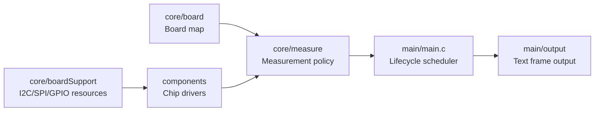
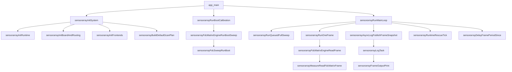
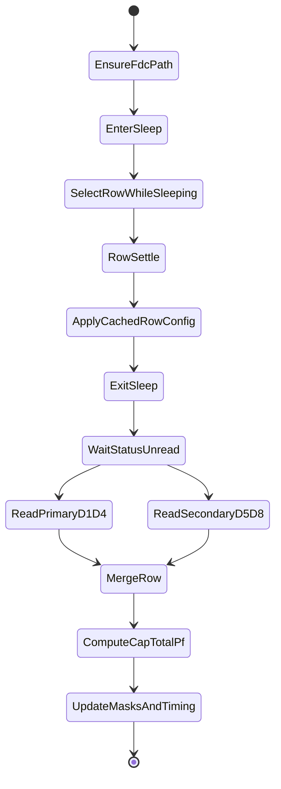
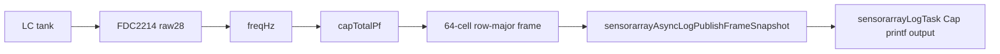

# SensorArray ESP32-S3 固件 / SensorArray ESP32-S3 Firmware

## Current runtime architecture and text protocol

### Current transport, ROWS, and battery contract

This section supersedes historical FF01/FF02, single-port UDP, fixed-64-cell,
and `transport/bleTransport` notes later in this file.

| Layer | Responsibility |
|---|---|
| `components/sensorarrayBle` | BLE controller/Bluedroid, GAP/GATTS, subscriptions, congestion state, and notify primitives |
| `components/sensorarrayWifi` | SoftAP, UDP sockets, control receive, and send primitives |
| `core/transport` | Project data/log/control policy, source replies, command routing, and drop/backpressure statistics |
| `core/config` | Single source of truth for active/pending scan row limit |
| `main/net/sensorarrayNetStatus.c` | Deprecated thin compatibility glue into `core/transport` |

The removed `transport/bleTransport` directory was an unused placeholder.
BLE is initialized before Wi-Fi. BLE/Wi-Fi components do not parse `ROWS`.

| Transport | DATA | LOG | CTRL |
|---|---|---|---|
| BLE service `0x00FF` | `0xFF20` DATA_TX notify | `0xFF30` LOG_TX notify | `0xFF10` CTRL_RX write, `0xFF11` CTRL_TX notify |
| Wi-Fi UDP | 3333 | 3334 | 3335 |
| Serial | throttled debug/fallback | logs | line RX and source-local ACK/ERR |

All control sources use one parser: `ROWS?`, `ROWS=1..8`, `ROWLIMIT=1..8`,
and `SCANROWS=1..8`. Pending rows apply at the next frame boundary. The FDC
scan itself only visits row1 through rowN.

```text
ACK,cmd=ROWS,value=5,cells=40
C,seq=101,ts=123456999,rows=5,cells=40,rf=1F,pf=1F,sf=1F,bad=0/0/0,fmt=pf6,n=40
D0,<16 values>
D1,<16 values>
D2,<8 values>
K,seq=101,crc=<crc32>
```

CRC-32 covers C through the last D line, including each LF, and excludes K.
DATA is queued to BLE/Wi-Fi first. Serial DATA is throttled and non-blocking.

The board battery divider is `BAT -- R -- AIN8 -- R -- GND`, ratio 2/1.
Measure BAT-GND, AIN8-GND, and AINCOM-GND when diagnosing it. The ADC reads
`a8d = AIN8 - AINCOM`. With VBIAS enabled, firmware validates the ADS126x
analog supply monitor against configured `AVDD_GND + |AVSS_GND|`, then uses:

```text
acom = rail * (AVDD_GND - |AVSS_GND|) / (2 * (AVDD_GND + |AVSS_GND|))
a8g = a8d - zeroResidual + acom
bt_uv = a8g * divider_num / divider_den
```

The rail monitor is configured in firmware as CCh/CCh, internal 2.5 V
reference, PGA gain 1, chop disabled, and scale factor 4. MUX/reference changes
get a 1 ms settling interval and a fresh conversion. `rail` is accepted only
when it is within `CONFIG_SENSORARRAY_ADS_RAIL_EXPECTED_TOLERANCE_UV` of the
nominal `AVDD_GND + |AVSS_GND|`; an invalid rail cannot generate a battery
value.

An invalid rail, VBIAS, ADC result, divider, or single-cell voltage produces
`bt=-1` with an explicit `br`. A50 is LOG channel data. New fields are:
`rail` measured AVDD-AVSS mV, `rv` rail validity, `rexp` nominal rail mV,
`rerr` rail error mV, `a8d` AIN8-AINCOM uV, `acom` AINCOM-GND uV or `na`,
`a8g` AIN8-GND uV or `na`, `brat` divider ratio, `bt` battery mV or -1, and
`br` validity reason. The old unchecked battery formula is no longer used.

Firmware build/flash uses ESP-IDF Python. Host receivers must use repository
`.venv`, not system Python or ESP-IDF Python:

```powershell
$venvPython = "C:\ESP32\SensorArray\.venv\Scripts\python.exe"
& $venvPython -m pip install --upgrade pip
& $venvPython -m pip install bleak pyserial
& $venvPython tools\receive_ble_text.py --name SensorArray --duration 120 --set-rows 4 --show-cap --show-log
& $venvPython tools\receive_wifi_text.py --data-port 3333 --log-port 3334 --ctrl-port 3335 --duration 120 --set-rows 4 --show-cap --show-log
& $venvPython tools\receive_serial_text.py --port COM11 --baud 115200 --duration 120 --set-rows 4 --show-cap --show-log
& $venvPython tools\validate_battery_formula.py
```

This section is the source of truth for the current runtime transport. Older
performance notes later in this file describe historical measurements only.

### Two asynchronous domains

| Domain | Core | Owns | Must not do |
|---|---:|---|---|
| Acquisition Async Domain | Core 1 | FDC row epochs, ADS gap jobs, frame assembly, one-time C/D/K formatting, safe-boundary command apply | USB writes, UDP sends, BLE notify, blocking host output |
| Output/System Async Domain | Core 0 | text bus consumption, USB/Wi-Fi/BLE sinks, S50/F50/A50/O50 formatting, event output, host command parsing | mutate acquisition state directly |

The cross-core contracts are:

| Interface | Direction | Behaviour |
|---|---|---|
| `TextFrameBus` | Core 1 -> Core 0 | Fixed slots contain one already-formatted dynamic ASCII C/D/K packet. The producer never waits; when full it drops old normal frames and keeps the latest. All sinks reuse the same bytes. |
| `EventRing` | Core 1 -> Core 0 | Non-blocking error, overrun, state-change, and command-apply events. Queue overflow is counted rather than blocking acquisition. |
| `CommandMailbox` | Core 0 -> Core 1 | Fixed command queue. BLE writes are parsed on Core 0; Core 1 applies commands only before the next frame. |

USB, Wi-Fi, and BLE use ASCII compact text. The legacy binary frame mode is not
part of this version.

### Dynamic capacitance frame

```text
C,seq=301,ts=123456789,rows=5,cells=40,rf=1F,pf=1F,sf=1F,bad=0/0/0,fmt=pf6,n=40
D0,100302000,58098000,...16 values
D1,...16 values
D2,...8 values
K,seq=301,crc=89ABCDEF
```

The frame contains exactly `rows * 8` row-major cells. Each D line contains up
to 16 values, so the final D line may be short. No sentinel cells are appended
for rows that were not scanned. A value is integer
`capacitance_pF * 1,000,000`; divide by `1,000,000` to recover pF with six
decimal places. `-1000000` is the invalid fixed-point sentinel. `K.crc` is
standard reflected CRC-32 over the exact ASCII bytes from `C` through the last
`D` newline, excluding the `K` line.

| Tag | Purpose |
|---|---|
| `C` | Cap frame header with `rows`, `cells`, `n`, and freshness/invalid counts. |
| `D0` onward | Exactly `cells` fixed-point pF values, up to 16 per line. |
| `K` | Sequence-bound CRC-32. |
| `S50` | 50-frame system rate and bad-frame summary. |
| `F50` | FDC wait/read/coordinator and I2C error summary. |
| `A50` | ADS identity, active ADC, rail, zero residual, AIN8, battery, and ADS errors. |
| `O50` | USB/BLE/Wi-Fi sink rates, drops, bytes, blocking, queue depth, and watchdog count. |
| `E`, `W`, `FX`, `AX`, `OX`, `RX` | Event, warning, and subsystem exception lines. |
| `ADSBOOT`, `CALB` | One-time ADS identity and boot-calibration records. |

```text
S50,f=301-350,n=50,fps=12.38/12.38,bad=0/0/0
F50,ft=4160/1900/2230,ie=0/0/0,rv=100
A50,chip=1262,adc=1,rail=5171,rv=1,rexp=5100,rerr=71,z=111/445,a8d=1781658,acom=760441,a8g=2541988,brat=2/1,bt=-1,br=out_of_range,ae=0/0/0
O50,out=8/14,q=0/1,sfps=12.4/2.0/12.4,sdrop=0/0/0,skb=17/2/17,blk=0/0/0,tdrop=0,edrop=0,wdt=0
```

| Field | Meaning |
|---|---|
| `f`, `n`, `fps`, `bad` | frame range, count, capture/output FPS, stale/mixed/invalid-frame counts |
| `ft` | average FDC ready wait / DATA read / coordinator time in us |
| `ie` | I2C NACK / timeout / recovery counts |
| `F50.rv` | valid-cell percentage |
| `chip`, `adc` | detected ADS1262/ADS1263 and active background ADC |
| `rail`, `A50.rv`, `rexp`, `rerr` | measured rail, rail validity, nominal rail, and rail error |
| `z` | zero residual mean / standard deviation in uV |
| `a8d`, `acom`, `a8g` | AIN8-AINCOM, calibrated AINCOM-GND, and derived AIN8-GND in uV |
| `bt` | battery voltage in mV; `-1` means invalid |
| `br` | battery validity reason |
| `ae` | ADS SPI error / DRDY timeout / deadline skip counts |
| `sfps`, `sdrop`, `skb`, `blk` | USB/BLE/Wi-Fi tuples in that order |
| `tdrop`, `edrop`, `wdt` | TextFrameBus drops, EventRing drops, and actual task-watchdog count |

Do not add the removed duplicate fields `bm`, `bv`, `uf`, `bf`, `wf`, `ud`,
`bd`, or `wd` to new runtime records.

### ADS identity, calibration, and battery

The ID register is decoded as `dev=(id>>5)&7`, `rev=id&31`. Therefore `id=03`
is `dev=0,rev=3,chip=1262,a2=0`, not ADS1263. A recognised hardware ID
overrides a mismatching forced type; ADC2 probing is only a fallback for an
unknown ID.

Boot calibration enables INTREF and VBIAS, measures the analogue supply with
the internal 2.5 V reference, switches the operating reference to AVDD/AVSS,
synchronises the software VREF, runs ADC1 system-offset calibration on
AIN9-AINCOM, verifies the residual, and reads calibration/core registers. On
ADS1263 it also configures ADC2 at 800 SPS, runs ADC2 system-offset calibration,
and uses ADC2 for BAT/ZERO/RAIL gap jobs. ADS1262 uses the deadline-aware ADC1
DMA path.

```text
nominalRail = AVDD_GND + |AVSS_GND|
aincomGnd = rail * (AVDD_GND - |AVSS_GND|) / (2 * nominalRail)
ain8Gnd = ain8Diff - zeroResidual + aincomGnd
battery = ain8Gnd * dividerNum / dividerDen
```

AIN9-AINCOM is only a zero residual and never an absolute AINCOM-GND
measurement. An invalid calibration, rail, zero, ADC read, divider, VBIAS
state, overflow, or out-of-range single-cell result produces
`bt=-1,br=<reason>`.

### Transport policy

| Sink | Default content | Backpressure |
|---|---|---|
| BLE `FF20` / `FF30` | DATA / LOG | non-blocking notify; complete DATA frame or normal LOG may drop under congestion |
| Wi-Fi UDP 3333 / 3334 | DATA / LOG | non-blocking UDP; drops are isolated |
| USB Serial/JTAG | throttled DATA plus LOG/CTRL | independent latest-only queue; never blocks acquisition |

Wi-Fi requests maximum configured TX power, disables power save, enables
802.11b/g/n, tries HT40, then falls back to HT20. BLE requests configured high
TX power, short connection intervals, and 2M PHY, then accepts peer/controller
fallback to 1M. Unsupported high-speed settings are logged and do not stop
acquisition.

### Unified control commands

Write ASCII to Serial, BLE `FF10`, or Wi-Fi UDP 3335. ACK/ERR returns to the
originating Serial, BLE `FF11`, or UDP control peer:

| Command | Effect at next frame boundary |
|---|---|
| `ROWS?` | Return active rows and cells. |
| `ROWS=N`, `ROWLIMIT=N`, `SCANROWS=N` | Scan rows 1 through N, where N is 1..8. |
| `BLECAP=N` or `CAP=N` | Legacy low-rate cap control routed through the shared parser. |
| `TRACE=0` / `TRACE=1` | Disable/enable the runtime trace state. |
| `CAL=ZERO` | Schedule a zero-residual job in a safe ADS slack window. |
| `CAL=RAIL` | Schedule a rail-monitor job. |
| `CAL=ALL` | Schedule both rail and zero jobs. |

### Host validation tools

```powershell
$venvPython = "C:\ESP32\SensorArray\.venv\Scripts\python.exe"
& $venvPython tools\receive_ble_text.py --name SensorArray --duration 120 --set-rows 4 --show-cap --show-log
& $venvPython tools\receive_wifi_text.py --data-port 3333 --log-port 3334 --ctrl-port 3335 --duration 120 --set-rows 4 --show-cap --show-log
& $venvPython tools\receive_serial_text.py --port COM11 --baud 115200 --duration 120 --set-rows 4 --show-cap --show-log
```

All receivers share `tools/text_protocol.py`, accept dynamic `rows/cells/n`,
accept a short final D line, check CRC, and report sequence gaps, FPS, and
channel counts. Host receiver commands must use repository `.venv`.

## 目录 / Table of contents

- [当前源码树状态 / Current source-tree status](#当前源码树状态--current-source-tree-status)
- [项目目标 / Project purpose](#项目目标--project-purpose)
- [当前实现状态 / Current implementation status](#当前实现状态--current-implementation-status)
- [硬件拓扑 / Hardware topology](#硬件拓扑--hardware-topology)
- [软件架构 / Software architecture](#软件架构--software-architecture)
- [函数级生命周期 / Function-level lifecycle](#函数级生命周期--function-level-lifecycle)
- [配置项 / Configuration options](#配置项--configuration-options)
- [关键数据结构 / Key data structures](#关键数据结构--key-data-structures)
- [FDC 矩阵读取路径 / FDC matrix read path](#fdc-矩阵读取路径--fdc-matrix-read-path)
- [路由安全与 ADS/FDC 互斥 / Route safety and ADS/FDC mutual exclusion](#路由安全与-adsfdc-互斥--route-safety-and-adsfdc-mutual-exclusion)
- [帧格式与无效值策略 / Frame format and invalid data policy](#帧格式与无效值策略--frame-format-and-invalid-data-policy)
- [调试日志与控制命令 / Diagnostic logs and console commands](#调试日志与控制命令--diagnostic-logs-and-console-commands)
- [编译、烧录和监视 / Build, flash, and monitor](#编译烧录和监视--build-flash-and-monitor)
- [已知约束 / Known constraints](#已知约束--known-constraints)
- [文件地图 / File map](#文件地图--file-map)
- [Precision-safe 20 FPS optimisation](#precision-safe-20-fps-optimisation)

## 当前源码树状态 / Current source-tree status

### 中文

本文档描述当前源码树的主要固件结构、运行链路、配置项和调试方法。最终真源是源码本身，尤其是 `main/Kconfig.projbuild`、`main/sensorarrayConfig.h`、`main/main.c`、`core/measure/`、`core/board/` 和各组件头文件。README 正文不写死具体 commit 号。

### Australian English

This document describes the firmware structure, runtime flow, configuration options, and diagnostic workflow for the current source tree. The final source of truth is the code itself, especially `main/Kconfig.projbuild`, `main/sensorarrayConfig.h`, `main/main.c`, `core/measure/`, `core/board/`, and the component headers. The README body does not pin a specific commit hash.

## 项目目标 / Project purpose

### 中文

SensorArray 固件运行在 ESP32-S3 上，当前主路径是读取 8 x 8 FDC2214 电容矩阵。固件把板级路由、芯片驱动、测量策略和应用调度拆开：板级映射定义硬件语义，组件驱动只访问芯片，`core/measure` 负责测量策略，`main` 负责生命周期编排和输出调用。

### Australian English

SensorArray firmware runs on ESP32-S3. The current main path reads an 8 x 8 FDC2214 capacitance matrix. The firmware keeps board routing, chip drivers, measurement policy, and application scheduling separate: board mapping defines hardware meaning, component drivers only access chips, `core/measure` owns measurement policy, and `main` orchestrates lifecycle and output calls.

## 当前实现状态 / Current implementation status

| 路径 / Path | 当前状态 / Current status | 说明 / Notes |
|---|---|---|
| FDC2214 8 x 8 cap matrix | 主运行路径 / main runtime path | `sensorarrayFdcMatrixEngineReadFrame()` delegates to `sensorarrayMeasureReadFdcMatrixFrame()`. |
| ADS1262/ADS1263 matrix | 初始化和 API 存在，frame read returns unsupported / initialisation and APIs exist, frame read returns unsupported | `sensorarrayAdsMatrixEngineReadFrame()` initialises an invalid frame and returns `ESP_ERR_NOT_SUPPORTED`. |
| Mixed row mode | Thin pass-through to FDC path / thin pass-through to FDC path | `sensorarrayMixedRowEngineReadFrame()` currently calls the FDC matrix engine. |
| Text output | 异步主输出 / default async output | Core 1 builds one dynamic C/D/K ASCII packet; independent Core 0 USB, Wi-Fi, and BLE sinks reuse it. |
| Binary transport | 已移除 / removed | Runtime CapFrame transport is ASCII only. |
| Runtime commands | Shared control parser | Serial, BLE `FF10`, and Wi-Fi UDP 3335 share ROWS and legacy command routing; frame-affecting changes apply at a frame boundary. |

## 硬件拓扑 / Hardware topology

### 中文

板级映射是硬件语义的唯一真源。D-line、FDC 通道、SELA/SELB 逻辑电平和 ADS mux 的含义由 `core/board/sensorarrayBoardMap.c` 定义，不由芯片驱动定义。

### Australian English

The board map is the single source of truth for hardware meaning. D-line ownership, FDC channels, SELA/SELB logic levels, and ADS mux meaning are defined by `core/board/sensorarrayBoardMap.c`, not by chip drivers.

| 硬件 / Hardware | 在本项目中的作用 / Role in this project |
|---|---|
| ESP32-S3 | 主 MCU，运行 ESP-IDF 应用、FreeRTOS 任务、I2C/SPI/GPIO 控制和 printf 输出。 / Main MCU running the ESP-IDF app, FreeRTOS tasks, I2C/SPI/GPIO control, and printf output. |
| TMUX1108 | S1..S8 行选择和 SW GND/REF 源选择；`tmuxSwitchSelectRow(row - 1)` 选择当前行。 / Selects S1..S8 rows and SW GND/REF source; `tmuxSwitchSelectRow(row - 1)` selects the current row. |
| TMUX1134 | 前端路由开关；SELA 选择 ADS1263 或 FDC2214 分支，SELB 按板级 FDC 策略选择，EN 使能路由。 / Front-end route switch; SELA selects ADS1263 or FDC2214 branch, SELB follows the board FDC policy, and EN enables the route. |
| FDC2214 primary | D1-D4，CH0-CH3，默认 I2C 地址 `0x2B`。 / D1-D4, CH0-CH3, default I2C address `0x2B`. |
| FDC2214 secondary | D5-D8，CH0-CH3，默认 I2C 地址 `0x2A`。 / D5-D8, CH0-CH3, default I2C address `0x2A`. |
| ADS1262/ADS1263 | ADS 前端和 SPI driver 已存在；FDC matrix mode 下由 measurement layer 停止转换、关闭 internal reference 和 VBIAS。 / ADS frontend and SPI driver exist; in FDC matrix mode the measurement layer stops conversion and turns internal reference and VBIAS off. |
| LM27762 / negative rail | 原理图/资料中的模拟电源背景；当前源码树没有专用运行时 driver。 / Analogue power context from schematic/datasheets; no dedicated runtime driver in this source tree. |
| TPS631000 / 3.3 V rail | 电源架构背景；`core/powerCtrl` 只提供 GPIO abstraction。 / Power architecture context; `core/powerCtrl` only provides GPIO abstraction. |
| BQ24074 / charger | 充电器硬件背景；当前源码树没有 charger protocol driver。 / Charger hardware context; no charger protocol driver in this source tree. |
| USB Type-C | 供电/串口监视入口，实际传输仍以 printf text 为默认。 / Power and serial monitor entry; actual runtime transport defaults to printf text. |
| FPC/FFC connector | 传感阵列连接器，S/D 语义由 board map 解释。 / Sensor-array connector; S/D meaning is interpreted by the board map. |

矩阵索引为行优先：

```text
index = (sIndex - 1) * 8 + (dIndex - 1)
S1D1, S1D2, ..., S1D8, S2D1, ..., S8D8
D1-D4 -> primary FDC2214 CH0-CH3
D5-D8 -> secondary FDC2214 CH0-CH3
```

## 软件架构 / Software architecture



| 层 / Layer | 路径 / Path | 负责 / Owns | 不负责 / Does not own |
|---|---|---|---|
| Application | `main/main.c` | app lifecycle, safe idle, boot calibration call, main loop, frame output call | chip registers, matrix routing algorithm, board map |
| Output | `main/output` | text frame formatting and future output adapter boundary | measurement state mutation |
| Board map | `core/board` | S/D mapping, SELA/SELB meaning, ADS mux meaning, route audit logs | generic chip access |
| Board support | `core/boardSupport` | I2C bus install/delete, I2C callbacks, guarded timeout recovery | FDC rescue policy |
| Measurement | `core/measure` | route policy, ADS/FDC mutual exclusion, FDC frame builder, row epoch, rescue decisions | low-level register names as public policy |
| FDC engine facade | `core/measure/fdc/sensorarrayFdcMatrix.c` | thin engine wrapper | actual scanning algorithm |
| FDC sweep/rescue | `core/measure/fdc/sensorarrayFdcSweep.c`, `sensorarrayFdcRescue.c` | boot sweep, cache construction, rescue throttling | app lifecycle |
| Chip drivers | `components/fdc2214Cap`, `components/ads126xAdc`, `components/tmuxSwitch` | FDC I2C, ADS SPI, GPIO primitives | rows, D-line meaning, frame output, rescue strategy |
| Transport | `transport/*` | protocol/transport scaffolding | current production frame output |

## 函数级生命周期 / Function-level lifecycle



| 函数 / Function | 输入 / Input | 主要副作用 / Main side effects | 失败处理 / Failure handling | 相关配置 / Related config |
|---|---|---|---|---|
| `app_main()` | global `s_appContext` | clears context, runs init, boot calibration, main loop | init failure prints `APP_FATAL` and enters safe idle; boot failure sets diagnostic mode when boot sweep is required | `CONFIG_SENSORARRAY_FDC_BOOT_SWEEP_REQUIRED` |
| `sensorarrayInitRuntime()` | `sensorarrayAppContext_t *ctx` | clears ctx, disables fast-speed output, sets `runtimeMode = SENSORARRAY_RUNTIME_MODE_FDC_MATRIX`, parses FDC I2C addresses and channel count | invalid ctx returns `ESP_ERR_INVALID_ARG` | `CONFIG_SENSORARRAY_FDC_PRIMARY_I2C_ADDR`, `CONFIG_SENSORARRAY_FDC_SECONDARY_I2C_ADDR`, `CONFIG_FDC2214CAP_CHANNELS` |
| `sensorarrayInitBoardAndRouting()` | app context state | runs `boardSupportInit()`, `tmuxSwitchInit()`, `sensorarrayBoardMapAudit()`, default TMUX route | board support failure returns fatal init error; TMUX failure returns error | `CONFIG_BOARD_I2C*`, `CONFIG_TMUX*` |
| `sensorarrayInitFrontends()` | app context state | initialises ADS, assigns FDC I2C contexts, initialises primary/secondary FDC, logs parallel bus config, initialises engines and rescue context | engine init failure aborts init; individual FDC state is tracked in `state.fdcPrimary/Secondary.ready` | `CONFIG_SENSORARRAY_FDC_PARALLEL_DUAL_BUS_READ`, `CONFIG_ADS126X_*` |
| `sensorarrayBuildDefaultScanPlan()` | app context | builds 8 rows x 8 cells with `SENSORARRAY_CELL_OP_FDC_CAP` | no error return | `CONFIG_SENSORARRAY_MATRIX_ROWS`, `CONFIG_SENSORARRAY_MATRIX_COLS` |
| `sensorarrayRunBootCalibration()` | app context | checks FDC readiness, runs boot sweep, stores `fdcBootSummary`, sets `fdcBootSweepOk`, `fdcDegradedMode` and `fdcDiagnosticMode` | primary missing is fatal; secondary missing is fatal only when dual FDC is required; required boot quality must be `OK` | `CONFIG_SENSORARRAY_REQUIRE_DUAL_FDC_FOR_BOOT`, `CONFIG_SENSORARRAY_FDC_BOOT_SWEEP_REQUIRED`, `CONFIG_SENSORARRAY_FDC_BOOT_MIN_VALID_CELLS` |
| `sensorarrayRunMainLoop()` | app context | consumes full-sweep requests, reads frames, prints diagnostics/output, ticks rescue, delays to frame period | diagnostic mode prints `MATRIXFDC_DIAG`; all-invalid frame triggers rescue tick; frame error logs `FRAME_ERROR` | `CONFIG_SENSORARRAY_FDC_MATRIX_PERIOD_MS`, rescue and timing configs |
| `sensorarrayRunQueuedFullSweep()` | app context | runs queued full matrix rescue via `sensorarrayFdcMatrixEngineRunFullRescue()` | skips while running, inside cooldown, or after max failed full sweeps; can force diagnostic mode | `CONFIG_SENSORARRAY_FDC_FULL_SWEEP_REQUEST_COOLDOWN_MS`, `CONFIG_SENSORARRAY_FDC_MAX_CONSECUTIVE_FULL_SWEEP_FAILS` |
| `sensorarrayRunOneFrame()` | app context | dispatches by `runtimeMode` | unsupported ADS mode returns `ESP_ERR_NOT_SUPPORTED`; unknown mode returns invalid state | runtime mode enum |
| `sensorarrayDelayFramePeriodSince()` | frame start timestamp, sequence | sleeps remaining period or prints compact `OV` overrun diagnostics | no return value | `CONFIG_SENSORARRAY_FDC_MATRIX_PERIOD_MS` |

## 配置项 / Configuration options

### 说明 / Notes

### 中文

`main/Kconfig.projbuild` 是项目自定义配置的主入口。`sensorarrayConfig.h` 为缺失配置提供编译 fallback；当 ESP-IDF Kconfig 生成 `sdkconfig.h` 时，以 Kconfig/defaults 为准。`sdkconfig.defaults` 和 `sdkconfig.defaults.esp32s3` 会覆盖部分 Kconfig default，例如当前默认 FDC frame period 为 `50 ms`，目标约 `20 fps`。如果把 period 改成 `250 ms`，目标帧率约为每秒 4 帧；真实帧率仍受 I2C、row settle、FDC conversion、日志输出和 rescue 活动影响。

### Australian English

`main/Kconfig.projbuild` is the main project configuration entry. `sensorarrayConfig.h` provides compile-time fallbacks for missing symbols; when ESP-IDF generates `sdkconfig.h`, Kconfig/defaults are authoritative. `sdkconfig.defaults` and `sdkconfig.defaults.esp32s3` override some Kconfig defaults. The current default FDC frame period is `50 ms`, or roughly a `20 fps` target. If the period is changed to `250 ms`, the target rate is about four frames per second; actual frame rate still depends on I2C, row settling, FDC conversion, logging, and rescue activity.

### Build and target configuration / 编译与目标配置

| 配置项 / Option | 类型 / Type | 默认值 / Default | 作用 / Purpose | 影响的函数 / Affected functions | 调整建议 / Tuning notes |
|---|---:|---:|---|---|---|
| `CONFIG_IDF_TARGET` | string | sdkconfig defaults: `esp32s3` | Selects ESP-IDF target. | ESP-IDF build system | Keep `esp32s3` for this board. |
| `CONFIG_ESPTOOLPY_FLASHSIZE_16MB` | bool | sdkconfig defaults: y | Sets flash size profile. | ESP-IDF flashing/partition handling | Match physical module flash. |
| `CONFIG_ESP_MAIN_TASK_STACK_SIZE` | int | sdkconfig defaults: `16384` | Main task stack size. | `app_main()`, FreeRTOS startup | Lower only after stack high-water logs are reviewed. |
| `CONFIG_FREERTOS_CHECK_STACKOVERFLOW_CANARY` | bool | sdkconfig defaults: y | Enables stack overflow checking. | FreeRTOS runtime | Keep enabled during bring-up. |
| `CONFIG_FREERTOS_WATCHPOINT_END_OF_STACK` | bool | sdkconfig defaults: y | Uses watchpoint at stack end. | FreeRTOS runtime | Keep enabled for debug builds. |
| `CONFIG_HEAP_POISONING_LIGHT` | bool | sdkconfig defaults: y | Adds heap corruption checks. | ESP-IDF heap | Useful for diagnostics; may add overhead. |
| `CONFIG_COMPILER_STACK_CHECK_MODE_STRONG` | choice | sdkconfig defaults: strong | Compiler stack checking. | all compiled C code | Keep strong unless measuring release performance. |
| `CONFIG_SENSORARRAY_ENABLE_WIRED` | bool | Kconfig: y | Enables wired transport option. | transport build paths | Current default output still uses printf text. |
| `CONFIG_SENSORARRAY_ENABLE_BLE` | bool | Kconfig: y | Enables BLE transport option. | BLE transport build paths | Disable when BLE task/memory budget is not required. |
| `CONFIG_SENSORARRAY_SCAN_TASK_CORE`, `CONFIG_SENSORARRAY_SCAN_TASK_STACK`, `CONFIG_SENSORARRAY_SCAN_TASK_PRIO` | int | `1`, `16384`, `12` | Scheduling defaults for scan work. | scan task and worker/task config defaults | Keep scan work away from comm/BLE unless core affinity needs debugging. |
| `CONFIG_SENSORARRAY_RUNTIME_PERIODIC_DIAG_ENABLE` | bool | n | Prints scan-task stack/heap diagnostics every 100 frames. | `sensorarrayRunMainLoop()` | Leave disabled for formal timing because synchronous printf introduces a frame gap. |
| `CONFIG_SENSORARRAY_COMM_TASK_CORE`, `CONFIG_SENSORARRAY_COMM_TASK_STACK`, `CONFIG_SENSORARRAY_COMM_TASK_PRIO` | int | `0`, `4096`, `8` | Scheduling defaults for communication work. | transport/task config defaults | Increase stack if future transport code adds deeper call chains. |
| `CONFIG_SENSORARRAY_BLE_TASK_CORE` | int | `0` | BLE task core when BLE is enabled. | BLE transport task config | Current BLE transport is placeholder only. |

### FDC matrix configuration / FDC 矩阵配置

| 配置项 / Option | 类型 / Type | 默认值 / Default | 作用 / Purpose | 影响的函数 / Affected functions | 调整建议 / Tuning notes |
|---|---:|---:|---|---|---|
| `CONFIG_SENSORARRAY_FDC_PRIMARY_I2C_ADDR` | hex | Kconfig: `0x2B` | Primary FDC for D1-D4. | `sensorarrayInitRuntime()`, `sensorarrayInitFdcDevice()` | Change only if hardware address strap changes. |
| `CONFIG_SENSORARRAY_FDC_SECONDARY_I2C_ADDR` | hex | Kconfig: `0x2A` | Secondary FDC for D5-D8. | `sensorarrayInitRuntime()`, `sensorarrayInitFdcDevice()` | Change only if hardware address strap changes. |
| `CONFIG_SENSORARRAY_FDC_STARTUP_PROBE` | bool | Kconfig: y | Enables startup probe path where used by bring-up. | `sensorarrayBringupProbeFdcBus()` | Keep enabled while validating hardware. |
| `CONFIG_FDC2214CAP_CHANNELS` | int | component Kconfig: `4` | Requested FDC channel count. | `sensorarrayInitRuntime()`, `sensorarrayBringupNormalizeFdcChannels()` | Current matrix expects 4 channels per FDC. Fewer channels reduce matrix completeness and are normalised upward by app init. |
| `CONFIG_SENSORARRAY_FDC_TANK_INDUCTOR_NH` | int | Kconfig and defaults: `18000` | LC tank inductor for `freqHz -> capTotalPf`. | `sensorarrayMeasureComputeFdcFrameCapTotalPf()`, `sensorarrayMeasureFdcComputeCapacitancePf()` | Must match hardware. Wrong L shifts pF values but does not change `raw28`. Formula: `C = 1 / ((2 * pi * f)^2 * L)`. |
| `CONFIG_SENSORARRAY_FDC_TANK_INDUCTOR_UH` | int | Kconfig: `0` | Legacy/optional sweep conversion input. | `sensorarrayFdcSweep.c` | Prefer `CONFIG_SENSORARRAY_FDC_TANK_INDUCTOR_NH` for MATRIXFDC pF output. |
| `CONFIG_SENSORARRAY_FDC_REF_CLOCK_USE_EXTERNAL`, `CONFIG_SENSORARRAY_FDC_REF_CLOCK_USE_EXTERNAL_VALUE` | bool/int | Kconfig: external y, value `1` | Selects external FDC reference clock path. | `sensorarrayConfig.h`, FDC frequency conversion helpers | Keep aligned with actual CLKIN. |
| `CONFIG_SENSORARRAY_FDC_EXTERNAL_CLOCK_HZ` | int | Kconfig: `40000000` | External CLKIN frequency in Hz. | `sensorarrayMeasureFdcEffectiveFclkHz()` | Wrong clock value skews frequency and capacitance conversion. |
| `CONFIG_SENSORARRAY_MATRIX_ROWS`, `CONFIG_SENSORARRAY_MATRIX_COLS` | int | Kconfig: `8`, `8` | Logical matrix size. | `sensorarrayScanPlanBuildDefaultFdcMatrix()`, frame arrays | Current frame type is fixed for 64 cells; treat changes as architecture work. |
| `CONFIG_SENSORARRAY_FRAME_PERIOD_MS` | int | Kconfig: `CONFIG_SENSORARRAY_FDC_MATRIX_PERIOD_MS`; header fallback `250` if absent | Generic frame-period fallback. | `sensorarrayConfig.h` | For current FDC path, tune `CONFIG_SENSORARRAY_FDC_MATRIX_PERIOD_MS` directly. |
| `CONFIG_SENSORARRAY_OVERSAMPLE` | int | Kconfig: `1` | Generic oversample default. | scan/matrix defaults | Current FDC production path uses row epoch logic rather than a generic oversample loop. |

### FDC timing and frame-rate configuration / FDC 时序与帧率配置

| 配置项 / Option | 类型 / Type | 默认值 / Default | 作用 / Purpose | 影响的函数 / Affected functions | 调整建议 / Tuning notes |
|---|---:|---:|---|---|---|
| `CONFIG_SENSORARRAY_FDC_MATRIX_PERIOD_MS` | int | Kconfig and defaults: `50` | Target period for one 64-cell text frame. | `sensorarrayFdcFramePeriodMs()`, `sensorarrayDelayFramePeriodSince()` | Lower values raise target fps but increase overrun risk. `250 ms` means about `4 fps`. |
| `CONFIG_SENSORARRAY_FDC_MATRIX_TARGET_FPS` | int | Kconfig/defaults: `20` | Timing budget target used in profiling. | `SENSORARRAY_FDC_TARGET_FRAME_US`, timing logs | Keep consistent with frame period when comparing `SCAN_TIMING_*`. |
| `CONFIG_SENSORARRAY_FDC_MATRIX_SETTLE_US` | int | Kconfig/defaults: `1000` | Settle delay for some path/ADS helper paths. | `sensorarrayMeasurePrepareFdcMatrixPath()`, ADS helper paths, sweep paths | Lower only after verifying route stability and invalid-frame rate. |
| `CONFIG_SENSORARRAY_FDC_ROW_SWITCH_SETTLE_US` | int | Kconfig/defaults: `50` | Row settle delay while FDC devices are sleeping. | `sensorarrayMeasureSelectFdcRowWhileSleeping()` | Too low can increase row-to-row mixing, amplitude warnings, or invalid rows. |
| `CONFIG_SENSORARRAY_FDC_MATRIX_DISCARD_SAMPLES` | int | Kconfig: `0`, sdkconfig.defaults: `1` | Discard count used by legacy/direct paths. | ADS/FDC helper code | Keep low in row epoch mode; excessive discard hurts fps. |
| `CONFIG_SENSORARRAY_FDC_DISCARD_FRAMES_AFTER_ROW_SWITCH` | int | Kconfig/defaults: `0` | Runtime autoscan frame discard count after row switch. | `sensorarrayMeasureFdcDiscardFrames()`, discard helper | Production sleep-epoch path defaults to zero discard frames. |
| `CONFIG_SENSORARRAY_FDC_ROW_EPOCH_RESTART_ENABLE` | bool | Kconfig/defaults: y | Enables per-row conversion epoch restart. | row epoch helpers | Keep enabled for current row isolation strategy. |
| `CONFIG_SENSORARRAY_FDC_ROW_EPOCH_RESTART_METHOD_SLEEP` | bool | Kconfig/defaults: y | Uses `CONFIG.SLEEP_MODE_EN` for row restart. | `sensorarrayMeasureFdcSetSleepMode()` | Current stable path uses sleep entry/exit rather than SD pin reset. |
| `CONFIG_SENSORARRAY_FDC_DIFF_CACHE_APPLY` | bool | Kconfig/defaults: y | Applies only changed cached FDC row registers while devices are sleeping. | `sensorarrayMeasureApplyFdcCachedRowConfig()` | Keep enabled to reduce per-row I2C writes. |
| `CONFIG_SENSORARRAY_FDC_PROFILE_HIGH_PRECISION`, `CONFIG_SENSORARRAY_FDC_PROFILE_BALANCED_20FPS`, `CONFIG_SENSORARRAY_FDC_PROFILE_FAST_DEBUG` | choice | default `high_precision` | Selects the fallback/default FDC matrix profile. | `sensorarrayConfig.h`, cache/sweep channel config | `high_precision` keeps existing 0x2089 timing; `balanced_20fps` targets the row budget; `fast_debug` is for controlled timing experiments. |
| `CONFIG_SENSORARRAY_FDC_RCOUNT_DEFAULT` | hex | selected profile: `0x2089`, `0x0E00`, or `0x0900` | Default FDC RCOUNT used when no calibrated cache entry overrides it. | bring-up, cache apply, timing estimate | Lower values improve estimated fps but reduce conversion precision/noise margin. |
| `CONFIG_SENSORARRAY_FDC_FORMAL_FAST_PROFILE_ENABLE` | bool | Kconfig/defaults: n | Enables experimental runtime RCOUNT reduction when cached profile timing is too slow. | `sensorarrayMeasureApplyFdcCachedRowConfig()` | Keep disabled for normal matrix reads; enable only for controlled fast-profile debugging. |
| `CONFIG_SENSORARRAY_FDC_FORMAL_FAST_TARGET_ROUND_US` | int | Kconfig/defaults: `4000` | Target round time for the optional formal fast profile. | PFU/P5 diagnostics, optional fast-profile tuning | With fast profile disabled, this is diagnostic only and does not mutate cached RCOUNT. |
| `CONFIG_SENSORARRAY_FDC_PROFILE_TOO_SLOW_RESCUE_ENABLE` | bool | Kconfig/defaults: n | Allows `profile_too_slow` to request rescue/sweep. | `sensorarrayMeasureRequestFdcCellRescue()`, row watchdog/cache apply gates | Keep disabled unless running an explicit debug experiment; slow estimated timing is not an electrical failure. |
| `CONFIG_SENSORARRAY_FDC_ALLOW_SAFE_DEFAULT_FORMAL_READ` | bool | Kconfig: n | Allows uncalibrated safe-default row configs during formal reads. | `sensorarrayMeasureApplyFdcCachedRowConfig()` | Keep disabled for normal operation. A missing cache now marks cells invalid, logs `FDC_CACHE_MISS`, and requests fast rescue. |
| `CONFIG_SENSORARRAY_LOG_CACHE_APPLY_VERBOSE` | bool | Kconfig: n | Prints verbose cache apply details. | `sensorarrayFdcCacheApply.inc` | Enable only when debugging cache fingerprints; it adds log load. |
| `CONFIG_SENSORARRAY_FDC_CACHE_APPLY_VERBOSE_LOG` | bool | defaults: n | Legacy compatibility alias for cache apply logging. | compatibility fallback | Prefer `CONFIG_SENSORARRAY_LOG_CACHE_APPLY_VERBOSE` in new builds. |
| `CONFIG_SENSORARRAY_FDC_SETTLECOUNT_DEFAULT` | hex | selected profile: `0x0080` | Default FDC SETTLECOUNT used when no calibrated cache entry overrides it. | cache/sweep channel config | Lower only after valid conversions are stable. |
| `CONFIG_SENSORARRAY_FDC_ROW_WAIT_SAFETY_US` | int | Kconfig: `2000` | Legacy safety margin after one autoscan cycle. | FDC wait/sweep helpers | Strict ready wait now uses the larger of this value and `CONFIG_SENSORARRAY_FDC_READY_GUARD_US`. |
| `CONFIG_SENSORARRAY_FDC_READY_POLICY_INTB_STRICT_LEVEL` | choice bool | Kconfig/defaults: y | Default formal ready policy: one STATUS pre-check, INTB wait, STATUS ack/verify, and one timeout STATUS classification. | `sensorarrayFdcWaitDeviceReady()` | Production path; no repeated pre-INTB polling and no legacy fallback recovery loop. |
| `CONFIG_SENSORARRAY_FDC_READY_POLICY_INTB_WITH_POLL_FALLBACK` | choice bool | Kconfig/defaults: n | Legacy diagnostic policy: wait INTB, verify STATUS, then allow bounded STATUS fallback. | `sensorarrayFdcWaitDeviceReady()` | Enable only to compare old fallback behaviour; fallback recovery appears as `src=FB`. |
| `CONFIG_SENSORARRAY_FDC_READY_POLICY_INTB_THEN_STATUS` | choice bool | Kconfig/defaults: n | Wait INTB then verify STATUS once, without legacy fallback. | `sensorarrayFdcWaitDeviceReady()` | Diagnostic mode for missed-INTB validation. |
| `CONFIG_SENSORARRAY_FDC_READY_POLICY_POLL_ONLY` | choice bool | Kconfig/defaults: n | Poll STATUS/unread directly instead of using INTB. | `sensorarrayFdcWaitDeviceReady()` | Debug/compatibility mode; not the default frame-rate path. |
| `CONFIG_SENSORARRAY_FDC_AFTER_INTB_RECHECK_ENABLE` | bool | Kconfig/defaults: y | Allows short STATUS rechecks only after INTB when unread is full but `DRDY=0`. | `sensorarrayFdcWaitDeviceReady()` | Normal recovery source is `src=AR`; it never replaces waiting for INTB. |
| `CONFIG_SENSORARRAY_FDC_AFTER_INTB_RECHECK_MAX` | int | Kconfig/defaults: `3` | Maximum after-INTB STATUS rechecks. | `sensorarrayFdcWaitDeviceReady()` | Keep bounded so one row-device cannot dominate frame time. |
| `CONFIG_SENSORARRAY_FDC_AFTER_INTB_RECHECK_INTERVAL_US` | int | Kconfig/defaults: `250` | Delay between after-INTB STATUS rechecks. | `sensorarrayFdcWaitDeviceReady()` | Lower increases I2C pressure; higher increases ready latency. |
| `CONFIG_SENSORARRAY_FDC_AFTER_INTB_RECHECK_DEADLINE_US` | int | Kconfig/defaults: `1000` | Total after-INTB recheck deadline. | `sensorarrayFdcWaitDeviceReady()` | Hard cap for the `src=AR` path. |
| `CONFIG_SENSORARRAY_FDC_INTB_FALLBACK_POLLING` | bool | Kconfig/defaults: n | Compatibility switch for legacy INTB-unavailable fallback handling. | `sensorarrayFdcWaitDeviceReady()` | Keep disabled for strict formal runs. |
| `CONFIG_SENSORARRAY_FDC_READY_GUARD_US` | int | Kconfig/defaults: `3000` | Guard after the estimated autoscan round before the one `STT` diagnostic/fallback. | `sensorarrayFdcWaitDeviceReady()` | Before this deadline strict mode reads only INTB level/notification. |
| `CONFIG_SENSORARRAY_FDC_DISABLE_READY_STATUS_POLL` | bool | Kconfig/defaults: y | Documents/enforces that normal ready wait has no STATUS polling. | strict matrix ready path | Keep enabled for production. |
| `CONFIG_SENSORARRAY_FDC_STATUS_AFTER_TIMEOUT_FALLBACK` | bool | Kconfig/defaults: y | Allows the one `STT` STATUS fallback after estimated round plus guard. | `sensorarrayFdcWaitDeviceReady()` | This is one read, not a polling loop. |
| `CONFIG_SENSORARRAY_FDC_INTB_STATUS_CONFIRM_RETRY`, `CONFIG_SENSORARRAY_FDC_INTB_STATUS_CONFIRM_RETRY_US` | int | Kconfig/defaults: `1`, `100` | Allows one short STATUS confirmation retry after active-low INTB. | `sensorarrayFdcWaitDeviceReady()` | Retry count is capped at one. |
| `CONFIG_SENSORARRAY_FDC_STALE_UNREAD_DRAIN_ENABLE` | bool | Kconfig/defaults: y | Reads DATA_CH0..CH3 to a discard buffer for stale `unread=full,DRDY=0`. | `sensorarrayMeasureFdcDrainStaleUnread()` | Keeps CHx_UNREADCONV sticky state from contaminating later row epochs; never emits discard data as MATRIXFDC data. |
| `CONFIG_SENSORARRAY_FDC_STALE_UNREAD_HARD_THRESHOLD` | int | Kconfig/defaults: `3` | Consecutive stale unread/no-DRDY row-device misses before hard classification. | row-device ready/watchdog path | Below threshold, stale unread is soft invalid plus drain, not rescue. |
| `CONFIG_SENSORARRAY_FDC_UNREAD_NO_DRDY_RESCUE_ENABLE` | bool | Kconfig/defaults: n | Allows repeated unread-full/no-DRDY stale events to request rescue. | row-device watchdog path | Keep disabled unless diagnostics prove repeated drain failures are true hard faults. |
| `CONFIG_SENSORARRAY_FDC_DIAG_READ_UNREAD_FULL_WITHOUT_DRDY` | bool | Kconfig/defaults: n | Emits `FDC_UNREAD_ONLY_DIAG` for controlled discard reads when unread is full but DRDY is low. | stale unread drain path | Debug only; diagnostic DATA is not accepted into the formal frame. |
| `CONFIG_SENSORARRAY_FDC_POLL_FALLBACK_MAX_POLLS`, `CONFIG_SENSORARRAY_FDC_READY_MAX_POLLS_AFTER_UNREAD_BEFORE_DRDY`, `CONFIG_SENSORARRAY_FDC_READY_POLL_INTERVAL_US` | int | legacy defaults | Legacy poll-only/diagnostic controls. | explicit legacy ready policies only | Not used by normal `INTB_STRICT_LEVEL` matrix frames. |
| `CONFIG_SENSORARRAY_FDC_REQUIRE_DRDY_FOR_VALID` | bool | Kconfig/defaults: y | Requires `DRDY=1` before data registers are accepted. | `sensorarrayFdcWaitDeviceReady()`, `sensorarrayMeasureReadFdcAutoscan4chMasked()` | Keep enabled. `unread=full && DRDY=0` is never accepted as readable. |
| `CONFIG_SENSORARRAY_FDC_SUPPRESS_STATUS_READ_BEFORE_INTB` | bool | Kconfig/defaults: y | Legacy suppression counter compatibility. | `sensorarrayFdcWaitDeviceReady()` | Strict mode performs no pre-INTB STATUS pre-check or poll. |
| `CONFIG_SENSORARRAY_FDC_DISABLE_INTB_FOR_DEBUG` | bool | Kconfig/defaults: n | Forces INTB output disabled for debug builds. | `sensorarrayMeasureFdcConfigBaseWithoutSleep()`, bring-up/sweep config builders | Enable only when intentionally testing poll-only behaviour. |

### FDC sweep and rescue configuration / FDC 扫描与救援配置

| 配置项 / Option | 类型 / Type | 默认值 / Default | 作用 / Purpose | 影响的函数 / Affected functions | 调整建议 / Tuning notes |
|---|---:|---:|---|---|---|
| `CONFIG_SENSORARRAY_FDC_BOOT_SWEEP_REQUIRED` | bool | Kconfig: y | Requires boot sweep success before normal output. | `sensorarrayRunBootCalibration()`, `sensorarrayFdcSweepRunBoot()` | Disable only for degraded bring-up; normal operation should require a valid boot cache. |
| `CONFIG_SENSORARRAY_FDC_BOOT_MIN_VALID_CELLS` | int | Kconfig: `48` | Minimum accepted cells for an OK boot sweep. | `sensorarrayFdcSweepRunBoot()`, `sensorarrayRunBootCalibration()` | Raise for stricter production gating; lower only when intentionally accepting partial hardware. |
| `CONFIG_SENSORARRAY_FDC_BOOT_ALLOW_DEGRADED` | bool | Kconfig: y | Allows a non-zero but incomplete boot sweep to enter degraded mode instead of hard fail. | `sensorarrayFdcSweepRunBoot()`, `sensorarrayRunBootCalibration()` | With boot sweep required, degraded quality still enters diagnostic mode unless app policy accepts it. |
| `CONFIG_SENSORARRAY_FDC_BOOT_REQUIRED_ROWS_MASK` | hex | Kconfig: `0xFF` | Required S-row mask for boot quality. | `sensorarrayFdcSweepRunBoot()` | Keep `0xFF` for the full 8-row matrix. |
| `CONFIG_SENSORARRAY_REQUIRE_DUAL_FDC_FOR_BOOT` | bool | Kconfig/defaults: y | Requires both FDC devices at boot. | `sensorarrayRunBootCalibration()` | If disabled, secondary absence allows primary-only D1-D4 output while D5-D8 are invalid. |
| `CONFIG_SENSORARRAY_FDC_SWEEP_STEP_TIMEOUT_MS` | int | Kconfig: `180` | Timeout per sweep candidate. | `sensorarrayFdcSweep.c` | Increase for slow/noisy oscillators; too high can block boot/rescue. |
| `CONFIG_SENSORARRAY_FDC_SWEEP_TOTAL_TIMEOUT_MS` | int | Kconfig: `2500` | Bounded timeout per channel sweep. | `sensorarrayFdcSweep.c` | Higher values improve chance of finding a valid candidate but delay recovery. |
| `CONFIG_SENSORARRAY_FDC_SWEEP_SETTLE_MS` | int | Kconfig: `20` | Settle after applying sweep candidate. | `sensorarrayFdcSweep.c` | Lower for speed only after raw and warning stability are confirmed. |
| `CONFIG_SENSORARRAY_FDC_SWEEP_SAMPLE_TIMEOUT_MS` | int | Kconfig: `80` | Wait timeout for sweep sample. | `sensorarrayMeasureWaitFdcAutoscanFrameReady()`, sweep reads | Increase if sweep samples time out before unread bits appear. |
| `CONFIG_SENSORARRAY_FDC_SWEEP_SAMPLE_POLL_MS` | int | Kconfig: `2` | Poll interval for sweep sample. | `sensorarrayFdcSweep.c` | Lower increases bus/log pressure; higher slows sweep. |
| `CONFIG_SENSORARRAY_FDC_DIRECT_FAIL_THRESHOLD` | int | Kconfig: `3` | Direct-read failures before fast sweep consideration. | `sensorarrayFdcSweep.c` | Raise to avoid unnecessary sweeps; lower to recover faster. |
| `CONFIG_SENSORARRAY_FDC_CELL_FAST_SWEEP_FAIL_THRESHOLD` | int | Kconfig/defaults: `2` | Cell failures before bounded fast sweep escalation. | `sensorarrayFdcSweepRunFullRescueCell()` | Tune with hard-error rate. |
| `CONFIG_SENSORARRAY_FDC_FAST_FAIL_THRESHOLD` | int | Kconfig: `2` | Fast sweep failures before full rescue. | FDC sweep/rescue helpers | Lower makes full rescue more aggressive. |
| `CONFIG_SENSORARRAY_FDC_FAST_SWEEP_COOLDOWN_MS` | int | Kconfig/defaults: `30000` | Cooldown between fast sweeps for a cell. | `sensorarrayFdcSweep.c` | Increase to reduce runtime disruption; lower for faster recovery. |
| `CONFIG_SENSORARRAY_FDC_FAST_SWEEP_MIN_COOLDOWN_MS` | int | Kconfig: `30000`, sdkconfig.defaults: `1000` | Minimum automatic runtime fast-sweep cooldown. | `sensorarrayFdcSweep.c` | The sdkconfig default intentionally allows quicker runtime recovery than the Kconfig default. |
| `CONFIG_SENSORARRAY_FDC_RUNTIME_FAST_SWEEP_ENABLE` | bool | Kconfig/defaults: y | Allows automatic runtime fast sweeps. | `sensorarrayMeasureRequestFdcCellRescue()` | Disable to study raw failure behaviour without automatic fast rescue. |
| `CONFIG_SENSORARRAY_FDC_FULL_SWEEP_REQUEST_COOLDOWN_MS` | int | Kconfig/defaults: `5000` | Cooldown for queued full sweep requests. | `sensorarrayRunQueuedFullSweep()`, `sensorarrayFdcSweepReportAllInvalidFrame()` | Prevents repeated full sweeps from blocking main loop. |
| `CONFIG_SENSORARRAY_FDC_MAX_CONSECUTIVE_FULL_SWEEP_FAILS` | int | Kconfig/defaults: `3` | Full rescue failures before diagnostic mode. | `sensorarrayRunQueuedFullSweep()` | Raise only if hardware often recovers after repeated full sweeps. |
| `CONFIG_SENSORARRAY_FDC_FULL_RESCUE_COOLDOWN_MS` | int | Kconfig/defaults: `3000` | Full-matrix rescue cooldown in sweep layer. | `sensorarrayFdcSweep.c` | Co-ordinate with queued full-sweep cooldown. |
| `CONFIG_SENSORARRAY_FDC_FULL_SWEEP_RESCUE_COOLDOWN_MS` | int | Kconfig: `10000` | Cell/full-sweep rescue cooldown legacy path. | `sensorarrayFdcSweep.c` | Keep higher than fast local rescue to avoid heavy scans. |
| `CONFIG_SENSORARRAY_FDC_NO_OSC_RESCUE_COOLDOWN_MS` | int | Kconfig: `500` | No-oscillation rescue cooldown. | FDC sweep/rescue helpers | Lower only when false no-oscillation is rare. |
| `CONFIG_SENSORARRAY_FDC_ALL_INVALID_RESCUE_THRESHOLD` | int | Kconfig/defaults: `3` | All-invalid threshold for rescue policy. | `sensorarrayFdcRescueTick()`, `sensorarrayFdcSweep.c` | Lower triggers full recovery sooner but can mask timing issues. |
| `CONFIG_SENSORARRAY_FDC_ALL_INVALID_FULL_SWEEP_THRESHOLD` | int | Kconfig/defaults: `3` | All-invalid threshold before full sweep queue. | `sensorarrayFdcSweepReportAllInvalidFrame()` | Keep aligned with rescue threshold unless debugging. |
| `CONFIG_SENSORARRAY_FDC_ALL_INVALID_RESTART_THRESHOLD` | int | Kconfig: `3` | Legacy/diagnostic threshold for repeated invalid frames. | FDC rescue paths | Treat as diagnostic guard. |
| `CONFIG_SENSORARRAY_FDC_ROW_RESCUE_FAIL_COUNT` | int | Kconfig/defaults: `4` | Per-row fail count hint for rescue diagnostics. | FDC sweep/rescue diagnostics | Adjust for row-level noisy hardware. |
| `CONFIG_SENSORARRAY_FDC_RESCUE_TASK_STACK` | int | Kconfig/defaults: `12288` | Reserved rescue task stack bytes. | rescue task paths if used | Keep large enough for register dump/sweep diagnostics. |

### FDC I2C and parallel-worker configuration / FDC I2C 与并行 worker 配置

| 配置项 / Option | 类型 / Type | 默认值 / Default | 作用 / Purpose | 影响的函数 / Affected functions | 调整建议 / Tuning notes |
|---|---:|---:|---|---|---|
| `CONFIG_BOARD_I2C_PORT`, `CONFIG_BOARD_I2C_SDA_GPIO`, `CONFIG_BOARD_I2C_SCL_GPIO` | int | `0`, `9`, `10` | Primary I2C bus pins and port. | `boardSupportInit()` | Match board wiring. |
| `CONFIG_BOARD_I2C_FREQ_HZ`, `CONFIG_BOARD_I2C0_FREQ_HZ` | int | defaults: `350000` | Primary bus startup frequency before FDC probe/fallback. | `boardSupportInit()`, timing estimates | Runtime locks the highest level that passes FDC ID reads. |
| `CONFIG_BOARD_I2C1_ENABLE`, `CONFIG_BOARD_I2C1_PORT`, `CONFIG_BOARD_I2C1_SDA_GPIO`, `CONFIG_BOARD_I2C1_SCL_GPIO`, `CONFIG_BOARD_I2C1_FREQ_HZ` | bool/int | y, `1`, `11`, `12`, `350000` | Optional second I2C bus startup frequency for secondary FDC. | `boardSupportIsI2c1Enabled()`, `sensorarrayLogFdcParallelCfg()` | True parallel worker mode needs a valid second bus on a different port. |
| `CONFIG_BOARD_I2C_AUTO_FALLBACK_ENABLE`, `CONFIG_BOARD_I2C_FALLBACK_LEVELS` | bool/string | y, `350000,337500,325000,300000` | Early pre-handle ID fallback and runtime recovery levels. | `boardSupportSetI2cFrequency()`, FDC init/runtime fallback | Post-create startup selection additionally performs the 400-to-300 kHz real-load sweep. |
| `CONFIG_BOARD_I2C_RUNTIME_FALLBACK_ERROR_FRAMES` | int | `3` | Consecutive I2C-error frames before runtime fallback probe is retried. | `sensorarrayRuntimeI2cFallbackTick()` | Avoids dropping speed from a single transient error. |
| `CONFIG_SENSORARRAY_FDC_PARALLEL_DUAL_BUS_READ` | bool | Kconfig/defaults: y | Enables worker-based primary/secondary row reads when dual buses are available. | `sensorarrayMeasureReadFdcMatrixFrame()`, row epoch workers | Same bus or worker init failure falls back to serial. |
| `CONFIG_SENSORARRAY_FDC_PARALLEL_DUAL_BUS_READ_SAFE` | bool | Kconfig/defaults: y | Requires the guarded worker handoff before parallel row reads are used. | `sensorarrayMeasureReadFdcMatrixFrame()`, row epoch workers | Keep enabled. Worker timeout/fallback now waits for the worker to go idle before serial fallback. |
| `CONFIG_SENSORARRAY_FDC_FORCE_SINGLE_THREAD_READ` | bool | Kconfig: n | Forces serial row reads even when dual buses and workers are available. | `sensorarrayMeasureReadFdcMatrixFrame()` | Enable only to isolate worker scheduling or shared-handle issues. |
| `CONFIG_SENSORARRAY_FDC_WORKER_TASK_STACK` | int | Kconfig: `6144` | Static worker stack bytes. | `sensorarrayMeasureEnsureFdcWorkers()` | Increase if worker stack logs show low margin. |
| `CONFIG_SENSORARRAY_FDC_WORKER_TASK_PRIO` | int | Kconfig: `CONFIG_SENSORARRAY_SCAN_TASK_PRIO` | Worker task priority. | worker task creation | Keep near scan priority to reduce skew. |
| `CONFIG_SENSORARRAY_FDC_WORKER_TASK_CORE` | int | Kconfig: `-1` | Worker core affinity; `-1` means unpinned. | `sensorarrayMeasureEnsureFdcWorkers()` | `-1` uses unpinned static task creation; pinned mode needs valid CPU ID. |
| `CONFIG_SENSORARRAY_FDC_WORKER_SYNC_TIMEOUT_MS` | int | Kconfig: `25` | Queue/sleep/done sync timeout. | `sensorarrayMeasureReadFdcMatrixRowParallelEpoch()` | Increase if workers time out despite valid I2C. |
| `CONFIG_SENSORARRAY_I2C_RECOVERY_ENABLED` | bool | boardSupport/defaults: y | Guarded I2C bus recovery after timeout and stuck bus pins. | `boardSupportI2cShouldRecover()`, `boardSupportRecoverI2cBus()` | Recovery is not attempted for plain NACKs. |
| `CONFIG_SENSORARRAY_I2C_RECOVERY_COOLDOWN_MS` | int | defaults: `1000` | Cooldown between recovery attempts. | `boardSupportRecoverI2cBus()` | Lower only for lab recovery tests. |
| `CONFIG_SENSORARRAY_I2C_RECOVERY_MAX_FAILS` | int | defaults: `3` | Recovery failures before marking bus offline. | `boardSupportI2cMarkOffline()` | Raise if physical bus recovery is slow but possible. |
| `CONFIG_SENSORARRAY_I2C_RECOVERY_TOGGLE_CLOCKS` | int | defaults: `9` | SCL pulses during recovery. | `boardSupportI2cPulseRecoveryClock()` | Match common I2C recovery practice unless board demands otherwise. |
| `CONFIG_SENSORARRAY_I2C_RECOVER_ON_TIMEOUT` | bool | Kconfig: n, header fallback `0` | Legacy project-level timeout recovery symbol. | `sensorarrayConfig.h` compatibility | Current board recovery path uses `CONFIG_SENSORARRAY_I2C_RECOVERY_ENABLED` and related boardSupport options. |

### Output and logging configuration / 输出与日志配置

| 配置项 / Option | 类型 / Type | 默认值 / Default | 作用 / Purpose | 影响的函数 / Affected functions | 调整建议 / Tuning notes |
|---|---:|---:|---|---|---|
| `CONFIG_SENSORARRAY_FDC_EMIT_CAP_TOTAL_PF` | bool | Kconfig/defaults: y | Legacy compatibility symbol. | Kconfig compatibility | Use text output unit choice for new builds. |
| `CONFIG_SENSORARRAY_FDC_TEXT_OUTPUT_CAP_TOTAL_PF` | choice bool | default selected | Emits `Cap` with 64 capacitance values. | `sensorarrayFrameOutputPrintText()` | Default host path. |
| `CONFIG_SENSORARRAY_FDC_TEXT_OUTPUT_FREQ_HZ` | choice bool | default n | Emits only `MATRIXFDC_FREQ`. | `sensorarrayFrameOutputPrintText()` | Use for frequency diagnostics; pF output disabled in this mode. |
| `CONFIG_SENSORARRAY_FDC_TEXT_OUTPUT_BOTH_SEPARATE` | choice bool | default n | Emits separate cap and freq lines. | `sensorarrayFrameOutputPrintText()` | Doubles text output volume. |
| `CONFIG_SENSORARRAY_FDC_TEXT_OUTPUT_BOTH_INLINE_DEBUG` | choice bool | default n | Emits inline debug line with freq and cap. | `sensorarrayFrameOutputPrintText()` | Debug only; high serial load. |
| `CONFIG_SENSORARRAY_OUTPUT_LEGACY_MATRIXFDC_CAP` | bool | default n | Uses legacy `MATRIXFDC_CAP` tag instead of `Cap`. | `sensorarrayFrameOutputPrintCapLine()` | Enable only for older host tools that hard-code the old tag. |
| `CONFIG_SENSORARRAY_FDC_RAW_DEBUG_LOG` | bool | defaults: n | Emits `DEBUGFDC_RAW`. | `sensorarrayFrameOutputPrintText()` | Enable only for raw-data debugging. |
| `CONFIG_SENSORARRAY_LOG_FRAME_SUMMARY` | bool | Kconfig: y | Emits compact `S` frame summary before text matrix output. | `sensorarrayFrameOutputPrintText()` | Keep enabled for host-side validity checks without parsing the full 64-cell array. |
| `CONFIG_SENSORARRAY_LOG_ROW_SUMMARY` | bool | Kconfig: n | Enables compact per-row summaries when row-level logs are needed. | `sensorarrayMeasureFillFdcMatrixRow()`, row cache-miss path | Leave disabled for normal compact output. |
| `CONFIG_SENSORARRAY_LOG_I2C_STATS_EVERY_N_FRAMES` | int | Kconfig/defaults: `20` | Compact I2C aggregate period. | `sensorarrayMeasurePrintFdcTimingAggregate()` | Set 0 to suppress periodic I2C aggregate output. |
| `CONFIG_SENSORARRAY_LOG_TIMING_STATS_EVERY_N_FRAMES` | int | Kconfig/defaults: `20` | Compact timing aggregate period. | `sensorarrayMeasurePrintFdcTimingAggregate()` | Set 0 to suppress periodic timing aggregate output. |
| `CONFIG_SENSORARRAY_FDC_TIMING_SUMMARY_EVERY_N_FRAMES` | int | Kconfig/defaults: `20` | Runtime timing summary interval default. | `sensorarrayMeasureFdcProfileSetSummaryEvery()` | Lower increases log density. |
| `CONFIG_SENSORARRAY_FDC_TIMING_SUMMARY_PERIOD_FRAMES` | int | Kconfig/defaults: `20` | Compact aggregate period for `T5/R5/Q5/I5`; tag names are historical and `n` carries the actual period. | `sensorarrayMeasureUpdateFdcTimingAggregate()` | Set 0 to suppress aggregate summary. |
| `CONFIG_SENSORARRAY_ASYNC_LOG_ENABLE` | bool | Kconfig/defaults: y | Enables non-blocking frame snapshot publishing to `sensorarrayLogTask`. | `sensorarrayAsyncLogInit()`, main loop | Default path; measurement never waits for serial printf. |
| `CONFIG_SENSORARRAY_ASYNC_LOG_SUMMARY_EVERY_N_FRAMES` | int | Kconfig/defaults: `20` | Emits `LOG20` producer/consumer summary. | `sensorarrayAsyncLogMaybePrintSummary()` | Watch `droppedOutputFrames` and `frameAgeMaxUs`. |
| `CONFIG_SENSORARRAY_ASYNC_LOG_FRAME_SLOTS`, `CONFIG_SENSORARRAY_ASYNC_LOG_EVENT_QUEUE_LEN` | int | `16`, `32` | Fixed frame snapshot slots and non-blocking event queue. | async log producer/consumer | Slots are static; no per-frame heap allocation. The 16-frame depth absorbs the 20-frame diagnostic text burst without back-pressuring physical acquisition. |
| `CONFIG_SENSORARRAY_ASYNC_LOG_TASK_STACK`, `CONFIG_SENSORARRAY_ASYNC_LOG_TASK_PRIORITY`, `CONFIG_SENSORARRAY_ASYNC_LOG_TASK_CORE` | int | `12288`, `7`, `CONFIG_SENSORARRAY_COMM_TASK_CORE` | Log task stack, priority and affinity. | async log task creation | Keep lower than measurement priority unless profiling proves otherwise. |
| `CONFIG_SENSORARRAY_FDC_TIMING_SUMMARY_AGGREGATE` | bool | Kconfig/defaults: y | Enables aggregate timing summaries. | timing aggregate functions | Keep enabled during performance work. |
| `CONFIG_SENSORARRAY_FDC_TIMING_OVERRUN_IMMEDIATE_LOG` | bool | Kconfig/defaults: y | Prints bottleneck on frame overrun. | `sensorarrayMeasurePrintFdcBottleneck()` | Useful when testing lower frame periods. |
| `CONFIG_SENSORARRAY_FDC_TIMING_VERBOSE_PER_FRAME` | bool | defaults: n | Enables per-frame timing summary when profile summary is on. | `sensorarrayMeasurePrintFdcTimingSummary()` | High log volume; affects frame rate. |
| `CONFIG_SENSORARRAY_FDC_PROFILE_ROW_DEFAULT`, `CONFIG_SENSORARRAY_FDC_PROFILE_DEVICE_DEFAULT` | bool | defaults: n | Default row/device timing logs. | `sensorarrayMeasurePrintFdcRowTiming()`, `sensorarrayMeasurePrintFdcDeviceTiming()` | Enable only when detailed timing is needed. |
| `CONFIG_SENSORARRAY_FDC_LOG_FORMAT_COMPACT` | choice bool | Kconfig/defaults: y | Enables compact hot-path tokens such as `RB`, `STI`, `STT`, `STH`, `STM`, `RR`, `SR`, `RWD`, `D4`, `T5`, `R5`, `Q5`, `I5`, `P5`, and `OT`. | row epoch, read4, frame timing and output logs | Recommended while profiling 20 fps output because it reduces serial load. |
| `CONFIG_SENSORARRAY_FDC_LOG_FORMAT_VERBOSE` | choice bool | Kconfig/defaults: n | Keeps longer diagnostic log names where available. | row epoch and frame timing logs | Use only when human-readable hot-path logs matter more than frame-rate impact. |
| `CONFIG_SENSORARRAY_FDC_LOG_READY_EVERY_ROW` | bool | Kconfig/defaults: n | Emits compact ready diagnostics for every row/device. | `sensorarrayFdcWaitDeviceReady()` | Enable for INTB/STATUS bring-up; leave off for normal output. |
| `CONFIG_SENSORARRAY_FDC_LOG_ROW_PARALLEL_TIMING` | bool | Kconfig/defaults: n | Emits sampled per-row primary/secondary timing skew when row log level allows it. | row epoch parallel path | Enable only when validating worker skew and INTB timing. |
| `CONFIG_SENSORARRAY_FDC_I2C_TRACE_RING_SIZE` | int | defaults: `128` | Ring size for FDC I2C trace records. | `Fdc2214CapI2cTrace*()` | Larger rings use more RAM; trace dumps occur on errors/overruns when enabled. |
| `CONFIG_SENSORARRAY_LOG_LOW_LEVEL_I2C_XFER` | bool | Kconfig: n | Prints board-level I2C transaction begin/end lines. | `boardSupportI2cWriteRead()`, `boardSupportI2cWrite()`, `boardSupportI2cRead()`, `boardSupportI2cProbeAddress()` | Keep disabled during normal matrix reads; I2C errors and recovery still log when disabled. |
| `CONFIG_SENSORARRAY_LOG_FDC_REGISTER_TRACE` | bool | Kconfig: n | Project-level switch reserved for FDC register trace diagnostics. | FDC diagnostics | Keep disabled unless tracing register traffic. |
| `CONFIG_SENSORARRAY_LOG_SWEEP_CANDIDATE_VERBOSE` | bool | Kconfig: n | Prints every sweep candidate line. | `sensorarrayFdcSweep.c` | Use only for sweep tuning; rejected best candidates are still logged compactly when this is disabled. |
| `CONFIG_SENSORARRAY_LOG_WORKER_VERBOSE` | bool | Kconfig: n | Enables verbose worker logs. | row epoch workers | Keep disabled unless debugging worker scheduling. |
| `CONFIG_FDC2214CAP_LOW_LEVEL_I2C_TRACE`, `CONFIG_FDC2214CAP_RAW_I2C_TRACE` | bool | component Kconfig: n | Driver-level I2C/register printf trace. | `components/fdc2214Cap/fdc2214Cap.c` | Avoid in normal matrix reads because printf can dominate timing. |

### ADS configuration / ADS 配置

| 配置项 / Option | 类型 / Type | 默认值 / Default | 作用 / Purpose | 影响的函数 / Affected functions | 调整建议 / Tuning notes |
|---|---:|---:|---|---|---|
| `CONFIG_SENSORARRAY_ADS1262`, `CONFIG_SENSORARRAY_ADS1263` | choice | default `ADS1262` | Selects ADS126x variant. | ADS bring-up and conditional ADC2 handling | Match installed chip; ADC2 stop is conditional for ADS1263. |
| `CONFIG_ADS126X_LOG_LEVEL` | int | `3` | ADS component log level. | `components/ads126xAdc/ads126xAdc.c` | Raise only for driver diagnostics. |
| `CONFIG_ADS126X_SPI_CLOCK_HZ` | int | `2000000` | ADS SPI clock. | ADS SPI transactions | Increase only after DRDY/read reliability is verified. |
| `CONFIG_ADS126X_HAS_ADC2` | bool | y | Builds ADC2 API support. | `ads126xAdcStartAdc2()`, `ads126xAdcStopAdc2()` | ADS1262 returns not supported for ADC2 use. |
| `CONFIG_ADS126X_HELPER_CREATE_SPI` | bool | n | Builds helper SPI create/destroy functions. | `ads126xAdcHelperCreateSpiDevice()` | Keep disabled in project integration. |
| `CONFIG_SENSORARRAY_SPI_USE_DMA` | bool | y | Allows SPI DMA. | ADS SPI helper/device config | Keep enabled unless diagnosing DMA issues. |
| `CONFIG_SENSORARRAY_SPI_MAX_TRANSFER_BYTES` | int | `64` | ADS SPI transfer buffer size. | `ads126xAdcInit()` | Increase only if larger SPI transactions are added. |
| `CONFIG_BOARD_SPI_HOST`, `CONFIG_BOARD_SPI_SCLK_GPIO`, `CONFIG_BOARD_SPI_MOSI_GPIO`, `CONFIG_BOARD_SPI_MISO_GPIO`, `CONFIG_BOARD_ADS126X_CS_GPIO`, `CONFIG_BOARD_ADS126X_DRDY_GPIO`, `CONFIG_BOARD_ADS126X_RESET_GPIO` | int | host `2`, SCLK `47`, MOSI `21`, MISO `14`, CS `-1`, DRDY `13`, RESET `38` | Board SPI and ADS control pins. | board bring-up and ADS init | Match board wiring. |
| `CONFIG_SENSORARRAY_ADS_READ_STOP1_BEFORE_MUX`, `CONFIG_SENSORARRAY_ADS_READ_SETTLE_AFTER_MUX_MS`, `CONFIG_SENSORARRAY_ADS_READ_START1_EVERY_READ`, `CONFIG_SENSORARRAY_ADS_READ_BASE_DISCARD_COUNT`, `CONFIG_SENSORARRAY_ADS_READ_RETRY_COUNT` | bool/int | n, `0`, y, `0`, `0` | ADS read sequencing policy. | `sensorarrayMeasureReadAdsPairUv()`, `sensorarrayMeasureReadAdsUv()` | These affect ADS measurement paths, not the current FDC production frame. |

### Mixed-mode configuration / 混合模式配置

| 配置项 / Option | 类型 / Type | 默认值 / Default | 作用 / Purpose | 影响的函数 / Affected functions | 调整建议 / Tuning notes |
|---|---:|---:|---|---|---|
| `CONFIG_SENSORARRAY_MATRIX_ROWS`, `CONFIG_SENSORARRAY_MATRIX_COLS` | int | `8`, `8` | Shared scan-plan dimensions. | `sensorarrayScanPlanBuildMixedExample()` | Current mixed engine delegates to FDC read; changing dimensions needs frame redesign. |
| `CONFIG_SENSORARRAY_FRAME_PERIOD_MS`, `CONFIG_SENSORARRAY_OVERSAMPLE` | int | FDC period, `1` | Generic matrix defaults. | matrix/mixed Kconfig defaults | No separate mixed-mode runtime Kconfig was found in the current source tree. |
| `CONFIG_MATRIX_ROWS`, `CONFIG_MATRIX_COLS`, `CONFIG_MATRIX_FRAME_PERIOD_MS`, `CONFIG_MATRIX_OVERSAMPLE`, `CONFIG_MATRIX_USE_RINGBUFFER` | int/bool | derive from SensorArray defaults, ringbuffer y | Legacy/shared matrix engine settings. | `core/matrixEngine` | Current production path does not use matrixEngine for FDC frame output. |

### Safety and diagnostic configuration / 安全与诊断配置

| 配置项 / Option | 类型 / Type | 默认值 / Default | 作用 / Purpose | 影响的函数 / Affected functions | 调整建议 / Tuning notes |
|---|---:|---:|---|---|---|
| `CONFIG_SENSORARRAY_MEASURE_LOCK_TIMEOUT_MS` | int | `5000` | Measurement mutex timeout. | `sensorarrayMeasureTakeLock()` | Increase only if legitimate long measurements hold the lock. |
| `CONFIG_SENSORARRAY_FDC_SUPPRESS_ALL_ZERO_FRAMES` | bool | Kconfig n, header fallback `1` when absent | Suppresses all-zero invalid frames where code path uses it. | FDC invalid-frame handling | Prefer diagnostics over suppression during bring-up. |
| `CONFIG_SENSORARRAY_FDC_VERBOSE_REG_DUMP` | bool | Kconfig: y | Dumps FDC registers on boot/rescue failure. | `sensorarrayFdcSweepDumpAllDeviceRegs()` | Disable to reduce failure-time logs. |
| `CONFIG_SENSORARRAY_FDC_DIAG_DUMP_REGS` | bool | defaults: n | Dumps FDC registers while diagnostic mode is active. | `sensorarrayRunDiagnosticTick()` | Enable when remote diagnosis needs register snapshots. |
| `CONFIG_SENSORARRAY_FDC_DIAG_DUMP_INTERVAL_MS` | int | defaults: `5000` | Diagnostic register dump period. | `sensorarrayRunDiagnosticTick()` | Lower increases serial and I2C load. |
| `CONFIG_SENSORARRAY_FDC_DIAG_DUMP_SKIP_OFFLINE_BUS` | bool | defaults: y | Skips diagnostic dump when a bus is offline. | `sensorarrayRunDiagnosticTick()` | Keep enabled to avoid repeated offline-bus errors. |
| `CONFIG_SENSORARRAY_FDC_VERIFY_MODE_FULL`, `CONFIG_SENSORARRAY_FDC_VERIFY_MODE_STARTUP_ONLY`, `CONFIG_SENSORARRAY_FDC_VERIFY_MODE_NONE` | choice | default `STARTUP_ONLY` | Runtime register readback policy. | FDC cache/sweep apply paths | `FULL` is for debug; `NONE` is high-speed experimentation only. |
| `CONFIG_SENSORARRAY_FDC_HIGH_SPEED_PROFILE` | bool | defaults: n | Legacy sweep/debug gate for lower RCOUNT/SETTLECOUNT candidates. | `sensorarrayFdcSweep.c` | Use the explicit matrix profile choice for normal fallback timing; this flag does not rescue `profile_too_slow` by itself. |
| `CONFIG_TMUX1108_*`, `CONFIG_TMUX1134_*` | int/bool | component Kconfig defaults | TMUX GPIO and default logic levels. | `tmuxSwitchInit()`, route functions | Board-specific; wrong polarity breaks FDC/ADS route safety. |
| `CONFIG_POWER_*` | int | `-1` defaults | Optional power-control GPIO abstraction. | `core/powerCtrl` | Current main lifecycle does not actively manage charger/rail ICs through this layer. |

### Low-frequency diagnostic options / 低频调试配置

| 配置项 / Option | 类型 / Type | 默认值 / Default | 作用 / Purpose | 影响的函数 / Affected functions | 调整建议 / Tuning notes |
|---|---:|---:|---|---|---|
| `CONFIG_SENSORARRAY_FDC_VERBOSE_SCAN_LOG` | bool | defaults: n | Verbose per-row scan logs. | FDC row/scan helpers | Enable briefly; text output can reduce actual fps. |
| `CONFIG_SENSORARRAY_FDC_INTB_ENABLE` | bool | defaults: y | Enables FDC2214 INTB wake hints for formal matrix reads. | `sensorarrayMeasureEnsureFdcIntb()`, `sensorarrayMeasureFdcConfigBaseWithoutSleep()` | INTB is only a wake hint; STATUS `DRDY` plus unread bits remain authoritative. |
| `CONFIG_SENSORARRAY_FDC_INTB1_GPIO`, `CONFIG_SENSORARRAY_FDC_INTB2_GPIO` | int | `17`, `18` | Primary/secondary INTB GPIO numbers. | INTB setup/logging helpers | Match wiring; does not replace STATUS/unread validation. |
| `CONFIG_SENSORARRAY_FDC_INTB_ACTIVE_LOW`, `CONFIG_SENSORARRAY_FDC_INTB_TRIGGER_FALLING_EDGE`, `CONFIG_SENSORARRAY_FDC_INTB_TRIGGER_ANYEDGE`, `CONFIG_SENSORARRAY_FDC_INTB_WEAK_PULLUP` | bool | y, y, n, y | INTB GPIO polarity, interrupt edge, and weak pull-up policy. | INTB ISR setup and `FDC_INTB_GPIO` logs | Prefer active-low falling edge; any-edge is for diagnostics only. |
| `CONFIG_SENSORARRAY_FDC_INTB_WAIT_TIMEOUT_US` | int | `10000` | Per row-device ready wait timeout. | `sensorarrayFdcWaitDeviceReady()`, parallel worker done wait | Increase when valid unread bits arrive late; lower to fail faster. |
| `CONFIG_SENSORARRAY_FDC_REAPPLY_CACHE_ON_WARNING` | bool | defaults: n | Allows cache reapply after amplitude warnings. | `sensorarrayMeasureFillFdcMatrixRow()` / frame build rescue decision | Enable only when amplitude warnings are persistent and fresh. |
| `CONFIG_SENSORARRAY_FDC_WARNING_REAPPLY_THRESHOLD`, `CONFIG_SENSORARRAY_FDC_WARNING_REAPPLY_ONCE_PER_FINGERPRINT`, `CONFIG_SENSORARRAY_FDC_WARNING_REAPPLY_COOLDOWN_FRAMES` | int/bool | `2`, y, `50` | Controls warning-driven cache sanity reapply. | FDC frame build warning path | Tune to avoid repeated reapply loops. |
| `CONFIG_SENSORARRAY_FDC_AMPLITUDE_FAST_SWEEP_THRESHOLD`, `CONFIG_SENSORARRAY_FDC_WARNING_FAST_SWEEP_COOLDOWN_MS` | int | `4`, `1000` | Fresh amplitude warnings before fast sweep and its cooldown. | FDC warning rescue decision | Lower only when warnings are strong predictors of invalid data. |
| `CONFIG_SENSORARRAY_FDC_RESCUE_HARD_ERROR_THRESHOLD` | int | `4` | Hard runtime errors before rescue scheduling. | `sensorarrayMeasureRequestFdcCellRescue()` | Lower makes rescue more aggressive. |
| `CONFIG_SENSORARRAY_FDC_DIRECT_QUALITY_SAMPLES` | int | `6` | Direct-read quality sample count. | `sensorarrayFdcSweep.c` | More samples improve quality scoring but slow sweeps. |
| `CONFIG_SENSORARRAY_FDC_TIMING_LOG_EVERY_N_FRAMES` | int | deprecated alias, `20` | Deprecated timing interval alias. | compatibility fallback | Use `CONFIG_SENSORARRAY_FDC_TIMING_SUMMARY_EVERY_N_FRAMES` instead. |

## 关键数据结构 / Key data structures

### `sensorarrayAppContext_t`

| 字段 / Field | 生命周期与含义 / Lifecycle and meaning |
|---|---|
| `runtimeMode` | Set in `sensorarrayInitRuntime()` to FDC matrix. Controls `sensorarrayRunOneFrame()` dispatch. |
| `state` | Holds board, ADS, FDC and cache state. Updated by board/front-end init and measurement paths. |
| `scanPlan` | Built by `sensorarrayBuildDefaultScanPlan()` as 8 rows x 8 FDC cap operations. |
| `frame` | Current `sensorarrayFrame_t`, filled by measurement path and printed by output path. |
| `fdcEngine`, `adsEngine` | Engine facades initialised in `sensorarrayInitFrontends()`. FDC facade delegates to measurement/sweep code. |
| `fdcRescue` | Runtime all-invalid rescue context, reset during frontend init and ticked after each frame. |
| `primaryAddrValid`, `secondaryAddrValid` | Results of FDC I2C address parsing during runtime init. |
| `requestedFdcChannels` | Normalised FDC autoscan channel count; current matrix requires 4. |
| `fdcBootSweepOk` | Set true only when boot transport succeeds and boot quality is `OK`. Used in diagnostics. |
| `fdcBootSummary` | Last boot-sweep quality summary: valid/failed/cache-filled counts, row masks, quality and reason. |
| `fdcDegradedMode` | Set when the boot path allows partial hardware or the boot sweep reports degraded quality. |
| `fdcDiagnosticMode` | Set on primary/required-secondary/required-boot failures, non-OK required boot quality, or after too many full rescue failures. |
| `fdcFrameCounter` | Incremented once per main-loop frame read attempt. Also gates periodic stack/memory logs. |
| `failedRescueCount`, `rescueEpoch`, `lastFullRescueTimeUs`, `rescueRunning` | Full-sweep rescue throttle and diagnostic state used by `sensorarrayRunQueuedFullSweep()`. |

### `sensorarrayState_t`

| 字段 / Field | 生命周期与含义 / Lifecycle and meaning |
|---|---|
| `spiDevice`, `ads` | ADS SPI device/handle owned by board bring-up and ADS driver. |
| `adsReady`, `adsRefReady`, `adsAdc1Running`, `adsRefMuxValid`, `adsRefMux` | ADS state tracked so FDC route preparation can stop conversion and turn reference/VBIAS off. |
| `fdcPrimary`, `fdcSecondary` | Per-device FDC state for D1-D4 and D5-D8. |
| `fdcConfiguredChannels` | Requested/normalised FDC channel count. |
| `fdcCellCache[8][8]` | Per-cell FDC cache built by sweep/rescue paths. |
| `fdcAppliedRow[2]` | Per-device applied row-config shadow used for diff-only cache apply. |
| `boardReady`, `tmuxReady` | Set during board/routing init. Required by matrix readiness check. |

### `sensorarrayFdcDeviceState_t`

| 字段 / Field | 生命周期与含义 / Lifecycle and meaning |
|---|---|
| `label`, `i2cCtx`, `i2cAddr`, `handle`, `ready` | Device identity, bus context, I2C address, driver handle and readiness. |
| `haveIds`, `manufacturerId`, `deviceId`, `configVerified` | Bring-up diagnostics and ID/config verification state. |
| `refClockKnown`, `refClockSource`, `refClockHz` | Frequency conversion context. |
| `statusConfigReg`, `configReg`, `muxConfigReg` | Cached core registers used by runtime config and diagnostics. |
| `sweepProfile[4]` | Per-channel sweep profile information used during calibration/rescue. |

### `sensorarrayFrame_t` / `sensorarrayFdcMatrixFrame_t`

| 字段 / Field | 生命周期与含义 / Lifecycle and meaning |
|---|---|
| `timestampUs`, `sequence` | Initialised in `sensorarrayMeasureInitFdcMatrixFrame()`. |
| `freqHz[64]`, `capTotalPf[64]`, `raw28[64]` | Row-major cell data. Invalid `freqHz`/`capTotalPf` starts at `-1`. |
| `clockDividers[64]`, `driveCurrent[64]`, `deglitchCode[64]`, `effectiveFclkHz[64]` | Per-cell runtime config snapshot. |
| `validMask`, `capValidMask`, `freshMask`, `warnMask`, `errorMask` | Bit `i` maps to `index = (s - 1) * 8 + (d - 1)`. |
| `hardwareZeroRawCount`, `placeholderZeroCount`, `validCount`, `freshCount` | Frame quality counters. |
| `firstReadErr`, `firstBadRow`, `firstBadDevice`, `firstBadStatus`, `firstBadUnread` | First error diagnostics used by all-invalid logs and rescue. |

### FDC cache and rescue fields / FDC cache 与救援字段

`sensorarrayFdcCellConfigCache_t` stores per-cell cached RCOUNT, SETTLECOUNT, CLOCK_DIVIDERS, DRIVE_CURRENT, deglitch code, quality score, warning/error counters, timestamps, pending reapply/rescue flags, and degraded state. `sensorarrayFdcAppliedRowConfig_t` stores the last applied per-row/per-device register set and fingerprint so unchanged registers are skipped. `sensorarrayFdcRescueContext_t::allInvalidSequence` counts consecutive all-invalid frames and selects restore/resync/full-sweep actions.

## FDC 矩阵读取路径 / FDC matrix read path

### 函数级拆解 / Function-level breakdown

`sensorarrayMeasureReadFdcMatrixFrame()` is the production frame reader. Its current flow is:

1. Validate `outFrame`, initialise it with invalid sentinels, then validate `state`.
2. Take the global measurement mutex using `sensorarrayMeasureTakeLock()`.
3. Run `sensorarrayMeasureCheckFdcMatrixReady()`: board, TMUX, ADS and primary FDC must be ready; secondary absence is logged and treated as primary-only degraded operation.
4. Reset FDC I2C stats and read primary/secondary bus metadata.
5. Decide parallel eligibility from `CONFIG_SENSORARRAY_FDC_PARALLEL_DUAL_BUS_READ`, `CONFIG_SENSORARRAY_FDC_PARALLEL_DUAL_BUS_READ_SAFE`, `CONFIG_SENSORARRAY_FDC_FORCE_SINGLE_THREAD_READ`, both buses, different ports and worker availability.
6. Run `sensorarrayMeasureEnsureFdcMatrixPath(state, "fdc_matrix_frame")`; abort with `MATRIXFDC_DIAG,stage=read_abort` if route preparation fails.
7. Initialise workers on first eligible parallel frame. On worker init/queue/read failure, print `FDC_PARALLEL_FALLBACK`; worker timeout/fallback waits for the queued worker to become idle before serial fallback touches shared FDC handles or output buffers.
8. Run the formal precheck once when secondary is available.
9. For each row S1..S8, create one row epoch, apply cached row config with diff writes, and read primary D1-D4 plus secondary D5-D8 by parallel or serial row-epoch helper. A missing formal cache logs `FDC_CACHE_MISS`, marks affected cells invalid, requests fast rescue, and skips the normal read for that device.
10. Call `sensorarrayMeasureFillFdcMatrixRow()` to merge row samples into masks, raw values, frequencies and warning/error fields.
11. Accumulate timing, warning, I2C and rescue health.
12. Compute `capTotalPf` from `freqHz` and `CONFIG_SENSORARRAY_FDC_TANK_INDUCTOR_NH`.
13. Print row, frame, timing, cache, I2C, worker and validity summaries when profile settings require them.
14. Release the measurement mutex.
15. If `validMask == 0`, print all-invalid diagnostics, report all-invalid frame to sweep/rescue, and return an error. Otherwise return the first row/path error, or `ESP_OK`.

### Row epoch state machine / Row epoch 状态机

One row equals one conversion epoch. Parallel mode aligns primary and secondary worker jobs for the same row, but it is I2C/task parallelism, not a mathematical guarantee that both chips sampled at the exact same instant.



Relevant functions include `sensorarrayMeasureReadFdcMatrixRowParallelEpoch()`, `sensorarrayMeasureReadFdcMatrixRowSerialEpoch()`, `sensorarrayMeasureFdcSetSleepMode()`, `sensorarrayMeasureSelectFdcRowWhileSleeping()`, `sensorarrayMeasureApplyFdcCachedRowConfig()`, `sensorarrayMeasureFdcRunDeviceEpochAfterSleep()`, `sensorarrayFdcWaitDeviceReady()`, `sensorarrayMeasureReadFdcAutoscan4chMasked()` and `sensorarrayMeasureFillFdcMatrixRow()`.

### Data/output pipeline / 数据输出流水线



### INTB and STATUS / INTB 与 STATUS

The default formal matrix ready path treats INTB as a wake hint. The actual read gate is always STATUS `DRDY=1` plus all required unread bits:

- FDC DRDY-to-INTB output is enabled for formal matrix reads unless `CONFIG_SENSORARRAY_FDC_DISABLE_INTB_FOR_DEBUG` or poll-only ready policy is selected.
- The worker arms INTB notification before `sleep_exit`. The normal matrix wait reads only the active-low INTB GPIO/notification; it does not pre-read or poll STATUS.
- After INTB becomes active-low, `STI` confirms STATUS once, with at most one short confirmation retry. Success is `RR src=IE`/`IL`; failure is terminal `STM` / `INTB_ACTIVE_STATUS_MISMATCH`.
- Normal successful `STI`/`RR` row-device details are disabled by default (`CONFIG_SENSORARRAY_FDC_SAMPLE_DEVICE_LOG_EVERY_N_FRAMES=0`) because hot-path serial output can disturb worker timing; mismatch, timeout, fallback, and I2C-error diagnostics remain immediate.
- At `estimatedRoundUs + guardUs` with no INTB, strict mode permits one `STT` timeout diagnostic/fallback. If still not ready, it continues waiting for INTB only until the hard deadline. The final diagnostic is `STH`.
- `RP` and `src=SP` were removed from the normal matrix path. `CONFIG_SENSORARRAY_FDC_READY_POLICY_INTB_WITH_POLL_FALLBACK` and `CONFIG_SENSORARRAY_FDC_READY_POLICY_POLL_ONLY` remain explicit legacy/debug policies only.

中文：默认正式矩阵读取中，INTB 只是唤醒提示，最终以 `DRDY=1 && required unread full` 为正式有效条件。等待前只做一次轻量 STATUS 预检；超时后只做一次 STATUS 分类。`unread=0xF,DRDY=0` 先按 transient/stale 分层处理，必要时只 drain 到 discard buffer，不会直接并入 `Cap` 或 legacy `MATRIXFDC_CAP`。

## 路由安全与 ADS/FDC 互斥 / Route safety and ADS/FDC mutual exclusion

`sensorarrayMeasurePrepareFdcMatrixPath()` and `sensorarrayMeasureEnsureFdcMatrixPath()` are the FDC capacitance route safety gate.

FDC mode requires:

```text
SW -> GND source
SELA -> FDC2214 path
SELB -> board-defined FDC policy
TMUX1134 EN -> enabled
ADS conversion stopped
ADS internal reference off
ADS VBIAS off
```

`sensorarrayMeasureEnsureFdcMatrixPath()` first reads the current commanded/observed control state and ADS ref state. It only calls `sensorarrayMeasurePrepareFdcMatrixPath()` when it finds a mismatch. Relevant logs include:

```text
FDC_PATH,stage=ads_stop
FDC_PATH,stage=ads_stop2
FDC_PATH,stage=ads_ref_off
FDC_PATH,stage=ads_vbias_off
FDC_PATH,stage=tmux1134_fdc
FDC_PATH,stage=selb_fdc
FDC_PATH,stage=sw_gnd
FDC_PATH,stage=tmux1108_enable
FDC_PATH,stage=prepare_done
FDC_PATH,stage=ensure_mismatch
FDC_PATH,stage=ensure_ok        # only when verbose scan logging is enabled
```

This is a measurement-layer policy. The ADS driver does not decide when ADS must be off for FDC; it only exposes `ads126xAdcStopAdc1()`, `ads126xAdcStopAdc2()`, `ads126xAdcSetRefMux()`, `ads126xAdcSetVbiasEnabled()` and related chip-level APIs.

## 帧格式与无效值策略 / Frame format and invalid data policy

Default text output is compact fixed-point capacitance:

```text
C,seq=<n>,ts=<us>,rf=<hex>,pf=<hex>,sf=<hex>,bad=<stale>/<mixed>/<invalid>,fmt=pf6,n=64
D0,<16 signed fixed-point pF values>
D1,<16 signed fixed-point pF values>
D2,<16 signed fixed-point pF values>
D3,<16 signed fixed-point pF values>
K,seq=<n>,crc=<CRC32>
```

Each valid D value is `pF * 1,000,000`. The default runtime does not emit the
old 64-float `Cap,[...]`, frequency array, or raw array records.

Invalid policy:

- `-1000000` is the wire invalid sentinel for fixed-point cap text.
- `0 pF` must not be treated as invalid unless a separate display layer explicitly documents it as a placeholder.
- `raw28 == 0` from a fresh sample increments `hardwareZeroRawCount` and is invalid for FDC capacitance.
- `capValidMask` is set only after valid raw/frequency data successfully converts to pF.
- `warnMask` marks degraded but still usable data, such as amplitude warning cases that remain fresh and non-zero.
- `errorMask` marks hard invalid cells such as I2C errors, missing unread conversion outside the soft stale path, zero raw after DRDY, watchdog fault, saturation, or failed capacitance conversion. Soft stale invalid cells are exposed through `softInvalidCount`, not promoted directly to hard `errorMask`.

## 调试日志与控制命令 / Diagnostic logs and console commands

### 实际日志 / Actual logs

The current source tree emits these relevant log tags or lines:

```text
APP_INIT
APP_FATAL
APP_FDC_BOOT
APP_FDC
APP_MEM
APP_STACK
BOARD_I2C_CFG
BOARD_I2C_READY
BOARD_I2C_XFER
BOARD_I2C_ERR
BOARD_I2C_RECOVERY
ROUTEMAP
FDCMAP
FDC_FATAL
FDC_BUS_WARN
FDC_BOOT_MATRIX_SWEEP_DONE
FDC_SWEEP
FDC_ROW_SWEEP_RESULT
FDC_ROW_SWEEP_REJECT
FDC_PATH
FDC_PARALLEL_CFG
FDC_PARALLEL_WARN
FDC_PARALLEL_FALLBACK
FDC_WORKER_TIMEOUT
FDC_STALE_RESULT_DROPPED
FDC_FORMAL_PRECHECK
FDC_INTB_CFG
FDC_INTB_CONFIG_BAD
FDC_INTB_GPIO
FDC_ROW_EPOCH
FDC_READY
RB
STI
STT
STH
STM
RWT
RWS
RR
SR
RWD
FB
RS
RE
PS
D4
D4C
FDC_RESULT_MERGE_BUG
FDC_CACHE_MISS
FDC_DEFERRED_REPAIR
FDC_RESCUE
FDC_RESCUE_DECISION
FDC_RESCUE_SUPPRESSED
S
OT
OV
BN
PFU
P5
PR
R5
T5
Q5
I5
Cap
MATRIXFDC_CAP
MATRIXFDC_FREQ
MATRIXFDC_DIAG
DEBUGFDC_RAW
FRAME_ERROR
```

### Compact FDC log tokens / FDC 紧凑日志符号

The compact tokens are intended for high-frame-rate timing work, where long log lines can distort the result:

| Token | Meaning | Important fields |
|---|---|---|
| `FDC_INTB_CFG` | Formal precheck readback for FDC INTB configuration. | `config`, `statusConfig`, `drdy2int`, `intbDis`, `verified` |
| `FDC_INTB_CONFIG_BAD` | INTB output was expected but CONFIG/STATUS_CONFIG readback did not match, so that device degrades to poll-only readiness. | `dev`, `config`, `statusConfig`, `drdy2int`, `intbDis` |
| `FDC_INTB_GPIO` | INTB GPIO setup for a device. | `dev`, `gpio`, `level`, `edgeCount`, `pullup`, `intr` |
| `RB` | Ready wait begins for one FDC device. | `r`, `d`, `pol`, `to` |
| `STI` | STATUS confirmation after active-low INTB only. | `k`, `st`, `u`, `dr`, `ib0`, `ib1` |
| `STT` | Single STATUS diagnostic/fallback after estimated round plus guard. | `k`, `st`, `u`, `dr` |
| `STH` | Single STATUS diagnostic at the row-device hard deadline. | `k`, `st`, `u`, `dr` |
| `STM` | Active-low INTB remained inconsistent with STATUS after the one retry. | `st`, `u`, `dr`, `k` |
| `RWT` | Guard timeout summary before continuing the INTB-only hard-deadline wait. | `elapsed`, `hardRemain`, `action` |
| `RWS` | Internal wait-state leak/error; read4 is not entered. | `result`, `reason`, `action` |
| `RR` | Ready wait result. | `err`, `ok`, `kind`, `src`, `iw`, `su`, `fb` |
| `SR` | STATUS-read counters for the ready wait. | `bi`, `ai`, `ar`, `fb`, `wd`, `pd`, `sr`, `ack`, `supp` |
| `RWD` | Row-device watchdog/ready miss action. | `r`, `d`, `why`, `classification`, `rescueAction`, `consecutiveSoft`, `consecutiveStale`, `consecutiveHard` |
| `RWD_DIAG_STATUS` | Diagnostic-only STATUS read after a proven watchdog/miss condition. | `st`, `u`, `dr`, `diagOnly=1`, `accepted=0`, `reason` |
| `D4` | Read4 anomaly or sampled diagnostic. | `r`, `d`, `err`, `vm`, `fm`, `um`, `raw0` |
| `D4C` | Read4 consistency detail. | `r`, `d`, `zm`, `sat`, `warn`, `drdy` |
| `RE` | Per-row parallel primary/secondary timing alignment. | `span`, `ser`, `eff`, `sleepDx`, `readyDx`, `intbDx`, `statDx`, `readDx` |
| `T5` | Compact aggregate timing summary for the last timing window. | `n`, `fps`, `ready`, `worker`, `op`, `ov` |
| `R5` | Compact ready-state summary. | `full`, `rec`, `trans`, `staleDrain`, `hardTo`, `none`, `it` |
| `Q5` | Compact frame-quality/sweep summary. | `nr`, `softInvalid`, `hardInvalid`, `noStatusPollWait`, `statusAfterIntb`, `statusAfterTimeout`, `hardStatusDiag`, `intbStatusMismatch`, `suppressedRp`, `internalWaitLeak` |
| `FDC_READY_STALE_UNREAD` | `unread=full,DRDY=0` after `estimatedRoundUs+guard`. | `elapsed`, `est`, `guard`, `decision` |
| `FDC_STALE_UNREAD_DRAIN` | DATA_CH0..CH3 discard read used to clear stale unread bits. | `statusBefore`, `drainMask`, `readErr`, `rawNonZeroMask` |
| `FDC_WORKER_LATE_GOOD_ACCEPTED` | Late worker result matched row/epoch/dev and passed final read4 validation. | `row`, `epoch`, `device`, `validMask` |
| `FDC_WORKER_EPOCH_MISMATCH_DISCARD` | Worker result row/epoch/dev did not match current row epoch. | `resultRow`, `resultEpoch`, `resultDev`, `late` |
| `I5` | Compact I2C summary. | `n`, `wr`, `rd`, `err`, `nack`, `to` |
| `P5` | Compact profile summary. | `n`, `avg`, `max`, `target`, `rowBudget`, `profileTooSlow`, `profileTooSlowAction`, `fpsMax` |
| `PR` | Per-row/device profile detail when profile is slow or row profile logging is enabled. | `r`, `d`, `ch`, `round`, `rc`, `sc`, `cd`, `dc`, `dg` |
| `PFU` | FDC Profile Update / Profile Fast or diagnostic Update for a row/device. | `r`, `d`, `why`, `action`, `round` or `oldRound/newRound`, `target`, `rowBudget`, `rCount`, `newRcount`, `decisionReason` |
| `FDC_EPOCH` | Sleep/row/cache/exit-sleep epoch diagnostic. | `stage`, `row`, `dev`, `cfg`, `mux`, `status`, `unread`, `drdy`, `intbLevel` |
| `FDC_PARALLEL_FALLBACK` | Parallel worker fallback/join diagnostic. | `reason`, `workerDeadlineUs`, `workerJoinUs`, `parentWaitUs`, `workerTimedOut`, `workerLateDoneUs`, `staleDiscarded`, `rowHardDeadlineUs` |
| `FDC_RESULT_MERGE_BUG` | A guard detected an attempt to invalidate or lose a row-device whose final read4 data is complete. | `dev`, `row`, `epoch`, `validMask`, `freshMask`, `unread`, `drdy` |
| `FDC_DEFERRED_REPAIR` | A failed secondary/primary device path was not repaired inline in the realtime row path; affected cells are marked invalid and rescue is requested later. | `row`, `dev`, `reason`, `status`, `unread`, `drdy`, `action` |

Readiness diagnostics:

- `src=IL` or `src=IE` means INTB level/event arrived and one STATUS ack verified `DRDY=1` plus required unread bits.
- `src=AR` means the single short after-INTB confirmation retry recovered readiness.
- `src=STT` means the guard timeout STATUS fallback proved the sample was ready. This is counted as `lateStatusReady`, not as a true timeout.
- `src=IT` means the hard deadline expired and `STH` was still not ready.
- Removed legacy success sources: `src=FP`, `src=FR`, and `src=GR` are not valid formal ready sources. Old `fp/fr` recovery counters are removed from firmware logs.
- `src=DI` means STATUS after INTB was inconsistent and is treated as a hard row-device fault.
- `src=FB` should only appear when the legacy fallback policy is selected.
- `pre` and `bi` must stay at 0 in strict INTB mode. `ai` is the after-INTB confirmation, `ar` is at most one retry, `fb` is the one `STT` read, `wd` includes `STH`, and `sr` is the total STATUS read count.
- `ack` means STATUS was read while INTB was low. A watchdog diagnostic STATUS read is never an ack and never changes the current epoch to ready.
- A formal read4 result is data-complete-good only when the ready result is `OK_INTB_DRDY_UNREAD_FULL` or `OK_STATUS_READY_AFTER_TIMEOUT`, read/I2C errors are clear, `DRDY=1`, required unread/fresh/valid masks are full, raw data is not all zero, and zero-before/after-DRDY masks are clear.
- DATA_CHx reads after invalid/missed INTB are discard-only drains when enabled; they are not written into `Cap` or legacy `MATRIXFDC_CAP`.

Parallel row epoch logic:

- Both workers first enter FDC sleep and acknowledge the row epoch.
- The scan task switches the row while both FDCs are sleeping, applies both cached row configs, then releases both workers.
- Workers perform `sleep_exit -> INTB wait/status verify -> read4` in parallel, which keeps primary and secondary measurements in the same row epoch.
- Parallel arbitration uses the strict read4 data-complete-good predicate; hard ready/read4 faults are handled by the row-device watchdog before merge.
- Runtime repair/resync is deferred out of the realtime row path only for true hard faults; recovered full read4 samples are kept for frame fill.

### Console commands / 控制命令

Current source search found no `esp_console_cmd_register` call. Therefore these command names are not documented as user-callable console commands in this source tree:

| 名称 / Name | 当前源码树状态 / Current source-tree status |
|---|---|
| `force_full_sweep` | Not present as a registered console command / 当前未发现注册为 console command |
| `fdc_diag` | Not present as a registered console command / 当前未发现注册为 console command |
| `fdc_boot_sweep` | Not present as a registered console command / 当前未发现注册为 console command |
| `fdc_rescue` | Not present as a registered console command / 当前未发现注册为 console command |
| `fdc_period_ms` | Not present as a registered console command / 当前未发现注册为 console command |
| `fdc_profile` | Not present as a registered console command; profile setters exist as C APIs / 未注册为 console command；存在 C API setter |
| `fdc_i2c_trace` | Not present as a registered console command; trace control exists as C APIs in `fdc2214Cap` / 未注册为 console command；trace 控制是 C API |
| `fdc_discard_frames` | Not present as a registered console command; `sensorarrayMeasureFdcSetDiscardFrames()` exists as C API / 未注册为 console command；存在 C API |

## 编译、烧录和监视 / Build, flash, and monitor

### Windows PowerShell ESP-IDF 环境 / Windows PowerShell ESP-IDF environment

This is the recommended Windows/PowerShell workflow for this project:

```powershell
$env:IDF_PATH = "C:\Espressif\frameworks\esp-idf-v5.5.1"
$env:IDF_PYTHON_ENV_PATH = "C:\Espressif\python_env\idf5.5_py3.11_env"

$pythonDir = "C:\Espressif\python_env\idf5.5_py3.11_env\Scripts"
$cmakeDir = "C:\Espressif\tools\cmake\3.30.2\bin"
$ninjaDir = "C:\Espressif\tools\ninja\1.12.1"
$gccDir = "C:\Espressif\tools\xtensa-esp-elf\esp-14.2.0_20241119\xtensa-esp-elf\bin"

$env:Path = "$pythonDir;$cmakeDir;$ninjaDir;$gccDir;C:\Espressif\frameworks\esp-idf-v5.5.1\tools;$env:Path"

function idf {
    & "$pythonDir\python.exe" "$env:IDF_PATH\tools\idf.py" @args
}

idf --version
python --version
cmake --version
ninja --version
xtensa-esp32s3-elf-gcc --version

cd C:\ESP32\SensorArray
idf build
idf -p COMx flash monitor
```

New-board flash:

```powershell
idf -p COMx erase-flash
idf -p COMx flash monitor
```

Readback verification:

```powershell
python -m esptool --chip esp32s3 -p COMx read_flash 0x0 0x100 flash_0x0_after.bin
```

正常情况下 readback 不应全是 `FF`。ESP image header 常见起始 byte 为 `E9`。

In normal cases the readback should not be all `FF`. ESP image headers commonly start with byte `E9`.

## 已知约束 / Known constraints

- Current production output is compact ASCII text on every transport; binary CapFrame is not implemented.
- Primary FDC absence is a serious boot error. Secondary FDC absence can be primary-only only when dual-FDC boot is not required.
- ADS matrix read is not a production frame path in this source tree.
- Mixed row mode currently delegates to FDC matrix read.
- Formal FDC matrix readiness is `INTB_STRICT_LEVEL` by default; STATUS is read once after INTB as the ack/verify gate, and legacy fallback is disabled.
- High-density text logs affect frame rate, serial stability, and timing measurements.
- FDC pF values depend on `CONFIG_SENSORARRAY_FDC_TANK_INDUCTOR_NH`; raw28 does not.
- Changing matrix dimensions or mixed ADS/FDC scheduling is architecture work, not a README-level setting.

## 文件地图 / File map

| 路径 / Path | 说明 / Description |
|---|---|
| `main/main.c` | Application lifecycle orchestration, boot calibration call, main loop, safe idle. |
| `main/output/` | Text frame output. |
| `main/Kconfig.projbuild` | Main project Kconfig. |
| `main/sensorarrayConfig.h` | Compile-time fallback defaults and hardware constants. |
| `main/sensorarrayTypes.h` | Shared types, frame fields, board/FDC/ADS state. |
| `core/board/` | Board map and bring-up helpers. |
| `core/boardSupport/` | I2C/SPI/GPIO resource ownership and I2C recovery. |
| `core/measure/sensorarrayMeasure.c` | Measurement route policy, FDC frame reader, ADS helper includes, profile setters. |
| `core/measure/fdc/sensorarrayFdcMatrix.c` | Thin FDC engine facade. |
| `core/measure/fdc/sensorarrayFdcSweep.c` | Boot sweep, cache calibration, rescue sweep implementation. |
| `core/measure/fdc/sensorarrayFdcRescue.c` | Runtime all-invalid rescue policy. |
| `core/measure/fdc/*.inc` | FDC row epoch, cache apply, read4, frame build, conversion helpers. |
| `core/measure/ads/` | ADS measurement helpers and ADS matrix engine stub. |
| `core/measure/mixed/` | Mixed row engine stub delegating to FDC path. |
| `components/fdc2214Cap/` | Chip-level FDC2214/FDC2212 I2C driver. |
| `components/ads126xAdc/` | Chip-level ADS126x SPI driver. |
| `components/tmuxSwitch/` | GPIO/control primitive layer for TMUX1108/TMUX1134. |
| `transport/` | Transport/protocol scaffolding, not current default frame output. |
| `docs/architecture.md` | Short architecture notes. |
| `datasheets/` | Reference PDFs and schematic images. |
| `example/` | Standalone examples, not part of main firmware lifecycle. |

## 2026-06 FDC Runtime Ready, Watchdog, Profile, And Compact Logs

This section documents the current FDC runtime behaviour after the INTB/STATUS and log-pressure fix. The code source of truth is still `main/Kconfig.projbuild`, `main/sensorarrayConfig.h`, `core/measure/sensorarrayMeasure.c`, `core/measure/fdc/*.inc`, and `main/output/sensorarrayFrameOutput.c`.

### FDC Ready State Machine

The formal matrix read path now defaults to `SENSORARRAY_FDC_READY_POLICY_INTB_STRICT_LEVEL`.

- INTB is treated as level-latched active-low, not only as a falling edge.
- The waiter arms the current task first, clears stale notifications, records the edge counter, then reads the initial INTB level.
- If INTB is already low, the row-device is treated as latched-ready and the code reads STATUS once.
- If INTB is high, the code waits for an edge or a final low level using `actualIntbWaitUs = max(CONFIG_SENSORARRAY_FDC_INTB_WAIT_TIMEOUT_US, estimatedRoundUs + max(CONFIG_SENSORARRAY_FDC_ROW_WAIT_SAFETY_US, CONFIG_SENSORARRAY_FDC_READY_GUARD_US))`, clamped by the row-device hard deadline.
- If INTB never goes low, the strict path reports `src=IT,k=intb_wait_miss`, marks the row-device for watchdog handling, and does not read DATA for the official frame.
- A watchdog STATUS read may be emitted as `RWD_DIAG_STATUS`, but it is diagnostic-only (`diagOnly=1,accepted=0`) and never recovers the current row-device sample.
- Once INTB is confirmed low, STATUS is read once as an acknowledge and verify operation. STATUS is not a harmless peek.
- `DRDY=1` plus the required unread mask means DATA can be read.
- `DRDY=0` plus the required unread mask is not a hard fault by itself. Before `estimatedRoundUs + guard`, it is `FDC_READY_UNREAD_FULL_NO_DRDY_TRANSIENT`; after that boundary it is `FDC_READY_STALE_UNREAD_NO_DRDY` and the DATA registers are drained to a discard buffer if enabled.
- Other STATUS states after INTB low are treated as inconsistent and go to row-device watchdog handling.
- `INTB_WITH_POLL_FALLBACK` and `POLL_ONLY` remain available only as legacy or diagnostic modes.

After-INTB recheck defaults:

| Option | Default | Meaning |
|---|---:|---|
| `CONFIG_SENSORARRAY_FDC_AFTER_INTB_RECHECK_ENABLE` | `y` | Enables the short post-INTB recheck window. |
| `CONFIG_SENSORARRAY_FDC_AFTER_INTB_RECHECK_MAX` | `3` | Maximum STATUS rechecks after confirmed INTB. |
| `CONFIG_SENSORARRAY_FDC_AFTER_INTB_RECHECK_INTERVAL_US` | `250` | Delay between rechecks. |
| `CONFIG_SENSORARRAY_FDC_AFTER_INTB_RECHECK_DEADLINE_US` | `1000` | Total recheck deadline. |

STATUS read accounting and the actual wait budget are visible in compact ready logs:

```text
RB,d=p,r=2,e=5050,to=30088,iw=15544,est=13544,hard=62500,hardRemain=58000,waitSource=estimated_round,estKind=autoscan_4ch_round,req=F,lvl=1,edge=10,mode=INTB_STRICT_LEVEL,intb=1
RR,d=p,r=2,e=5050,src=IE,st=C04F,u=F,dr=1,wu=14066,pc=1,k=FULL,ack=1,ib0=0,ib1=1,err=0,iw=15544,est=13544,hardRemain=42000,elapsed=14066
SR,d=p,r=2,e=5050,bi=0,ai=1,ar=0,fb=0,wd=0,pd=0,sr=1,supp=0,ack=1,ib0=0,ib1=1
IM,d=p,r=2,e=5051,stage=wait_miss,armLevel=1,levelBeforeWait=1,levelAfterWait=1,edgeBefore=10,edgeAfter=10,lastEdgeUs=0,waitTaskSet=1,epochSeen=5051,currentEpoch=5051,action=watchdog
RR,d=p,r=2,e=5051,src=IT,st=0000,u=0,dr=0,wu=15544,pc=0,k=intb_wait_miss,ack=0,ib0=-1,ib1=-1,err=0x107,iw=15544,est=13544,hardRemain=42000,elapsed=15544
RWD_DIAG_STATUS,d=p,r=2,e=5051,st=C04F,u=F,dr=1,diagOnly=1,accepted=0,reason=after_intb_miss_not_recoverable,ib0=1,ib1=1,err=0x0
SR,d=p,r=2,e=5051,bi=0,ai=0,ar=0,fb=0,wd=1,pd=0,sr=1,supp=1,ack=0,ib0=-1,ib1=-1
```

`ack=1` or higher means STATUS was read while INTB was low. `ib0=0,ib1=1` means INTB was low before STATUS and high after STATUS, which is expected when STATUS clears the latch.
`estKind=autoscan_4ch_round` is required for the normal `requestedMask=0xF` autoscan path; single-channel estimates must not be used for 4-channel unread waits.

`unread=0xF,DRDY=0` is not observed during the normal pre-guard wait because STATUS is not read there:

- If it appears in `STT`, the state machine continues waiting for active-low INTB until the hard deadline; it is not a terminal `before_estimated_round_transient` result.
- If it appears in `STH`, the row-device ends as `HARD_TIMEOUT_NO_DRDY`. A terminal internal/transient wait state is rejected before read4 and cannot produce `D4 mode=skipped_not_ready,k=before_estimated_round_transient`.
- If `st=000F,u=F,dr=0` appears outside `STT`, `STH`, init/sweep/config verification, or an explicit diagnostic policy, the code path is wrong.
- `CONFIG_SENSORARRAY_FDC_DIAG_READ_UNREAD_FULL_WITHOUT_DRDY=y` remains a controlled discard-only diagnostic and never makes unread-without-DRDY formally readable.

### Row-Device Watchdog And Recovery

The row-device watchdog replaces the old "missed INTB then STATUS fallback poll" production path.

Hard timeout formula:

```text
singleRowBudgetUs = CONFIG_SENSORARRAY_TARGET_FRAME_PERIOD_US / rowCount
rowDeviceWatchdogHardTimeoutUs = singleRowBudgetUs * CONFIG_SENSORARRAY_FDC_ROW_DEVICE_WATCHDOG_MULTIPLIER
```

In this firmware the target frame budget is derived from `CONFIG_SENSORARRAY_FDC_MATRIX_TARGET_FPS`. At the default 20 fps and 8 rows:

```text
targetFrameUs = 50000
singleRowBudgetUs = 6250
multiplier = 10
hardTimeoutUs = 62500
```

This is not a fixed 100 ms timeout and it is not a STATUS polling timeout. `CONFIG_SENSORARRAY_FDC_ROW_DEVICE_WATCHDOG_OVERRIDE_US=0` keeps the dynamic formula. A non-zero override uses the override value.

Watchdog reasons include:

| Reason | Typical source |
|---|---|
| `intb_wait_miss` | INTB did not go low before the hard deadline and `STH` did not prove ready. |
| `drdy_not_closed_after_intb` | Legacy name for active INTB whose STATUS did not become readable after the one short retry. |
| `status_inconsistent_after_intb` | `STM`: STATUS after confirmed INTB did not match a valid read state after the one retry. |
| `read4_i2c_error` | DATA register read failed. |
| `zero_after_drdy` | DATA returned zero after ready was confirmed. |
| `raw_all_zero` | All four raw channels were zero. |
| `amplitude_warning` | Fresh amplitude warning crossed policy threshold. |
| `watchdog_fault` | FDC sensor watchdog fault was seen. |
| `saturated` | Raw value reached the saturation threshold. |
| `profile_too_slow` | The shadow profile round estimate exceeds the warn budget. This is a timing diagnostic by default, not an electrical failure or automatic rescue reason. |

The compact watchdog line includes classification, rescue action, and per row-device consecutive counters:

```text
RWD,d=p,r=2,e=5050,why=after_estimated_round_no_drdy,rowBudget=6250,mul=10,hard=62500,override=0,retryMax=1,retryActual=0,classification=stale,rescueAction=drain_only,consecutiveSoft=1,consecutiveStale=1,consecutiveHard=0
```

Runtime fast rescue is reserved for true hard faults or repeated hard classifications. The default policy is:

- transient unread/no-DRDY: no hard error, no rescue, count a soft ready miss;
- stale unread/no-DRDY: drain DATA_CH0..CH3 to discard, mark soft invalid for this row-device, no immediate rescue;
- repeated stale unread/no-DRDY: count toward `CONFIG_SENSORARRAY_FDC_STALE_UNREAD_HARD_THRESHOLD`; rescue still requires `CONFIG_SENSORARRAY_FDC_UNREAD_NO_DRDY_RESCUE_ENABLE=y`;
- I2C errors, config/readback mismatch, DATA error bits, all-zero invalid raw after DRDY, and other existing hard faults still go through watchdog/rescue.

### FDC Profile Logging

The formal read path keeps a shadow profile snapshot when cached row config is applied. It does not read back all FDC config registers in the DATA hot path.

The snapshot records:

- `RCOUNT`
- `SETTLECOUNT`
- `CLOCK_DIVIDERS`
- `DRIVE_CURRENT`
- deglitch code
- effective FCLK
- per-channel settle, convert, switch, and total time
- 4-channel autoscan round estimate
- expected ready timeout
- mux, STATUS_CONFIG, and CONFIG shadow values

The estimate follows the FDC timing model used by the code:

```text
settleUs  = ceil(SETTLECOUNT * 16 / fREF)
convertUs = ceil(RCOUNT * 16 / fREF)
roundUs   = sum(settleUs + convertUs + switchUs for required channels)
```

This is how a line such as `est=13544` is explained: `P5` and `PR` show the register values and per-channel timing that sum to the round estimate.

Default profile logs:

```text
P5,s=630,n=20,profile=high_precision,cnt=16,avg=13544,max=13544,row=1,d=p,ch=2,target=4000,rowBudget=6250,profileTooSlow=1,profileTooSlowAction=diag_only,theoreticalMaxFps=9.22,rc=[2089,2089,2089,2089],sc=[0080,0080,0080,0080],cd=[1001,1001,1001,1001],dc=[7800,7800,7800,7800],dg=3,round=13544
PR,s=630,d=p,r=1,src=shadow,why=profile_too_slow,rc=[2089,2089,2089,2089],sc=[0080,0080,0080,0080],cd=[1001,1001,1001,1001],dc=[7800,7800,7800,7800],dg=3,fh=[40000000,40000000,40000000,40000000],su=[...],cu=[...],tu=[...],round=13544,to=30088
PFU,d=p,r=1,profile=high_precision,why=profile_too_slow,action=disabled_diag_only,round=13544,target=4000,rowBudget=6250,theoreticalMaxFps=9.22,rCount=[0x2089,0x2089,0x2089,0x2089],settle=[0x0080,0x0080,0x0080,0x0080]
```

Readback verification is reserved for boot/init, cache writes, sweep updates, diagnostics, or non-hot-path checks. Do not add config register readbacks between confirmed INTB and DATA reads.

### Formal Fast Profile

The firmware keeps formal fast profile metadata alongside the stable boot/cache profile:

| Field | Meaning |
|---|---|
| `bootStableProfile` | Conservative profile derived from boot/full/fast calibration cache. |
| `formalFastProfile` | Formal read profile metadata used to judge high-speed readiness. |
| `CONFIG_SENSORARRAY_FDC_PROFILE_HIGH_PRECISION` | Default profile, `RCOUNT=0x2089`, `SETTLECOUNT=0x0080`. |
| `CONFIG_SENSORARRAY_FDC_PROFILE_BALANCED_20FPS` | Explicit 20 fps target profile, `RCOUNT=0x0E00`, `SETTLECOUNT=0x0080`. |
| `CONFIG_SENSORARRAY_FDC_PROFILE_FAST_DEBUG` | Explicit debug profile, `RCOUNT=0x0900`, `SETTLECOUNT=0x0080`. |
| `CONFIG_SENSORARRAY_FDC_FORMAL_FAST_PROFILE_ENABLE` | Disabled by default. When enabled, permits experimental runtime RCOUNT reduction. |
| `CONFIG_SENSORARRAY_FDC_FORMAL_FAST_TARGET_ROUND_US` | Default target is `4000 us`; with fast profile disabled it is diagnostic only. |
| `CONFIG_SENSORARRAY_FDC_PROFILE_TOO_SLOW_WARN_US` | Default warning budget is `6250 us`, the 20 fps row budget. |
| `CONFIG_SENSORARRAY_FDC_PROFILE_TOO_SLOW_RESCUE_ENABLE` | Disabled by default. Allows slow-profile diagnostics to request rescue only when explicitly enabled. |
| `CONFIG_SENSORARRAY_FDC_PFU_LOG_EVERY_N_FRAMES` | Repeats an unchanged `profile_too_slow` fingerprint only every 100 row-device visits by default. Startup/config changes still log immediately. |

If `autoscanRoundUs` exceeds the warning budget, the default cache-apply path treats this as a timing diagnostic. It logs PFU with `action=disabled_diag_only` or `profile_too_slow_diag_only`, keeps the cached profile unchanged, does not reduce RCOUNT, and does not request rescue or sweep. Unchanged PFU fingerprints are rate-limited by `CONFIG_SENSORARRAY_FDC_PFU_LOG_EVERY_N_FRAMES`. `4000 us` is the formal fast target, not a measured round value; with fast profile disabled it is shown only for comparison and no longer forces a `13544 -> 4000` mutation.

An autoscan round such as `13544 us` still limits the theoretical maximum frame rate, but a 1-2 s MATRIXFDC frame is usually a ready-state invalid storm, stale unread handling, worker sync, or I2C issue. Check `T5/R5/Q5/I5/BN` before treating `profile_too_slow` as a fault.

Default example:

```text
PFU,d=p,r=1,profile=high_precision,why=profile_too_slow,action=disabled_diag_only,round=13544,target=4000,rowBudget=6250,theoreticalMaxFps=9.22,rCount=[0x2089,0x2089,0x2089,0x2089],settle=[0x0080,0x0080,0x0080,0x0080]
```

When `CONFIG_SENSORARRAY_FDC_FORMAL_FAST_PROFILE_ENABLE=y`, PFU actions distinguish actual writes and cache promotion:

- `apply_fast_profile_and_write`: fast profile changed the expected profile and wrote FDC registers.
- `fast_profile_already_applied_no_write`: fast profile was computed but already matched applied registers.
- `promote_fast_profile_cache_only`: the runtime fast profile was written back to per-cell cache without a register write.
- `promote_fast_profile_and_write`: the runtime fast profile was written back to per-cell cache and registers were written.
- `apply_cached_profile_write`: normal cached profile write, not fast profile.
- `no_write_already_applied`: expected and applied profiles already matched.

### Quality-Based Sweep

Runtime fast/full sweep decisions are quality based, not only invalid-frame based. Fast sweep can be requested by:

- persistent fresh amplitude warnings
- sensor watchdog fault
- saturation
- zero raw after DRDY
- all-zero raw
- I2C/read4 error
- repeated ready-state recovery or row-device watchdog activity
- drive/current/profile margin issues

`profile_too_slow` is excluded from automatic fast/full sweep by default. It can request rescue only when `CONFIG_SENSORARRAY_FDC_PROFILE_TOO_SLOW_RESCUE_ENABLE=y`, which is intended for explicit debug experiments.

Full sweep remains reserved for broader or repeated failures, such as repeated fast sweep failure, multiple row/channel faults, large-area invalid/stale frames, or persistent profile quality loss. A single `unread=F,DRDY=0` after INTB does not directly force full sweep; it first goes through after-INTB recheck and row-device recovery.

For all-invalid frames, escalation is deterministic: sequence 1 restores autoscan/exit-sleep state, sequence 2 forces a soft resync/cache dirty path, and sequence 3 or later queues a full sweep unless an explicit cooldown, pending request, max-fail, or manual-disable policy is active. `-1` in `Cap` or legacy `MATRIXFDC_CAP` means no trustworthy fresh conversion was obtained, not a physical capacitance of `-1`; repeated `-1` frames drive this rescue escalation.

### Compact Log Dictionary

Default log format is compact key/value. The normal capacitance frame tag is `Cap`; older GUIs can restore `MATRIXFDC_CAP` with `CONFIG_SENSORARRAY_OUTPUT_LEGACY_MATRIXFDC_CAP=y`. The `pf` array still defaults to the original 6 decimal places.

Tag dictionary:

| Legacy or concept | Compact tag |
|---|---|
| capacitance frame | `Cap` by default, or `MATRIXFDC_CAP` when `CONFIG_SENSORARRAY_OUTPUT_LEGACY_MATRIXFDC_CAP=y` |
| `FDC_FRAME_OUTPUT` | `FO` in legacy mode only |
| `FDC_FRAME_SUMMARY` | `S` |
| `FDC_OUTPUT_TIMING` | `OT` |
| `SCAN_TIMING_OVERRUN` | `OV` |
| `SCAN_BOTTLENECK` | `BN` |
| `FRB` | `RB` |
| `FRP` / `RP` | removed; use `STI`, `STT`, and `STH` for legal STATUS observations |
| `FRR` | `RR` |
| `SRC` | `SR` |
| `FPR` | `RE` |
| `FDC_ROW_SUMMARY` | `RS` |
| `FDC_DEVICE_READ4` | `D4` |
| read consistency detail | `D4C` |
| row-device watchdog | `RWD` |
| profile summary | `P5` |
| profile row detail | `PR` |
| profile update | `PFU` |
| ready summary | `R5` |
| timing summary | `T5` |
| quality/sweep summary | `Q5` |
| I2C summary | `I5` |

Field dictionary:

| Field | Meaning |
|---|---|
| `s` | sequence |
| `s0`, `s1` | sequence window start/end |
| `t` | timestamp us |
| `r` | row |
| `e` | epoch |
| `d` | device token, `p` or `s` |
| `q` | frame quality, `F` full or `P` partial |
| `pa` | partial |
| `cv`, `fm`, `vm`, `wm`, `em` | cap valid, fresh, valid, warning, error masks |
| `pf` | capacitance pF array, default 6 decimals |
| `fq` | frequency Hz |
| `raw` | raw28 values |
| `st` | STATUS register |
| `u` | unread mask |
| `dr` | DRDY |
| `wu`, `ru` | wait and read time us |
| `pc` | poll/read count |
| `ed` | INTB edge delta |
| `rm` | ready mode |
| `er` | error code |
| `to` | timeout |
| `nr`, `z0`, `zd`, `az` | not ready, zero before ready, zero after DRDY, raw all zero |
| `op` | output printf time us |
| `fu`, `pu` | frame and period time us |
| `ml`, `ww` | measure lock held, worker done wait |
| `rc`, `sc`, `cd`, `dc`, `dg` | RCOUNT, SETTLECOUNT, CLOCK_DIVIDERS, DRIVE_CURRENT, deglitch |
| `round` | estimated autoscan round us |
| `ack` | STATUS read acknowledge count |
| `ib0`, `ib1` | INTB level before and after STATUS |
| `src` | ready source: `SP`, `IL`, `IE`, `AR`, `LT`, `IT`, `FB`, `PD` |

Mask shorthand:

| Token | Meaning |
|---|---|
| `*` | all valid/all fresh/all ones |
| `0` | no warning/no error/all zero |
| `F` | 4-bit channel mask all set |
| `FF` | 8-bit row mask all set |

Normal per-frame output:

```text
C,seq=631,ts=813405664,rf=FF,pf=FF,sf=FF,bad=0/0/0,fmt=pf6,n=64
D0,100302000,58098000,...16 values
D1,...16 values
D2,...16 values
D3,...16 values
K,seq=631,crc=89ABCDEF
```

The following block documents legacy focused diagnostic windows. Normal runtime summaries are S50/F50/A50/O50 every 50 frames.

```text
T5,s0=611,s1=630,n=20,fps=18.42,fa=54281,rw=6120,rmax=13544,ww=6040,rp=28120,sp=420,dr=3100,i2c=22100,op=6400,prof=13544,pe=0,frameEffectiveFps=18.42
R5,s0=611,s1=630,n=20,full=320,pre=48,intb=264,late=8,trueTo=0,rec=0,ar=8,trans=0,staleDrain=0,hardTo=0,part=0,none=0,it=0,ack=328,b=48,bp=48,a=328,fb=0,supp=320,uwd=8,dp=0
Q5,s0=611,s1=630,n=20,fw=0,sw=0,tw=0,z0=0,zd=0,nr=0,invRow=0,invDev=0,fs=0,sweepReq=0,sweepQ=0,def=0
I5,s0=611,s1=630,n=20,w=480,r=960,vr=0,retry=0,nack=0,to=0,rec=0,b0=240/480/9000,b1=240/480/9100,avg0=50,avg1=50,maxRead=2300
LOG20,s0=611,s1=630,n=20,measureFps=18.40,outputFps=18.38,frameAgeAvgUs=1200,frameAgeMaxUs=2800,outputQueueDepth=0,qDepthMax=1,droppedOutputFrames=0,droppedEventLogs=0,outUsAvg=6400,outUsMax=9100,measureFrameUsAvg=54281,measureFrameUsMax=56800
BN,s=630,t1=ready:28120,t2=i2c:22100,t3=output:6400,readyPollUs=28120,statusPrecheckUs=420,dataReadUs=3100,serialFallbackUs=0,staleDrainUs=0,workerSyncUs=6040,measureLockHeldUs=54281,frameEffectiveFps=18.42,h=ready_wait
```

For ready-state diagnosis, `pre`, `intb`, `late`, and `trueTo` separate STATUS-ready-before-wait, INTB-confirmed ready, STATUS-ready-after-timeout, and true timeout-not-ready paths. `sp`/`statusPrecheckUs`, `dr`/`dataReadUs`, and `frameEffectiveFps` expose whether the frame-rate loss is dominated by ready waiting, data reads, output, or another bottleneck.

### Backward Compatibility

Relevant defaults:

| Option | Default |
|---|---:|
| `CONFIG_SENSORARRAY_LOG_FORMAT_COMPACT_KV` | `y` |
| `CONFIG_SENSORARRAY_OUTPUT_LEGACY_MATRIXFDC_CAP` | `n` |
| `CONFIG_SENSORARRAY_FDC_CAP_PRINT_DECIMALS` | `6` |
| `CONFIG_SENSORARRAY_LOG_FRAME_OUTPUT_LEGACY` | `n` |
| `CONFIG_SENSORARRAY_ASYNC_LOG_ENABLE` | `y` |
| `CONFIG_SENSORARRAY_ASYNC_LOG_SUMMARY_EVERY_N_FRAMES` | `20` |
| `CONFIG_SENSORARRAY_FDC_DEVICE_READ4_LOG_LEVEL` | `0` |
| `CONFIG_SENSORARRAY_FDC_ROW_LOG_LEVEL` | `1` |
| `CONFIG_SENSORARRAY_FDC_PROFILE_HIGH_PRECISION` | `y` |
| `CONFIG_SENSORARRAY_FDC_RCOUNT_DEFAULT` | derived from profile, `0x2089` for `high_precision` |
| `CONFIG_SENSORARRAY_FDC_SETTLECOUNT_DEFAULT` | `0x0080` |
| `CONFIG_SENSORARRAY_FDC_SAMPLE_DEVICE_LOG_EVERY_N_FRAMES` | `0` |
| `CONFIG_SENSORARRAY_FDC_PROFILE_LOG_EVERY_N_FRAMES` | `20` |
| `CONFIG_SENSORARRAY_FDC_READY_LOG_EVERY_N_FRAMES` | `20` |
| `CONFIG_SENSORARRAY_FDC_TIMING_COMPACT_EVERY_N_FRAMES` | `20` |
| `CONFIG_SENSORARRAY_LOG_FRAME_SUMMARY_EVERY_N_FRAMES` | `20` |
| `CONFIG_SENSORARRAY_FDC_QUALITY_LOG_EVERY_N_FRAMES` | `20` |
| `CONFIG_SENSORARRAY_FDC_I2C_LOG_EVERY_N_FRAMES` | `20` |

To support an older GUI, set `CONFIG_SENSORARRAY_OUTPUT_LEGACY_MATRIXFDC_CAP=y`; the frame tag becomes `MATRIXFDC_CAP`. To restore old verbose logs, select `CONFIG_SENSORARRAY_LOG_FORMAT_LEGACY=y` and enable `CONFIG_SENSORARRAY_LOG_FRAME_OUTPUT_LEGACY`, `CONFIG_SENSORARRAY_FDC_LOG_READY_EVERY_ROW`, or higher read4/row log levels as needed.

### Runtime Checks

Use these checks in monitor output:

- Strict INTB is active when startup/formal logs show `readyMode=INTB_STRICT_LEVEL`.
- Formal path no longer recovers by `src=FB` unless legacy diagnostic policy is selected.
- After-INTB recheck is only shown as `src=AR` after INTB was confirmed.
- A ready sample can be accepted only by the terminal results behind `src=IE`/`IL`, `src=AR`, or `src=STT`; every accepted path must still have `DRDY=1`, required unread bits full, nonzero raw data, and no I2C error.
- In `R5`, `pre`, `intb`, `late`, and `trueTo` should explain where ready decisions came from. `late` means timeout STATUS was ready; only `trueTo` means STATUS was not ready after the wait.
- Row-device watchdog default is `rowBudget=6250,mul=10,hard=62500` at 20 fps and 8 rows.
- `P5` explains slow estimates such as `13544 us` using `rc/sc/cd/dc/dg` and per-channel detail in `PR`.
- `P5/R5/T5/Q5/I5` carry `n=20` by default. If Kconfig changes the period, trust the `n` field.
- `OT` gives output `op`; falling `op` should correlate with lower `OV/BN` pressure.
- `Cap` is the default frame tag and `pf` uses 6 decimals unless `CONFIG_SENSORARRAY_FDC_CAP_PRINT_DECIMALS` is changed. Legacy `MATRIXFDC_CAP` is opt-in.

## 当前双总线并行读取与验收 / Current Dual-Bus Runtime

### FDC formal frame pipeline

正式连续帧主路径如下：

```text
sensorarrayRunMainLoop()
  -> sensorarrayRunOneFrame()
  -> sensorarrayFdcMatrixEngineReadFrame()
  -> sensorarrayMeasureReadFdcMatrixFrame()
     -> row select and settle while both FDCs sleep
     -> apply primary and secondary diff-only cached row config
     -> queue secondary worker and wait ready acknowledgement
     -> release start barrier
     -> parent runs primary wait INTB + STATUS ack + ordered DATA_CHx/DATA_LSB_CHx reads
        in parallel with secondary worker wait INTB + STATUS ack + ordered DATA_CHx/DATA_LSB_CHx reads
     -> parent waits only for the secondary tail
     -> validate frame/row/epoch/device/generation and merge
  -> sensorarrayAsyncLogPublishFrameSnapshot()
  -> sensorarrayLogTask()
  -> sensorarrayFrameOutputPrint()
```

父任务直接执行 primary FDC；secondary worker 在收到 job 后先进入 ready-to-start，
等待 parent release barrier。`workerDoneWaitUs`/`T5.ww` 只计算 primary 完成后的真实
join 尾巴，不包含 worker 自己与 primary 重叠运行的时间。两颗 FDC 分别使用
boardSupport bus0/bus1 context；每条 bus 有独立 mutex，同一 bus 内互斥，不同 bus
可以并行。

### WP worker parallel timing

`WP` 每 5 帧或异常时输出：

```text
WP,r=<row>,e=<epoch>,q=<queueUs>,ack=<readyAckOffUs>,sg=<startGiveOffUs>,
ps=<parentStartOffUs>,pe=<parentEndOffUs>,ws=<workerStartOffUs>,
we=<workerEndOffUs>,jd=<joinWaitUs>,ov=<overlapUs>,pr=<parentRunUs>,
wr=<workerRunUs>,mode=<par|fallback>,reason=<reason>
```

所有 `*OffUs` 以该 row 开始为零点。真并行应满足 `ws ~= ps`、
`ov ~= min(pr,wr)`、`jd` 很小；正常目标是 `workerSyncUs < 20 ms/frame`，
最好 `< 5 ms/frame`，且 `T5.ww < 2000 us/row`。

常见 reason：

- `worker_late_start`: secondary worker 明显晚于 parent。
- `stale_done_or_join_bug`: done/result 与当前 generation 不匹配，或 worker 已结束但 join 仍异常。
- `i2c_lock_serialized`: 两侧已启动但运行窗口几乎不重叠。
- `queue_fail`, `ack_timeout`, `worker_deadline`: barrier/job deadline 失败。

### FDC2214 probed DATA reads

启动时 `Fdc2214CapProbeDataBurst4()` 对每颗 FDC 连续比较 ordered `0x00..0x07`
读取与候选 16-byte block read。只有所有 trial 的 raw28、valid 和 error bits 完全一致时，
该 device 才启用 block path；否则本次启动永久使用 ordered fallback。ordered 顺序为：

```text
DATA_CH0, DATA_LSB_CH0, DATA_CH1, DATA_LSB_CH1,
DATA_CH2, DATA_LSB_CH2, DATA_CH3, DATA_LSB_CH3
```

该顺序满足每通道先 DATA_CHx/MSB、再 DATA_LSB_CHx 的 datasheet 要求，并保留
DATA_CHx 的 watchdog/amplitude error bits。TI datasheet 的标准读时序只明确保证一次
register pointer 对应一个 16-bit register；当前驱动因此对每个通道执行
`DATA_CHx -> DATA_LSB_CHx` 的 ordered read，并把两半组合成 raw28。DATA read 失败会短重试
一次；再次失败则当前 row-device 无效，不复用旧 epoch 数据。`retry/nack/to/rec` 应保持零。

运行中若已启用的 block transaction 出现 I2C 错误，驱动立即关闭该 device 的 burst，
并在同一次调用中退回 ordered read。`BURST_PROBE` 和 `I2C20` 分别报告启动判定与运行计数；
软件不会在 probe mismatch 后继续依赖未证实的地址自动递增。

formal row 的 sleep enter/exit 使用 CONFIG write-only toggle，避免每 row/device 两次无必要
readback；`CONFIG_SENSORARRAY_FDC_VERIFY_MODE_FULL` 和启动/诊断路径仍可做完整读回验证。
FDC handle 创建后会对每条 bus 从 `400 kHz` 到 `300 kHz` 以 `5 kHz` 步进执行真实负载测试，
覆盖 ID、STATUS、ordered DATA，以及 probe 已确认时的 block DATA。最终频率为
`maxStableHz - 10 kHz`，最低不低于 `300 kHz`；结果见 `I2C_SWEEP` / `I2C_SELECTED`。

### Runtime profiles

boot/full sweep 的默认基础配置仍为 `high_precision`：
`RCOUNT=0x2089`, `SETTLECOUNT=0x0080`。formal continuous frame 使用独立 runtime profile：

| Runtime profile | RCOUNT | SETTLECOUNT | 用途 |
|---|---:|---:|---|
| `high_precision` | `0x2089` | `0x0080` | 用户明确要求的低速高精度正式帧 |
| `balanced_runtime` | `0x0E00` | `0x0080` | 中间精度/速度连续帧配置 |
| `fast_runtime` | `0x0900` | `0x0080` | 默认连续帧；boot/full sweep 仍使用 high precision |

2026-06-12 的 COM11 实机验证中，`fast_runtime` 连续 200 帧均为 64-cell full frame，
稳态 `P5_FULL` 为 `12.36 fps`。20 fps 目标未达到：conversion-only round 为
`3904 us`，但完整 row wall 为 `9674 us`；每 bus 每帧 I2C measured time 约
`24.6 ms`，高于 45-SCL 模型给出的 `9.36 ms`。因此当前限制来自 ready wait 和
I2C driver/wrapper 开销，而不是双 worker skew、重试、NACK 或恢复路径。

相关配置为 `CONFIG_SENSORARRAY_FDC_RUNTIME_PROFILE_*`、
`CONFIG_SENSORARRAY_FDC_PROFILE_TOO_SLOW_*`、
`CONFIG_SENSORARRAY_FDC_PROFILE_CHANGE_LOG` 和
`CONFIG_SENSORARRAY_FDC_FORCE_HIGH_PRECISION_BOOT_SWEEP`。默认 action 是
`auto_select_balanced`。用户明确选择 runtime high precision 时，P5 使用
`user_forced_high_precision` 说明，而不是把它误报为自动修复失败。`PR` 记录
old/new profile、round、RCOUNT、target、row budget、action 和 reason。

### Diff-only cache apply

每个 device 保留 last-applied row shadow。cache apply 比较 RCOUNT、SETTLECOUNT、
CLOCK_DIVIDERS、DRIVE_CURRENT、MUX_CONFIG、STATUS_CONFIG 和 CONFIG，仅写变化寄存器。
默认 `startup_only` verify 不会在每 row 重读 CONFIG/MUX/STATUS_CONFIG；full verify
模式仍可用于受控诊断。profile-too-slow 日志不会触发全量 apply。

worker 的 row-start semaphore 是 coordinator barrier，不是 ready/read watchdog。
首次 runtime profile 写入期间 worker 会持续等待 barrier；barrier release 后才从各自
`runStartUs` 启动 device deadline。这样首次 38-register profile apply 仍计入 row wall，
但不会在正式读取开始前把首行误判为 worker timeout。

- `CA5`: 聚合 `cacheApplyUs`、writes、full/diff/no-diff 和 fingerprint change。
- `CAWARN`: 单帧 cache apply 超过 `10 ms` 时输出。

稳定运行时 cache apply 应为 0 到数 ms，不应连续出现 100 ms 级 `CAWARN`。
Runtime profile 的 slow/action 判定使用 `rowBudgetUs`；`targetUs` 只作为性能目标展示，
不会让满足 row budget 的 `balanced_runtime` 每 100 次 row-device visit 重复打印 PFU。
`CONFIG_SENSORARRAY_FDC_DEVICE_READ4_LOG_LEVEL` 默认 `0`，需要定位单 device 异常时可临时提高，
避免 D4 长日志在 worker 并行窗口内扰动 I2C 时序。

### Compact log dictionary

| Tag | Meaning |
|---|---|
| `Cap` | 默认 64-cell capacitance frame；旧 GUI 可启用 `CONFIG_SENSORARRAY_OUTPUT_LEGACY_MATRIXFDC_CAP` |
| `FE` | row/device cache/profile snapshot |
| `FR` | compact row validity/status summary |
| `WP` | parent/secondary worker barrier and overlap |
| `T5` | timing aggregate；`ww` 是真实 join wait/row |
| `R5` | ready/INTB aggregate |
| `Q5` | strict-ready quality counters |
| `I5` | I2C aggregate；`bw` per-bus lock wait，`gl` global lock wait，`xs` cross-bus serialisation |
| `P5` / `PR` | profile summary / profile change |
| `CA5` / `CAWARN` | cache apply aggregate / slow warning |
| `S` | frame validity summary |
| `OT` | output timing |
| `OV` | frame-period overrun |

`CONFIG_SENSORARRAY_FDC_CAP_DECIMALS` 默认 6；`CONFIG_SENSORARRAY_FDC_ROW_VERBOSE_LOG`
控制 FE/FR row diagnostics。

### Build, COM11 flash, and 100-frame validation

Windows PowerShell 使用 ESP-IDF v5.5.1 环境后执行：

```powershell
idf fullclean
idf build
idf -p COM11 flash monitor
```

至少采集 100 个 `Cap`/legacy `MATRIXFDC_CAP` 正式帧，并检查：

- 无 reset/watchdog；primary/secondary online。
- `FR.vm=FF`, `wm=00`, `em=00`, `tm=00`, `pt=0` 长期稳定。
- `R5`: `trueTo=0`, `hardTo=0`, `part=0`。
- `Q5`: `noStatusPollWait`、`statusAfterIntb`、`suppressedRp` 按 row-device 数增长；
  `statusAfterTimeout=0`, `internalWaitLeak=0`。
- `I5/I2C20`: `retry=0,nack=0,to=0,rec=0,xs=0`，burst/ordered 计数与 `BURST_PROBE` 判定一致。
- `WP`: `ws ~= ps`, overlap 接近较短 run window，reason 正常为 `ok`。
- `T5`: `ww < 2000 us/row`，balanced runtime fps 明显高于 high precision。
- `CA5/CAWARN`: cache apply 无持续 100 ms 级异常。

若 `worker_late_start`，先检查 worker priority/core starvation；若
`i2c_lock_serialized`，检查 primary/secondary 是否错误映射到同一 bus/context；
若 `I2C20` read 数异常升高，检查 burst 是否 unsupported/fallback 以及 STATUS 是否频繁回退；若 `CAWARN` 连续，
检查 cache generation/reapplyPending/profile change 是否持续变化。

## 2026-06-12 Fresh Matrix Timing Contract

本节覆盖前文旧性能记录，定义当前正式验收口径。

### FPS 与 fresh frame

- `physicalSweepFps`: 完成一次 S1-S8 物理扫描的频率；示波器以 `FRAME_STROBE_GPIO` 复核。
- `coreReadFps`: formal 8-row read 调用完成频率；它不能单独代表有效数据 FPS。
- `capEmitFps`: async output 实际发送完整 fresh frame 的频率。
- `cellFreshFps`: `freshCells / 64 / elapsed`；完整帧时应与 `capEmitFps` 接近。
- `hostParseFps` / `guiRenderFps`: 固件不伪造这两个值，由上位机按成功解析和绘制事件计算。

frame 内含 `frameId`, `physicalSweepId`, `frameStartUs`, `frameEndUs`, `emitUs`, 三个 row/device
fresh mask、每 row epoch/cache fingerprint 及 route/ready/read/merge 时间戳。只有
`rowFreshMask=primaryFreshMask=secondaryFreshMask=0xFF`、64 cell fresh 且无 mixed epoch 时，
`frameId` 才递增并允许正式输出；非 fresh snapshot 默认只进入诊断统计。

真实 20 FPS 条件是 `physicalSweepFps >= 20`、`capEmitFps >= 20`、
`physicalSweepUsAvg <= 50000`、`capEmitIntervalUsAvg <= 50000`，并且
`staleFrames=0`、`mixedEpochFrames=0`。`coreReadFps >= 20` 单独不算达标。

### 20-frame logs

| Log | Purpose |
|---|---|
| `FPS20` | `coreFps`, `physFps`, `emitFps`, `cellFreshFps`, sweep/emit/output time, queue/drop/stale/mixed counts. |
| `PHY20` | row steps, row-step timing, frame-start interval and physical-sweep duration. |
| `FRESH20` | fresh/stale/mixed frame counts and bad row/primary/secondary masks. |
| `FAST20` | INTB direct DATA count, STATUS reads, fallbacks/reason mask and saved STATUS reads. |
| `I2C20` | bus rates, reads/writes/bytes, estimated wire time, measured driver time, burst/ordered/fallback counts. |
| `CACHE20` | memory compares, diff rows/writes, apply I2C time, restart and no-diff rows. |
| `PIPE20` | route/settle/cache/ready/STATUS/DATA/merge timing plus worker runtime and start/done skew. |
| `BURST_PROBE` | per-device ordered-versus-block startup comparison and enable decision. |
| `I2C_SWEEP`, `I2C_SELECTED` | per-frequency real-load result and final margin-adjusted bus clock. |

INTB 的新边沿/notify 且 arm 时并非 already-low 时，可直接读 DATA。DATA 的 I2C、valid/error、
全零等校验失败会计入 `FAST20`，随后等待下一轮 conversion 并走 STATUS-confirmed fallback；
already-low 不进入 direct path。row cache compare 始终保留为纯内存 fingerprint/字段 diff；
稳态 diff=0 不写 I2C，只有 dirty register 才写并标记 conversion restart/epoch change。

### Output protocols

当前运行期只使用动态 C/D/K compact ASCII。Core 1 只格式化一次，Core 0 的
USB/Wi-Fi/BLE sink 复用同一 packet；每个 sink 独立 drop-old/keep-latest，不能反压采集域。
完整字段、CRC 和 host 工具见本文开头的 current runtime protocol 章节。

### Oscilloscope and S8 isolation

Enable `CONFIG_SENSORARRAY_FDC_DEBUG_TIMING_GPIO_ENABLE` and assign row/frame/primary/secondary
GPIOs. The formal path pulses row/frame markers and holds each read-window pin high only around
that device's DATA transaction. Default disabled has no GPIO work in the hot path.

`CONFIG_SENSORARRAY_FDC_WAVE_DEBUG_MODE` supplies `route_only`, `row_hold`, `primary_only`,
`secondary_only`, and `single_channel`. Non-normal modes bypass formal frame publication and print
`WAVE_DEBUG`; use row S8 plus the strobe/read-window pins to determine whether its envelope follows
route A2, a device read, or a specific channel. `CONFIG_SENSORARRAY_FDC_MAP_VERIFY_DEBUG` checks the
firmware D1-D8 ownership/channel table; a physical single-point injection is still required to prove
PCB and GUI column wiring.

### Runtime verification

After `idf build`, run `idf -p COM11 flash monitor` for at least 60 seconds. A valid report must quote
`FPS20/PHY20/FRESH20/FAST20/I2C20/CACHE20/PIPE20`, confirm the three fresh masks are always `FF`, and report
NACK/timeout/recovery. If 20 FPS is not reached, use `PIPE20/I2C20/CACHE20` and optional deep diagnostics to separate
ready wait, DATA read, route/settle, cache apply, worker skew, merge, output, wire time and driver time;
do not substitute `coreReadFps` for the physical/emit result.

### 2026-06-12 COM11 validation result

The firmware was built from base `cf63c186b8c80ab982a9791d673667aa696166fd`, flashed to the
ESP32-S3 on COM11, and monitored for 65 seconds. The final capture contained 320 emitted Cap frames:

- steady windows after startup reported `coreFps=physFps=emitFps=cellFreshFps=12.41..12.42`;
- `physicalSweepUsAvg=78.52..78.61 ms` and `capEmitIntervalUsAvg=80.48..80.58 ms`;
- every captured frame had `rf=pfmask=sfmask=FF`, `stale=0`, and `mixed=0`; queue drops, NACK,
  timeout, recovery, direct-DATA fallback, and periodic scan-task diagnostic interruptions were all zero;
- both FDC2214 devices rejected the 16-byte candidate burst read (`5/5` mismatches), so runtime safely
  remained on ordered DATA reads; both real-load I2C sweeps selected `345 kHz` from a `355 kHz`
  highest-stable result with the required `10 kHz` margin;
- steady per-device-row averages were approximately `ready=4.276 ms`, `DATA=2.369 ms`, worker runtime
  `7.38 ms`, route `45 us`, settle `57 us`, cache compare `20 us`, and merge `255 us`;
- per bus and per 20 frames, estimated wire time was `209.623 ms` while measured driver/wrapper time
  was about `464 ms`, or approximately `10.48 ms` versus `23.2 ms` per frame per bus;
- row cache compare executed for all 320 device-row checks per window, while steady-state diff rows,
  writes, apply restarts, stale frames, and mixed frames remained zero.

Therefore the real fresh 20 FPS target is **not met**. The remaining physical bottleneck is the
approximately `9.54 ms` row step (`8 * 9.54 ms` plus frame overhead), dominated by FDC ready wait and
eight ordered register transactions per device-row with substantial driver overhead. The historical 64-float
text formatter cost about `63.3..63.6 ms`; the current C/D fixed-point formatter and independent sinks remove
that format from the runtime path, but cannot by themselves reduce the `78.5 ms` physical sweep. Debug timing GPIOs and
S8 isolation modes compile and remain default-off; this run did not assign pins or claim oscilloscope validation.

## Precision-safe 20 FPS optimisation

This path optimises software and I2C transaction overhead without changing the
FDC2214 conversion profile. The default runtime remains `fast_runtime` with the
same RCOUNT, SETTLECOUNT, clock divider, drive current, reference clock,
autoscan channel count, CONFIG, MUX_CONFIG, and STATUS_CONFIG values.
`FDC_PROFILE,name=precision_safe_fast,...,precisionAffecting=0` records those
values at startup. The existing lower-RCOUNT option is identified as
`experimental_precision_affecting_profile`, remains default-disabled, and is
not part of the precision-safe result.

### Why the bus sweep and burst policies are unchanged

The real-load automatic I2C sweep remains the source of truth. On the COM11
hardware both buses are stable through `355 kHz`, fail above that point, and
select `345 kHz` after the configured margin. Forcing `400 kHz` or `355 kHz`
would remove the measured stability margin and is not a valid performance fix.
NACKs during the sweep are probe results, not runtime failures.

The FDC2214 startup burst probe still rejects the candidate 16-byte
auto-increment read. Ordered sequence read is different from burst read:

- burst sends one starting DATA register address and assumes the device
  auto-increments through all DATA registers;
- ordered sequence explicitly sends register addresses `00,01,02,03,04,05,06,07`;
- every channel remains MSB-before-LSB and channels remain CH0-through-CH3;
- repeated-start operations are grouped into fewer ESP-IDF command
  submissions, but the on-device register access order is unchanged.

### Ordered sequence design and safety

`Fdc2214CapReadDataOrderedRegistersSequence()` supports `seqPair4`,
`seqQuad2`, and `seqAll1`. Startup probing exact-matches manufacturer/device
IDs, STATUS_CONFIG, CONFIG, MUX_CONFIG, and all channel RCOUNT, SETTLECOUNT,
CLOCK_DIVIDERS, and DRIVE_CURRENT registers. DATA comparison is performed while
conversion is frozen in sleep mode. The fastest exact-match mode is selected;
on COM11 both devices select `seqAll1`.

The board-support `seqAll1` hot path reuses a statically allocated ESP-IDF
command link and receive buffer. It performs no hot-path allocation. Any
sequence error immediately disables sequence mode and retries the same row
through ordered8, preserving a full-fresh frame where possible. A frame-level
freshness/validity precision guard also forces ordered8 on any invalid, stale,
or mixed frame. `PREC20` uses per-cell Welford mean/variance plus maximum raw
jump and reports structural precision-guard status every 20 frames.

### Row coordinator breakdown

`ROWPIPE20` separates queue/notify, the worker sleep barrier, pre-release work,
worker waits, join validation, merge, masks, bookkeeping, queue handoff, and
the requested coordinator residual. The two-worker, dual-bus, pinned-task
architecture remains parallel. The stable COM11 sequence result shows that
queue notification and start release are only about `18 us` and `22 us` per
row. The approximately `624 us` sleep barrier includes the required parallel
CONFIG sleep writes before changing the matrix route; removing it would violate
the routing/freshness contract. Consequently a direct-task-notification rewrite
cannot recover the remaining millisecond-scale gap by itself.

### COM11 ordered8 versus precision-safe sequence

Both modes retained `precisionAffecting=0`, automatic `345 kHz` bus selection,
64-cell full-fresh frames, `rf=pfmask=sfmask=FF`, `statusReads=0`,
`directValidRate=100%`, and zero stale, mixed, NACK, timeout, recovery, or
sequence fallback events.

| Stable 20-frame metric | ordered8 baseline | precision-safe seqAll1 |
|---|---:|---:|
| `physFps` / `cellFreshFps` | `12.35` | `13.14` |
| `physicalSweepUsAvg` | `78868 us` | `~74038 us` |
| `rowStepUsAvg` | `9585 us` | `~8983 us` |
| `readyWaitUsAvg` | `4272 us` | `~4277 us` |
| `dataReadUsAvg` | `2385 us` | `~1795 us` |
| `rowCoordinatorResidualUsAvg` | `1812 us` | `~1809 us` |
| logical DATA register reads per bus / 20 frames | `1280` | `1280` |
| hardware transactions per bus / 20 frames | `1600` | `480` |
| measured I2C time per bus / 20 frames | `~464 ms` | `~365 ms` |
| estimated wire time per bus / 20 frames | `209.623 ms` | `209.623 ms` |
| `PREC20` | pass | pass |
| representative `pfStdMax` / `pfStdAvg` | `0.0451 / 0.0070` | `0.0458 / 0.0067` |

`I2C20` reports logical reads separately from hardware transactions. It also
reports estimated `bus*WireUs`, total measured `bus*MeasuredUs`, and
`bus*DriverUs = measured - estimated wire`.

The final COM11 firmware used 16 static async frame slots and let IDLE0 run
once per 40 emitted frames. A 120-second text-output capture contained 1316
Cap frames with zero queue drops, bad masks, stale/mixed frames, watchdogs,
runtime alerts, sequence fallbacks, NACKs, timeouts, or recoveries. Across 65
reported windows, median `physFps=cellFreshFps=13.03`,
`physicalSweepUsAvg=74589 us`, `rowStepUsAvg=9050 us`,
`readyWaitUsAvg=4278 us`, `dataReadUsAvg=1818 us`, and
`rowCoordinatorResidualUsAvg=1816 us`. `PREC20` passed in every window.
The static output buffering affects only burst tolerance; it does not increase
or substitute for physical FPS.

### Precision-safe lower bound

At 20 FPS the row budget is `50000 / 8 = 6250 us`. With the conversion profile
unchanged, stable sequence-mode measurements give:

```text
ready wait                         4277 us
DATA ordered sequence read         1795 us
route + settle + cache + merge      373 us
subtotal before coordinator        6445 us
20 FPS row budget                  6250 us
```

This subtotal already exceeds the row budget by about `195 us` before the
required sleep barrier, wake/worker plumbing, join validation, masks, and
bookkeeping. The measured requested-formula coordinator residual is about
`1809 us`, and the actual row step is about `8983 us`. Therefore this COM11
hardware does **not** achieve precision-safe 20 FPS, and the firmware does not
claim otherwise.

The remaining function-level limits are the unchanged FDC conversion wait in
the worker (`~4.277 ms`), the explicit ordered DATA sequence through the
ESP-IDF I2C driver (`~1.795 ms` per device-row), the required
`sensorarrayMeasureFdcSetSleepMode()` barrier (`~0.624 ms` per row), and
coordinator/join/bookkeeping around the dual workers. Further precision-safe
work would require reducing lower-level I2C driver overhead or changing the
hardware/routing protocol. Lowering RCOUNT or SETTLECOUNT could shorten the
conversion wait, but that is an explicit user-selected precision trade-off and
remains disabled by default.

## Asynchronous heterogeneous acquisition architecture

The current architecture assigns all acquisition ownership to Core 1 and all
non-real-time work to Core 0:

- **ADC / Acquisition Core (Core 1):** TMUX1108 row selection, TMUX1134 route
  ownership, FDC primary/secondary workers, both FDC I2C buses, INTB waits,
  ADS1263 ADC1 initialization, START/DRDY handling, SPI DMA reads, and raw
  frame/sample commits.
- **Misc Core (Core 0):** 20-frame statistics, precision guard, text/binary
  output, USB logging, compact status formatting, Wi-Fi, BLE, and network send.

Core 1 must not format strings, print periodic logs, allocate memory in the hot
path, calculate window statistics, or wait for Core 0. FDC frames use fixed,
preallocated asynchronous slots. Compact network status uses a two-slot queue
with drop-old/keep-new behavior. Network and output backpressure therefore
cannot block acquisition.

At boot, `COREMAP` reports the configured mapping. Each important task reports
its actual core once using `TASKCORE`. The default mapping is:

```text
COREMAP,acq=1,misc=0,fdcP=1,fdcS=1,ads=1,log=0,out=0,net=0
```

### FDC timing model and safe-fast policy

The timing estimator is implemented in
`core/measure/fdc/sensorarrayFdcRowEpoch.inc` by
`sensorarrayMeasureFdcEstimateAutoscanReadyTimeoutUsWithSnapshot()`. For each
enabled autoscan channel it calculates:

```text
fREF(channel)       = selected reference clock / CHx_FREF_DIVIDER
sensor settle time  = SETTLECOUNT_CHx * 16 / fREF
conversion time     = RCOUNT_CHx * 16 / fREF
channel switch time = datasheet switch delay, rounded up with a 2 us floor
device autoscan set = sum of the enabled channel times
row ready lower bound = max(primary device set, secondary device set)
```

`FDCSPD20` combines the register snapshot (`RCOUNT`, `SETTLECOUNT`,
`CLOCK_DIVIDERS`, activation mode, high-current drive, `DRIVE_CURRENT`,
deglitch, MUX/CONFIG, and actual `fREF`) with measured ready, data-read, and
coordinator timing. `SENSOR_ACTIVATE_SEL` full-current activation is reported
as a safe-fast candidate. `CONFIG_SENSORARRAY_FDC_SPEED_PROFILE_SAFE_FAST` is
disabled by default and is report-only in this release. It does not
automatically lower RCOUNT or SETTLECOUNT because automatic precision
qualification and rollback are not yet complete.

### ADS1263 direct diagnostics and gap fill

The direct diagnostic path uses ADS1263 ADC1 only:

- START: GPIO48, controlled only by Core 1.
- DRDY: GPIO13 falling-edge interrupt; the ISR only notifies the acquisition
  task.
- ADC1: 32-bit, 38400 SPS default, gain 1, chop and IDAC rotation off. VBIAS
  is enabled for the AINCOM level shift; normal direct reads use AVDD/AVSS
  reference and rail monitoring temporarily uses the internal 2.5 V reference.
- SPI reads: preallocated DMA-capable buffers and queued DMA transactions.
- AIN9-AINCOM: zero-offset, drift, and ADC health only. It is not an absolute
  AINCOM voltage measurement.
- AIN8-AINCOM: raw battery input. Battery millivolts are valid only when
  `CONFIG_SENSORARRAY_ADS_AIN8_BATTERY_DIVIDER_NUM` and `_DEN` describe the
  board divider and the validated rail plus configured nominal split establish
  AINCOM-GND.

FDC row work owns `ROW_MUX|TMUX1134|FDC_ROUTE|FDC_I2C0|FDC_I2C1`. Direct ADS
jobs own only `ADS_SPI|ADS_START`, so AIN8/AIN9 jobs may run inside the
estimated FDC-ready window. Admission requires:

```text
ADS worst-case time + guardUs < remaining FDC wait
```

The initial guard is 500 us. An overrun increases the guard; three overruns
disable gap jobs and set `fallbackToBoundary=1`. Jobs requiring TMUX1134 or an
ADS matrix route are never run inside an FDC row conversion. Frame-boundary ADS
matrix diagnostics are not implemented in this release.

### Wi-Fi and BLE transport

Networking runs on Core 0. BLE is initialized before Wi-Fi so controller
allocation is not starved by Wi-Fi buffers.

- Wi-Fi SoftAP: `SensorArray_<last3bytesMac>`, configurable password, UDP DATA
  3333, LOG 3334, and CTRL 3335.
- BLE GATT service `0x00FF`: CTRL_RX `0xFF10`, CTRL_TX `0xFF11`, DATA_TX
  `0xFF20`, and LOG_TX `0xFF30`.
- BLE 2M PHY and BLE transmit power are separate settings. The firmware
  requests 2M on connection and falls back to 1M if unsupported. Coded PHY is
  disabled by default because it favors range, not throughput.

Wi-Fi/BLE initialization or send failures are counted and never fail the FDC
acquisition path. The Wi-Fi+BLE build uses the repository `partitions.csv`
with a 3 MiB factory application partition.

### Added status records

- `COREMAP`: configured acquisition/misc/task core mapping.
- `FDCSPD20`: FDC register timing model and measured-vs-theory timing.
- `ACQGAP20`: gap windows, ADS jobs, skips, overruns, guard, and slack.
- `ADSDMA20`: DMA read time and ADS SPI/DRDY errors.
- `ADS20`: ADS setup, offset/drift, AIN8 raw input, battery validity, and gap
  counters.
- `NET20`: SoftAP/client/send/drop/error status.
- `BLE20`: advertising/connection/subscription/MTU/PHY/TX power/notify status.
