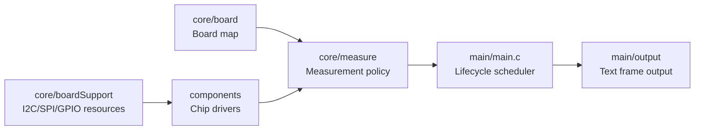
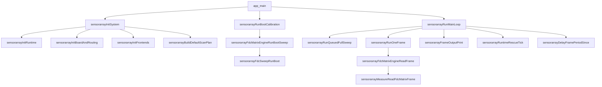
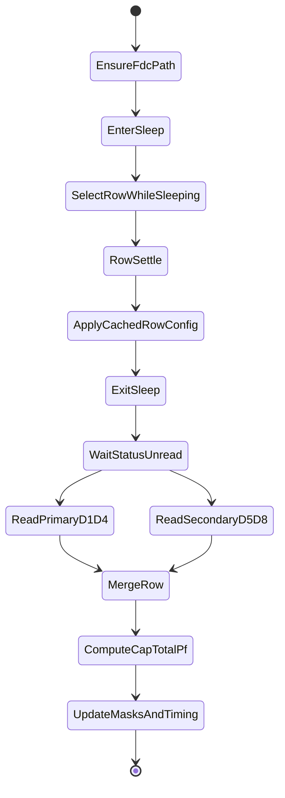
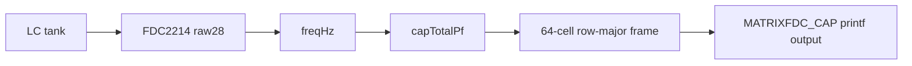

# SensorArray ESP32-S3 固件 / SensorArray ESP32-S3 Firmware

## 目录 / Table of contents

- [当前源码树状态 / Current source-tree status](#当前源码树状态--current-source-tree-status)
- [项目目标 / Project purpose](#项目目标--project-purpose)
- [当前实现状态 / Current implementation status](#当前实现状态--current-implementation-status)
- [硬件拓扑 / Hardware topology](#硬件拓扑--hardware-topology)
- [软件架构 / Software architecture](#软件架构--software-architecture)
- [函数级生命周期 / Function-level lifecycle](#函数级生命周期--function-level-lifecycle)
- [配置项 / Configuration options](#配置项--configuration-options)
- [关键数据结构 / Key data structures](#关键数据结构--key-data-structures)
- [FDC 矩阵读取路径 / FDC matrix read path](#fdc-矩阵读取路径--fdc-matrix-read-path)
- [路由安全与 ADS/FDC 互斥 / Route safety and ADS/FDC mutual exclusion](#路由安全与-adsfdc-互斥--route-safety-and-adsfdc-mutual-exclusion)
- [帧格式与无效值策略 / Frame format and invalid data policy](#帧格式与无效值策略--frame-format-and-invalid-data-policy)
- [调试日志与控制命令 / Diagnostic logs and console commands](#调试日志与控制命令--diagnostic-logs-and-console-commands)
- [编译、烧录和监视 / Build, flash, and monitor](#编译烧录和监视--build-flash-and-monitor)
- [已知约束 / Known constraints](#已知约束--known-constraints)
- [文件地图 / File map](#文件地图--file-map)

## 当前源码树状态 / Current source-tree status

### 中文

本文档描述当前源码树的主要固件结构、运行链路、配置项和调试方法。最终真源是源码本身，尤其是 `main/Kconfig.projbuild`、`main/sensorarrayConfig.h`、`main/main.c`、`core/measure/`、`core/board/` 和各组件头文件。README 正文不写死具体 commit 号。

### Australian English

This document describes the firmware structure, runtime flow, configuration options, and diagnostic workflow for the current source tree. The final source of truth is the code itself, especially `main/Kconfig.projbuild`, `main/sensorarrayConfig.h`, `main/main.c`, `core/measure/`, `core/board/`, and the component headers. The README body does not pin a specific commit hash.

## 项目目标 / Project purpose

### 中文

SensorArray 固件运行在 ESP32-S3 上，当前主路径是读取 8 x 8 FDC2214 电容矩阵。固件把板级路由、芯片驱动、测量策略和应用调度拆开：板级映射定义硬件语义，组件驱动只访问芯片，`core/measure` 负责测量策略，`main` 负责生命周期编排和输出调用。

### Australian English

SensorArray firmware runs on ESP32-S3. The current main path reads an 8 x 8 FDC2214 capacitance matrix. The firmware keeps board routing, chip drivers, measurement policy, and application scheduling separate: board mapping defines hardware meaning, component drivers only access chips, `core/measure` owns measurement policy, and `main` orchestrates lifecycle and output calls.

## 当前实现状态 / Current implementation status

| 路径 / Path | 当前状态 / Current status | 说明 / Notes |
|---|---|---|
| FDC2214 8 x 8 cap matrix | 主运行路径 / main runtime path | `sensorarrayFdcMatrixEngineReadFrame()` delegates to `sensorarrayMeasureReadFdcMatrixFrame()`. |
| ADS1262/ADS1263 matrix | 初始化和 API 存在，frame read returns unsupported / initialisation and APIs exist, frame read returns unsupported | `sensorarrayAdsMatrixEngineReadFrame()` initialises an invalid frame and returns `ESP_ERR_NOT_SUPPORTED`. |
| Mixed row mode | Thin pass-through to FDC path / thin pass-through to FDC path | `sensorarrayMixedRowEngineReadFrame()` currently calls the FDC matrix engine. |
| Text output | 默认主输出 / default main output | `main/output/sensorarrayFrameOutput.c` prints `FDC_FRAME_OUTPUT`, `MATRIXFDC_CAP`, optionally `MATRIXFDC_FREQ` and `DEBUGFDC_RAW`. |
| Binary transport | 非默认且未实现发送 / not default and send is unsupported | `sensorarrayFastSpeedSetEnabled(false)` runs at init; `sensorarrayTransportSendFdcMatrixFrame()` returns `ESP_ERR_NOT_SUPPORTED`. |
| Runtime console commands | 当前源码树未发现注册 / not found in this source tree | No `esp_console_cmd_register` call is present. Profile and discard setters are C APIs, not serial commands. |

## 硬件拓扑 / Hardware topology

### 中文

板级映射是硬件语义的唯一真源。D-line、FDC 通道、SELA/SELB 逻辑电平和 ADS mux 的含义由 `core/board/sensorarrayBoardMap.c` 定义，不由芯片驱动定义。

### Australian English

The board map is the single source of truth for hardware meaning. D-line ownership, FDC channels, SELA/SELB logic levels, and ADS mux meaning are defined by `core/board/sensorarrayBoardMap.c`, not by chip drivers.

| 硬件 / Hardware | 在本项目中的作用 / Role in this project |
|---|---|
| ESP32-S3 | 主 MCU，运行 ESP-IDF 应用、FreeRTOS 任务、I2C/SPI/GPIO 控制和 printf 输出。 / Main MCU running the ESP-IDF app, FreeRTOS tasks, I2C/SPI/GPIO control, and printf output. |
| TMUX1108 | S1..S8 行选择和 SW GND/REF 源选择；`tmuxSwitchSelectRow(row - 1)` 选择当前行。 / Selects S1..S8 rows and SW GND/REF source; `tmuxSwitchSelectRow(row - 1)` selects the current row. |
| TMUX1134 | 前端路由开关；SELA 选择 ADS1263 或 FDC2214 分支，SELB 按板级 FDC 策略选择，EN 使能路由。 / Front-end route switch; SELA selects ADS1263 or FDC2214 branch, SELB follows the board FDC policy, and EN enables the route. |
| FDC2214 primary | D1-D4，CH0-CH3，默认 I2C 地址 `0x2B`。 / D1-D4, CH0-CH3, default I2C address `0x2B`. |
| FDC2214 secondary | D5-D8，CH0-CH3，默认 I2C 地址 `0x2A`。 / D5-D8, CH0-CH3, default I2C address `0x2A`. |
| ADS1262/ADS1263 | ADS 前端和 SPI driver 已存在；FDC matrix mode 下由 measurement layer 停止转换、关闭 internal reference 和 VBIAS。 / ADS frontend and SPI driver exist; in FDC matrix mode the measurement layer stops conversion and turns internal reference and VBIAS off. |
| LM27762 / negative rail | 原理图/资料中的模拟电源背景；当前源码树没有专用运行时 driver。 / Analogue power context from schematic/datasheets; no dedicated runtime driver in this source tree. |
| TPS631000 / 3.3 V rail | 电源架构背景；`core/powerCtrl` 只提供 GPIO abstraction。 / Power architecture context; `core/powerCtrl` only provides GPIO abstraction. |
| BQ24074 / charger | 充电器硬件背景；当前源码树没有 charger protocol driver。 / Charger hardware context; no charger protocol driver in this source tree. |
| USB Type-C | 供电/串口监视入口，实际传输仍以 printf text 为默认。 / Power and serial monitor entry; actual runtime transport defaults to printf text. |
| FPC/FFC connector | 传感阵列连接器，S/D 语义由 board map 解释。 / Sensor-array connector; S/D meaning is interpreted by the board map. |

矩阵索引为行优先：

```text
index = (sIndex - 1) * 8 + (dIndex - 1)
S1D1, S1D2, ..., S1D8, S2D1, ..., S8D8
D1-D4 -> primary FDC2214 CH0-CH3
D5-D8 -> secondary FDC2214 CH0-CH3
```

## 软件架构 / Software architecture



| 层 / Layer | 路径 / Path | 负责 / Owns | 不负责 / Does not own |
|---|---|---|---|
| Application | `main/main.c` | app lifecycle, safe idle, boot calibration call, main loop, frame output call | chip registers, matrix routing algorithm, board map |
| Output | `main/output` | text frame formatting and future output adapter boundary | measurement state mutation |
| Board map | `core/board` | S/D mapping, SELA/SELB meaning, ADS mux meaning, route audit logs | generic chip access |
| Board support | `core/boardSupport` | I2C bus install/delete, I2C callbacks, guarded timeout recovery | FDC rescue policy |
| Measurement | `core/measure` | route policy, ADS/FDC mutual exclusion, FDC frame builder, row epoch, rescue decisions | low-level register names as public policy |
| FDC engine facade | `core/measure/fdc/sensorarrayFdcMatrix.c` | thin engine wrapper | actual scanning algorithm |
| FDC sweep/rescue | `core/measure/fdc/sensorarrayFdcSweep.c`, `sensorarrayFdcRescue.c` | boot sweep, cache construction, rescue throttling | app lifecycle |
| Chip drivers | `components/fdc2214Cap`, `components/ads126xAdc`, `components/tmuxSwitch` | FDC I2C, ADS SPI, GPIO primitives | rows, D-line meaning, frame output, rescue strategy |
| Transport | `transport/*` | protocol/transport scaffolding | current production frame output |

## 函数级生命周期 / Function-level lifecycle



| 函数 / Function | 输入 / Input | 主要副作用 / Main side effects | 失败处理 / Failure handling | 相关配置 / Related config |
|---|---|---|---|---|
| `app_main()` | global `s_appContext` | clears context, runs init, boot calibration, main loop | init failure prints `APP_FATAL` and enters safe idle; boot failure sets diagnostic mode when boot sweep is required | `CONFIG_SENSORARRAY_FDC_BOOT_SWEEP_REQUIRED` |
| `sensorarrayInitRuntime()` | `sensorarrayAppContext_t *ctx` | clears ctx, disables fast-speed output, sets `runtimeMode = SENSORARRAY_RUNTIME_MODE_FDC_MATRIX`, parses FDC I2C addresses and channel count | invalid ctx returns `ESP_ERR_INVALID_ARG` | `CONFIG_SENSORARRAY_FDC_PRIMARY_I2C_ADDR`, `CONFIG_SENSORARRAY_FDC_SECONDARY_I2C_ADDR`, `CONFIG_FDC2214CAP_CHANNELS` |
| `sensorarrayInitBoardAndRouting()` | app context state | runs `boardSupportInit()`, `tmuxSwitchInit()`, `sensorarrayBoardMapAudit()`, default TMUX route | board support failure returns fatal init error; TMUX failure returns error | `CONFIG_BOARD_I2C*`, `CONFIG_TMUX*` |
| `sensorarrayInitFrontends()` | app context state | initialises ADS, assigns FDC I2C contexts, initialises primary/secondary FDC, logs parallel bus config, initialises engines and rescue context | engine init failure aborts init; individual FDC state is tracked in `state.fdcPrimary/Secondary.ready` | `CONFIG_SENSORARRAY_FDC_PARALLEL_DUAL_BUS_READ`, `CONFIG_ADS126X_*` |
| `sensorarrayBuildDefaultScanPlan()` | app context | builds 8 rows x 8 cells with `SENSORARRAY_CELL_OP_FDC_CAP` | no error return | `CONFIG_SENSORARRAY_MATRIX_ROWS`, `CONFIG_SENSORARRAY_MATRIX_COLS` |
| `sensorarrayRunBootCalibration()` | app context | checks FDC readiness, runs boot sweep, sets `fdcBootSweepOk` and `fdcDiagnosticMode` | primary missing is fatal; secondary missing is fatal only when dual FDC is required; boot sweep failure is fatal when required | `CONFIG_SENSORARRAY_REQUIRE_DUAL_FDC_FOR_BOOT`, `CONFIG_SENSORARRAY_FDC_BOOT_SWEEP_REQUIRED` |
| `sensorarrayRunMainLoop()` | app context | consumes full-sweep requests, reads frames, prints diagnostics/output, ticks rescue, delays to frame period | diagnostic mode prints `MATRIXFDC_DIAG`; all-invalid frame triggers rescue tick; frame error logs `FRAME_ERROR` | `CONFIG_SENSORARRAY_FDC_MATRIX_PERIOD_MS`, rescue and timing configs |
| `sensorarrayRunQueuedFullSweep()` | app context | runs queued full matrix rescue via `sensorarrayFdcMatrixEngineRunFullRescue()` | skips while running, inside cooldown, or after max failed full sweeps; can force diagnostic mode | `CONFIG_SENSORARRAY_FDC_FULL_SWEEP_REQUEST_COOLDOWN_MS`, `CONFIG_SENSORARRAY_FDC_MAX_CONSECUTIVE_FULL_SWEEP_FAILS` |
| `sensorarrayRunOneFrame()` | app context | dispatches by `runtimeMode` | unsupported ADS mode returns `ESP_ERR_NOT_SUPPORTED`; unknown mode returns invalid state | runtime mode enum |
| `sensorarrayDelayFramePeriodSince()` | frame start timestamp, sequence | sleeps remaining period or prints `SCAN_TIMING_OVERRUN` | no return value | `CONFIG_SENSORARRAY_FDC_MATRIX_PERIOD_MS` |

## 配置项 / Configuration options

### 说明 / Notes

### 中文

`main/Kconfig.projbuild` 是项目自定义配置的主入口。`sensorarrayConfig.h` 为缺失配置提供编译 fallback；当 ESP-IDF Kconfig 生成 `sdkconfig.h` 时，以 Kconfig/defaults 为准。`sdkconfig.defaults` 和 `sdkconfig.defaults.esp32s3` 会覆盖部分 Kconfig default，例如当前默认 FDC frame period 为 `50 ms`，目标约 `20 fps`。如果把 period 改成 `250 ms`，目标帧率约为每秒 4 帧；真实帧率仍受 I2C、row settle、FDC conversion、日志输出和 rescue 活动影响。

### Australian English

`main/Kconfig.projbuild` is the main project configuration entry. `sensorarrayConfig.h` provides compile-time fallbacks for missing symbols; when ESP-IDF generates `sdkconfig.h`, Kconfig/defaults are authoritative. `sdkconfig.defaults` and `sdkconfig.defaults.esp32s3` override some Kconfig defaults. The current default FDC frame period is `50 ms`, or roughly a `20 fps` target. If the period is changed to `250 ms`, the target rate is about four frames per second; actual frame rate still depends on I2C, row settling, FDC conversion, logging, and rescue activity.

### Build and target configuration / 编译与目标配置

| 配置项 / Option | 类型 / Type | 默认值 / Default | 作用 / Purpose | 影响的函数 / Affected functions | 调整建议 / Tuning notes |
|---|---:|---:|---|---|---|
| `CONFIG_IDF_TARGET` | string | sdkconfig defaults: `esp32s3` | Selects ESP-IDF target. | ESP-IDF build system | Keep `esp32s3` for this board. |
| `CONFIG_ESPTOOLPY_FLASHSIZE_16MB` | bool | sdkconfig defaults: y | Sets flash size profile. | ESP-IDF flashing/partition handling | Match physical module flash. |
| `CONFIG_ESP_MAIN_TASK_STACK_SIZE` | int | sdkconfig defaults: `16384` | Main task stack size. | `app_main()`, FreeRTOS startup | Lower only after stack high-water logs are reviewed. |
| `CONFIG_FREERTOS_CHECK_STACKOVERFLOW_CANARY` | bool | sdkconfig defaults: y | Enables stack overflow checking. | FreeRTOS runtime | Keep enabled during bring-up. |
| `CONFIG_FREERTOS_WATCHPOINT_END_OF_STACK` | bool | sdkconfig defaults: y | Uses watchpoint at stack end. | FreeRTOS runtime | Keep enabled for debug builds. |
| `CONFIG_HEAP_POISONING_LIGHT` | bool | sdkconfig defaults: y | Adds heap corruption checks. | ESP-IDF heap | Useful for diagnostics; may add overhead. |
| `CONFIG_COMPILER_STACK_CHECK_MODE_STRONG` | choice | sdkconfig defaults: strong | Compiler stack checking. | all compiled C code | Keep strong unless measuring release performance. |
| `CONFIG_SENSORARRAY_ENABLE_WIRED` | bool | Kconfig: y | Enables wired transport option. | transport build paths | Current default output still uses printf text. |
| `CONFIG_SENSORARRAY_ENABLE_BLE` | bool | Kconfig: y | Enables BLE transport option. | BLE transport build paths | Disable when BLE task/memory budget is not required. |
| `CONFIG_SENSORARRAY_SCAN_TASK_CORE`, `CONFIG_SENSORARRAY_SCAN_TASK_STACK`, `CONFIG_SENSORARRAY_SCAN_TASK_PRIO` | int | `1`, `8192`, `12` | Scheduling defaults for scan work. | worker/task config defaults | Keep scan work away from comm/BLE unless core affinity needs debugging. |
| `CONFIG_SENSORARRAY_COMM_TASK_CORE`, `CONFIG_SENSORARRAY_COMM_TASK_STACK`, `CONFIG_SENSORARRAY_COMM_TASK_PRIO` | int | `0`, `4096`, `8` | Scheduling defaults for communication work. | transport/task config defaults | Increase stack if future transport code adds deeper call chains. |
| `CONFIG_SENSORARRAY_BLE_TASK_CORE` | int | `0` | BLE task core when BLE is enabled. | BLE transport task config | Current BLE transport is placeholder only. |

### FDC matrix configuration / FDC 矩阵配置

| 配置项 / Option | 类型 / Type | 默认值 / Default | 作用 / Purpose | 影响的函数 / Affected functions | 调整建议 / Tuning notes |
|---|---:|---:|---|---|---|
| `CONFIG_SENSORARRAY_FDC_PRIMARY_I2C_ADDR` | hex | Kconfig: `0x2B` | Primary FDC for D1-D4. | `sensorarrayInitRuntime()`, `sensorarrayInitFdcDevice()` | Change only if hardware address strap changes. |
| `CONFIG_SENSORARRAY_FDC_SECONDARY_I2C_ADDR` | hex | Kconfig: `0x2A` | Secondary FDC for D5-D8. | `sensorarrayInitRuntime()`, `sensorarrayInitFdcDevice()` | Change only if hardware address strap changes. |
| `CONFIG_SENSORARRAY_FDC_STARTUP_PROBE` | bool | Kconfig: y | Enables startup probe path where used by bring-up. | `sensorarrayBringupProbeFdcBus()` | Keep enabled while validating hardware. |
| `CONFIG_FDC2214CAP_CHANNELS` | int | component Kconfig: `4` | Requested FDC channel count. | `sensorarrayInitRuntime()`, `sensorarrayBringupNormalizeFdcChannels()` | Current matrix expects 4 channels per FDC. Fewer channels reduce matrix completeness and are normalised upward by app init. |
| `CONFIG_SENSORARRAY_FDC_TANK_INDUCTOR_NH` | int | Kconfig and defaults: `18000` | LC tank inductor for `freqHz -> capTotalPf`. | `sensorarrayMeasureComputeFdcFrameCapTotalPf()`, `sensorarrayMeasureFdcComputeCapacitancePf()` | Must match hardware. Wrong L shifts pF values but does not change `raw28`. Formula: `C = 1 / ((2 * pi * f)^2 * L)`. |
| `CONFIG_SENSORARRAY_FDC_TANK_INDUCTOR_UH` | int | Kconfig: `0` | Legacy/optional sweep conversion input. | `sensorarrayFdcSweep.c` | Prefer `CONFIG_SENSORARRAY_FDC_TANK_INDUCTOR_NH` for MATRIXFDC pF output. |
| `CONFIG_SENSORARRAY_FDC_REF_CLOCK_USE_EXTERNAL`, `CONFIG_SENSORARRAY_FDC_REF_CLOCK_USE_EXTERNAL_VALUE` | bool/int | Kconfig: external y, value `1` | Selects external FDC reference clock path. | `sensorarrayConfig.h`, FDC frequency conversion helpers | Keep aligned with actual CLKIN. |
| `CONFIG_SENSORARRAY_FDC_EXTERNAL_CLOCK_HZ` | int | Kconfig: `40000000` | External CLKIN frequency in Hz. | `sensorarrayMeasureFdcEffectiveFclkHz()` | Wrong clock value skews frequency and capacitance conversion. |
| `CONFIG_SENSORARRAY_MATRIX_ROWS`, `CONFIG_SENSORARRAY_MATRIX_COLS` | int | Kconfig: `8`, `8` | Logical matrix size. | `sensorarrayScanPlanBuildDefaultFdcMatrix()`, frame arrays | Current frame type is fixed for 64 cells; treat changes as architecture work. |
| `CONFIG_SENSORARRAY_FRAME_PERIOD_MS` | int | Kconfig: `CONFIG_SENSORARRAY_FDC_MATRIX_PERIOD_MS`; header fallback `250` if absent | Generic frame-period fallback. | `sensorarrayConfig.h` | For current FDC path, tune `CONFIG_SENSORARRAY_FDC_MATRIX_PERIOD_MS` directly. |
| `CONFIG_SENSORARRAY_OVERSAMPLE` | int | Kconfig: `1` | Generic oversample default. | scan/matrix defaults | Current FDC production path uses row epoch logic rather than a generic oversample loop. |

### FDC timing and frame-rate configuration / FDC 时序与帧率配置

| 配置项 / Option | 类型 / Type | 默认值 / Default | 作用 / Purpose | 影响的函数 / Affected functions | 调整建议 / Tuning notes |
|---|---:|---:|---|---|---|
| `CONFIG_SENSORARRAY_FDC_MATRIX_PERIOD_MS` | int | Kconfig and defaults: `50` | Target period for one 64-cell text frame. | `sensorarrayFdcFramePeriodMs()`, `sensorarrayDelayFramePeriodSince()` | Lower values raise target fps but increase overrun risk. `250 ms` means about `4 fps`. |
| `CONFIG_SENSORARRAY_FDC_MATRIX_TARGET_FPS` | int | Kconfig/defaults: `20` | Timing budget target used in profiling. | `SENSORARRAY_FDC_TARGET_FRAME_US`, timing logs | Keep consistent with frame period when comparing `SCAN_TIMING_*`. |
| `CONFIG_SENSORARRAY_FDC_MATRIX_SETTLE_US` | int | Kconfig/defaults: `1000` | Settle delay for some path/ADS helper paths. | `sensorarrayMeasurePrepareFdcMatrixPath()`, ADS helper paths, sweep paths | Lower only after verifying route stability and invalid-frame rate. |
| `CONFIG_SENSORARRAY_FDC_ROW_SWITCH_SETTLE_US` | int | Kconfig/defaults: `50` | Row settle delay while FDC devices are sleeping. | `sensorarrayMeasureSelectFdcRowWhileSleeping()` | Too low can increase row-to-row mixing, amplitude warnings, or invalid rows. |
| `CONFIG_SENSORARRAY_FDC_MATRIX_DISCARD_SAMPLES` | int | Kconfig: `0`, sdkconfig.defaults: `1` | Discard count used by legacy/direct paths. | ADS/FDC helper code | Keep low in row epoch mode; excessive discard hurts fps. |
| `CONFIG_SENSORARRAY_FDC_DISCARD_FRAMES_AFTER_ROW_SWITCH` | int | Kconfig/defaults: `0` | Runtime autoscan frame discard count after row switch. | `sensorarrayMeasureFdcDiscardFrames()`, discard helper | Production sleep-epoch path defaults to zero discard frames. |
| `CONFIG_SENSORARRAY_FDC_ROW_EPOCH_RESTART_ENABLE` | bool | Kconfig/defaults: y | Enables per-row conversion epoch restart. | row epoch helpers | Keep enabled for current row isolation strategy. |
| `CONFIG_SENSORARRAY_FDC_ROW_EPOCH_RESTART_METHOD_SLEEP` | bool | Kconfig/defaults: y | Uses `CONFIG.SLEEP_MODE_EN` for row restart. | `sensorarrayMeasureFdcSetSleepMode()` | Current stable path uses sleep entry/exit rather than SD pin reset. |
| `CONFIG_SENSORARRAY_FDC_DIFF_CACHE_APPLY` | bool | Kconfig/defaults: y | Applies only changed cached FDC row registers while devices are sleeping. | `sensorarrayMeasureApplyFdcCachedRowConfig()` | Keep enabled to reduce per-row I2C writes. |
| `CONFIG_SENSORARRAY_FDC_CACHE_APPLY_VERBOSE_LOG` | bool | defaults: n | Prints verbose no-diff/skipped cache logs. | `sensorarrayFdcCacheApply.inc` | Enable only when debugging cache fingerprints; it adds log load. |
| `CONFIG_SENSORARRAY_FDC_SETTLECOUNT_DEFAULT` | hex | Kconfig: `0x0080` | Conservative default FDC SETTLECOUNT. | cache/sweep channel config | Lower only after valid conversions are stable. |
| `CONFIG_SENSORARRAY_FDC_ROW_WAIT_SAFETY_US` | int | Kconfig: `500` | Safety margin after one autoscan cycle. | FDC wait/sweep helpers | Increase when DRDY/unread timing is marginal. |

### FDC sweep and rescue configuration / FDC 扫描与救援配置

| 配置项 / Option | 类型 / Type | 默认值 / Default | 作用 / Purpose | 影响的函数 / Affected functions | 调整建议 / Tuning notes |
|---|---:|---:|---|---|---|
| `CONFIG_SENSORARRAY_FDC_BOOT_SWEEP_REQUIRED` | bool | Kconfig: y | Requires boot sweep success before normal output. | `sensorarrayRunBootCalibration()`, `sensorarrayFdcSweepRunBoot()` | Disable only for degraded bring-up; normal operation should require a valid boot cache. |
| `CONFIG_SENSORARRAY_REQUIRE_DUAL_FDC_FOR_BOOT` | bool | Kconfig/defaults: y | Requires both FDC devices at boot. | `sensorarrayRunBootCalibration()` | If disabled, secondary absence allows primary-only D1-D4 output while D5-D8 are invalid. |
| `CONFIG_SENSORARRAY_FDC_SWEEP_STEP_TIMEOUT_MS` | int | Kconfig: `180` | Timeout per sweep candidate. | `sensorarrayFdcSweep.c` | Increase for slow/noisy oscillators; too high can block boot/rescue. |
| `CONFIG_SENSORARRAY_FDC_SWEEP_TOTAL_TIMEOUT_MS` | int | Kconfig: `2500` | Bounded timeout per channel sweep. | `sensorarrayFdcSweep.c` | Higher values improve chance of finding a valid candidate but delay recovery. |
| `CONFIG_SENSORARRAY_FDC_SWEEP_SETTLE_MS` | int | Kconfig: `20` | Settle after applying sweep candidate. | `sensorarrayFdcSweep.c` | Lower for speed only after raw and warning stability are confirmed. |
| `CONFIG_SENSORARRAY_FDC_SWEEP_SAMPLE_TIMEOUT_MS` | int | Kconfig: `80` | Wait timeout for sweep sample. | `sensorarrayMeasureWaitFdcAutoscanFrameReady()`, sweep reads | Increase if sweep samples time out before unread bits appear. |
| `CONFIG_SENSORARRAY_FDC_SWEEP_SAMPLE_POLL_MS` | int | Kconfig: `2` | Poll interval for sweep sample. | `sensorarrayFdcSweep.c` | Lower increases bus/log pressure; higher slows sweep. |
| `CONFIG_SENSORARRAY_FDC_DIRECT_FAIL_THRESHOLD` | int | Kconfig: `3` | Direct-read failures before fast sweep consideration. | `sensorarrayFdcSweep.c` | Raise to avoid unnecessary sweeps; lower to recover faster. |
| `CONFIG_SENSORARRAY_FDC_CELL_FAST_SWEEP_FAIL_THRESHOLD` | int | Kconfig/defaults: `2` | Cell failures before bounded fast sweep escalation. | `sensorarrayFdcSweepRunFullRescueCell()` | Tune with hard-error rate. |
| `CONFIG_SENSORARRAY_FDC_FAST_FAIL_THRESHOLD` | int | Kconfig: `2` | Fast sweep failures before full rescue. | FDC sweep/rescue helpers | Lower makes full rescue more aggressive. |
| `CONFIG_SENSORARRAY_FDC_FAST_SWEEP_COOLDOWN_MS` | int | Kconfig/defaults: `30000` | Cooldown between fast sweeps for a cell. | `sensorarrayFdcSweep.c` | Increase to reduce runtime disruption; lower for faster recovery. |
| `CONFIG_SENSORARRAY_FDC_FAST_SWEEP_MIN_COOLDOWN_MS` | int | Kconfig: `30000`, sdkconfig.defaults: `1000` | Minimum automatic runtime fast-sweep cooldown. | `sensorarrayFdcSweep.c` | The sdkconfig default intentionally allows quicker runtime recovery than the Kconfig default. |
| `CONFIG_SENSORARRAY_FDC_RUNTIME_FAST_SWEEP_ENABLE` | bool | Kconfig/defaults: y | Allows automatic runtime fast sweeps. | `sensorarrayMeasureRequestFdcCellRescue()` | Disable to study raw failure behaviour without automatic fast rescue. |
| `CONFIG_SENSORARRAY_FDC_FULL_SWEEP_REQUEST_COOLDOWN_MS` | int | Kconfig/defaults: `5000` | Cooldown for queued full sweep requests. | `sensorarrayRunQueuedFullSweep()`, `sensorarrayFdcSweepReportAllInvalidFrame()` | Prevents repeated full sweeps from blocking main loop. |
| `CONFIG_SENSORARRAY_FDC_MAX_CONSECUTIVE_FULL_SWEEP_FAILS` | int | Kconfig/defaults: `3` | Full rescue failures before diagnostic mode. | `sensorarrayRunQueuedFullSweep()` | Raise only if hardware often recovers after repeated full sweeps. |
| `CONFIG_SENSORARRAY_FDC_FULL_RESCUE_COOLDOWN_MS` | int | Kconfig/defaults: `3000` | Full-matrix rescue cooldown in sweep layer. | `sensorarrayFdcSweep.c` | Co-ordinate with queued full-sweep cooldown. |
| `CONFIG_SENSORARRAY_FDC_FULL_SWEEP_RESCUE_COOLDOWN_MS` | int | Kconfig: `10000` | Cell/full-sweep rescue cooldown legacy path. | `sensorarrayFdcSweep.c` | Keep higher than fast local rescue to avoid heavy scans. |
| `CONFIG_SENSORARRAY_FDC_NO_OSC_RESCUE_COOLDOWN_MS` | int | Kconfig: `500` | No-oscillation rescue cooldown. | FDC sweep/rescue helpers | Lower only when false no-oscillation is rare. |
| `CONFIG_SENSORARRAY_FDC_ALL_INVALID_RESCUE_THRESHOLD` | int | Kconfig/defaults: `3` | All-invalid threshold for rescue policy. | `sensorarrayFdcRescueTick()`, `sensorarrayFdcSweep.c` | Lower triggers full recovery sooner but can mask timing issues. |
| `CONFIG_SENSORARRAY_FDC_ALL_INVALID_FULL_SWEEP_THRESHOLD` | int | Kconfig/defaults: `3` | All-invalid threshold before full sweep queue. | `sensorarrayFdcSweepReportAllInvalidFrame()` | Keep aligned with rescue threshold unless debugging. |
| `CONFIG_SENSORARRAY_FDC_ALL_INVALID_RESTART_THRESHOLD` | int | Kconfig: `3` | Legacy/diagnostic threshold for repeated invalid frames. | FDC rescue paths | Treat as diagnostic guard. |
| `CONFIG_SENSORARRAY_FDC_ROW_RESCUE_FAIL_COUNT` | int | Kconfig/defaults: `4` | Per-row fail count hint for rescue diagnostics. | FDC sweep/rescue diagnostics | Adjust for row-level noisy hardware. |
| `CONFIG_SENSORARRAY_FDC_RESCUE_TASK_STACK` | int | Kconfig/defaults: `12288` | Reserved rescue task stack bytes. | rescue task paths if used | Keep large enough for register dump/sweep diagnostics. |

### FDC I2C and parallel-worker configuration / FDC I2C 与并行 worker 配置

| 配置项 / Option | 类型 / Type | 默认值 / Default | 作用 / Purpose | 影响的函数 / Affected functions | 调整建议 / Tuning notes |
|---|---:|---:|---|---|---|
| `CONFIG_BOARD_I2C_PORT`, `CONFIG_BOARD_I2C_SDA_GPIO`, `CONFIG_BOARD_I2C_SCL_GPIO` | int | `0`, `9`, `10` | Primary I2C bus pins and port. | `boardSupportInit()` | Match board wiring. |
| `CONFIG_BOARD_I2C_FREQ_HZ`, `CONFIG_BOARD_I2C0_FREQ_HZ` | int | defaults: `337500` | Primary bus frequency. | `boardSupportInit()`, timing estimates | Higher is not always more stable; watch NACK, timeout, and SCL stretch. |
| `CONFIG_BOARD_I2C1_ENABLE`, `CONFIG_BOARD_I2C1_PORT`, `CONFIG_BOARD_I2C1_SDA_GPIO`, `CONFIG_BOARD_I2C1_SCL_GPIO`, `CONFIG_BOARD_I2C1_FREQ_HZ` | bool/int | y, `1`, `11`, `12`, `337500` | Optional second I2C bus for secondary FDC. | `boardSupportIsI2c1Enabled()`, `sensorarrayLogFdcParallelCfg()` | True parallel worker mode needs a valid second bus on a different port. |
| `CONFIG_SENSORARRAY_FDC_PARALLEL_DUAL_BUS_READ` | bool | Kconfig/defaults: y | Enables worker-based primary/secondary row reads when dual buses are available. | `sensorarrayMeasureReadFdcMatrixFrame()`, row epoch workers | Same bus or worker init failure falls back to serial. |
| `CONFIG_SENSORARRAY_FDC_WORKER_TASK_STACK` | int | Kconfig: `6144` | Static worker stack bytes. | `sensorarrayMeasureEnsureFdcWorkers()` | Increase if worker stack logs show low margin. |
| `CONFIG_SENSORARRAY_FDC_WORKER_TASK_PRIO` | int | Kconfig: `CONFIG_SENSORARRAY_SCAN_TASK_PRIO` | Worker task priority. | worker task creation | Keep near scan priority to reduce skew. |
| `CONFIG_SENSORARRAY_FDC_WORKER_TASK_CORE` | int | Kconfig: `-1` | Worker core affinity; `-1` means unpinned. | `sensorarrayMeasureEnsureFdcWorkers()` | `-1` uses unpinned static task creation; pinned mode needs valid CPU ID. |
| `CONFIG_SENSORARRAY_FDC_WORKER_SYNC_TIMEOUT_MS` | int | Kconfig: `25` | Queue/sleep/done sync timeout. | `sensorarrayMeasureReadFdcMatrixRowParallelEpoch()` | Increase if workers time out despite valid I2C. |
| `CONFIG_SENSORARRAY_I2C_RECOVERY_ENABLED` | bool | boardSupport/defaults: y | Guarded I2C bus recovery after timeout and stuck bus pins. | `boardSupportI2cShouldRecover()`, `boardSupportRecoverI2cBus()` | Recovery is not attempted for plain NACKs. |
| `CONFIG_SENSORARRAY_I2C_RECOVERY_COOLDOWN_MS` | int | defaults: `1000` | Cooldown between recovery attempts. | `boardSupportRecoverI2cBus()` | Lower only for lab recovery tests. |
| `CONFIG_SENSORARRAY_I2C_RECOVERY_MAX_FAILS` | int | defaults: `3` | Recovery failures before marking bus offline. | `boardSupportI2cMarkOffline()` | Raise if physical bus recovery is slow but possible. |
| `CONFIG_SENSORARRAY_I2C_RECOVERY_TOGGLE_CLOCKS` | int | defaults: `9` | SCL pulses during recovery. | `boardSupportI2cPulseRecoveryClock()` | Match common I2C recovery practice unless board demands otherwise. |
| `CONFIG_SENSORARRAY_I2C_RECOVER_ON_TIMEOUT` | bool | Kconfig: n, header fallback `0` | Legacy project-level timeout recovery symbol. | `sensorarrayConfig.h` compatibility | Current board recovery path uses `CONFIG_SENSORARRAY_I2C_RECOVERY_ENABLED` and related boardSupport options. |

### Output and logging configuration / 输出与日志配置

| 配置项 / Option | 类型 / Type | 默认值 / Default | 作用 / Purpose | 影响的函数 / Affected functions | 调整建议 / Tuning notes |
|---|---:|---:|---|---|---|
| `CONFIG_SENSORARRAY_FDC_EMIT_CAP_TOTAL_PF` | bool | Kconfig/defaults: y | Legacy compatibility symbol. | Kconfig compatibility | Use text output unit choice for new builds. |
| `CONFIG_SENSORARRAY_FDC_TEXT_OUTPUT_CAP_TOTAL_PF` | choice bool | default selected | Emits `MATRIXFDC_CAP`. | `sensorarrayFrameOutputPrintText()` | Default host path. |
| `CONFIG_SENSORARRAY_FDC_TEXT_OUTPUT_FREQ_HZ` | choice bool | default n | Emits only `MATRIXFDC_FREQ`. | `sensorarrayFrameOutputPrintText()` | Use for frequency diagnostics; pF output disabled in this mode. |
| `CONFIG_SENSORARRAY_FDC_TEXT_OUTPUT_BOTH_SEPARATE` | choice bool | default n | Emits separate cap and freq lines. | `sensorarrayFrameOutputPrintText()` | Doubles text output volume. |
| `CONFIG_SENSORARRAY_FDC_TEXT_OUTPUT_BOTH_INLINE_DEBUG` | choice bool | default n | Emits inline debug line with freq and cap. | `sensorarrayFrameOutputPrintText()` | Debug only; high serial load. |
| `CONFIG_SENSORARRAY_FDC_RAW_DEBUG_LOG` | bool | defaults: n | Emits `DEBUGFDC_RAW`. | `sensorarrayFrameOutputPrintText()` | Enable only for raw-data debugging. |
| `CONFIG_SENSORARRAY_FDC_TIMING_SUMMARY_EVERY_N_FRAMES` | int | Kconfig/defaults: `10` | Runtime summary interval variable default. | `sensorarrayMeasureFdcProfileSetSummaryEvery()` | Lower increases log density. |
| `CONFIG_SENSORARRAY_FDC_TIMING_SUMMARY_PERIOD_FRAMES` | int | Kconfig/defaults: `10` | Aggregate `SCAN_TIMING_10` period. | `sensorarrayMeasureUpdateFdcTimingAggregate()` | Set 0 to suppress aggregate summary. |
| `CONFIG_SENSORARRAY_FDC_TIMING_SUMMARY_AGGREGATE` | bool | Kconfig/defaults: y | Enables aggregate timing summaries. | timing aggregate functions | Keep enabled during performance work. |
| `CONFIG_SENSORARRAY_FDC_TIMING_OVERRUN_IMMEDIATE_LOG` | bool | Kconfig/defaults: y | Prints bottleneck on frame overrun. | `sensorarrayMeasurePrintFdcBottleneck()` | Useful when testing lower frame periods. |
| `CONFIG_SENSORARRAY_FDC_TIMING_VERBOSE_PER_FRAME` | bool | defaults: n | Enables per-frame timing summary when profile summary is on. | `sensorarrayMeasurePrintFdcTimingSummary()` | High log volume; affects frame rate. |
| `CONFIG_SENSORARRAY_FDC_PROFILE_ROW_DEFAULT`, `CONFIG_SENSORARRAY_FDC_PROFILE_DEVICE_DEFAULT` | bool | defaults: n | Default row/device timing logs. | `sensorarrayMeasurePrintFdcRowTiming()`, `sensorarrayMeasurePrintFdcDeviceTiming()` | Enable only when detailed timing is needed. |
| `CONFIG_SENSORARRAY_FDC_I2C_TRACE_RING_SIZE` | int | defaults: `128` | Ring size for FDC I2C trace records. | `Fdc2214CapI2cTrace*()` | Larger rings use more RAM; trace dumps occur on errors/overruns when enabled. |
| `CONFIG_FDC2214CAP_LOW_LEVEL_I2C_TRACE`, `CONFIG_FDC2214CAP_RAW_I2C_TRACE` | bool | component Kconfig: n | Driver-level I2C/register printf trace. | `components/fdc2214Cap/fdc2214Cap.c` | Avoid in normal matrix reads because printf can dominate timing. |

### ADS configuration / ADS 配置

| 配置项 / Option | 类型 / Type | 默认值 / Default | 作用 / Purpose | 影响的函数 / Affected functions | 调整建议 / Tuning notes |
|---|---:|---:|---|---|---|
| `CONFIG_SENSORARRAY_ADS1262`, `CONFIG_SENSORARRAY_ADS1263` | choice | default `ADS1262` | Selects ADS126x variant. | ADS bring-up and conditional ADC2 handling | Match installed chip; ADC2 stop is conditional for ADS1263. |
| `CONFIG_ADS126X_LOG_LEVEL` | int | `3` | ADS component log level. | `components/ads126xAdc/ads126xAdc.c` | Raise only for driver diagnostics. |
| `CONFIG_ADS126X_SPI_CLOCK_HZ` | int | `2000000` | ADS SPI clock. | ADS SPI transactions | Increase only after DRDY/read reliability is verified. |
| `CONFIG_ADS126X_HAS_ADC2` | bool | y | Builds ADC2 API support. | `ads126xAdcStartAdc2()`, `ads126xAdcStopAdc2()` | ADS1262 returns not supported for ADC2 use. |
| `CONFIG_ADS126X_HELPER_CREATE_SPI` | bool | n | Builds helper SPI create/destroy functions. | `ads126xAdcHelperCreateSpiDevice()` | Keep disabled in project integration. |
| `CONFIG_SENSORARRAY_SPI_USE_DMA` | bool | y | Allows SPI DMA. | ADS SPI helper/device config | Keep enabled unless diagnosing DMA issues. |
| `CONFIG_SENSORARRAY_SPI_MAX_TRANSFER_BYTES` | int | `64` | ADS SPI transfer buffer size. | `ads126xAdcInit()` | Increase only if larger SPI transactions are added. |
| `CONFIG_BOARD_SPI_HOST`, `CONFIG_BOARD_SPI_SCLK_GPIO`, `CONFIG_BOARD_SPI_MOSI_GPIO`, `CONFIG_BOARD_SPI_MISO_GPIO`, `CONFIG_BOARD_ADS126X_CS_GPIO`, `CONFIG_BOARD_ADS126X_DRDY_GPIO`, `CONFIG_BOARD_ADS126X_RESET_GPIO` | int | host `2`, SCLK `47`, MOSI `21`, MISO `14`, CS `-1`, DRDY `13`, RESET `38` | Board SPI and ADS control pins. | board bring-up and ADS init | Match board wiring. |
| `CONFIG_SENSORARRAY_ADS_READ_STOP1_BEFORE_MUX`, `CONFIG_SENSORARRAY_ADS_READ_SETTLE_AFTER_MUX_MS`, `CONFIG_SENSORARRAY_ADS_READ_START1_EVERY_READ`, `CONFIG_SENSORARRAY_ADS_READ_BASE_DISCARD_COUNT`, `CONFIG_SENSORARRAY_ADS_READ_RETRY_COUNT` | bool/int | n, `0`, y, `0`, `0` | ADS read sequencing policy. | `sensorarrayMeasureReadAdsPairUv()`, `sensorarrayMeasureReadAdsUv()` | These affect ADS measurement paths, not the current FDC production frame. |

### Mixed-mode configuration / 混合模式配置

| 配置项 / Option | 类型 / Type | 默认值 / Default | 作用 / Purpose | 影响的函数 / Affected functions | 调整建议 / Tuning notes |
|---|---:|---:|---|---|---|
| `CONFIG_SENSORARRAY_MATRIX_ROWS`, `CONFIG_SENSORARRAY_MATRIX_COLS` | int | `8`, `8` | Shared scan-plan dimensions. | `sensorarrayScanPlanBuildMixedExample()` | Current mixed engine delegates to FDC read; changing dimensions needs frame redesign. |
| `CONFIG_SENSORARRAY_FRAME_PERIOD_MS`, `CONFIG_SENSORARRAY_OVERSAMPLE` | int | FDC period, `1` | Generic matrix defaults. | matrix/mixed Kconfig defaults | No separate mixed-mode runtime Kconfig was found in the current source tree. |
| `CONFIG_MATRIX_ROWS`, `CONFIG_MATRIX_COLS`, `CONFIG_MATRIX_FRAME_PERIOD_MS`, `CONFIG_MATRIX_OVERSAMPLE`, `CONFIG_MATRIX_USE_RINGBUFFER` | int/bool | derive from SensorArray defaults, ringbuffer y | Legacy/shared matrix engine settings. | `core/matrixEngine` | Current production path does not use matrixEngine for FDC frame output. |

### Safety and diagnostic configuration / 安全与诊断配置

| 配置项 / Option | 类型 / Type | 默认值 / Default | 作用 / Purpose | 影响的函数 / Affected functions | 调整建议 / Tuning notes |
|---|---:|---:|---|---|---|
| `CONFIG_SENSORARRAY_MEASURE_LOCK_TIMEOUT_MS` | int | `5000` | Measurement mutex timeout. | `sensorarrayMeasureTakeLock()` | Increase only if legitimate long measurements hold the lock. |
| `CONFIG_SENSORARRAY_FDC_SUPPRESS_ALL_ZERO_FRAMES` | bool | Kconfig n, header fallback `1` when absent | Suppresses all-zero invalid frames where code path uses it. | FDC invalid-frame handling | Prefer diagnostics over suppression during bring-up. |
| `CONFIG_SENSORARRAY_FDC_VERBOSE_REG_DUMP` | bool | Kconfig: y | Dumps FDC registers on boot/rescue failure. | `sensorarrayFdcSweepDumpAllDeviceRegs()` | Disable to reduce failure-time logs. |
| `CONFIG_SENSORARRAY_FDC_DIAG_DUMP_REGS` | bool | defaults: n | Dumps FDC registers while diagnostic mode is active. | `sensorarrayRunDiagnosticTick()` | Enable when remote diagnosis needs register snapshots. |
| `CONFIG_SENSORARRAY_FDC_DIAG_DUMP_INTERVAL_MS` | int | defaults: `5000` | Diagnostic register dump period. | `sensorarrayRunDiagnosticTick()` | Lower increases serial and I2C load. |
| `CONFIG_SENSORARRAY_FDC_DIAG_DUMP_SKIP_OFFLINE_BUS` | bool | defaults: y | Skips diagnostic dump when a bus is offline. | `sensorarrayRunDiagnosticTick()` | Keep enabled to avoid repeated offline-bus errors. |
| `CONFIG_SENSORARRAY_FDC_VERIFY_MODE_FULL`, `CONFIG_SENSORARRAY_FDC_VERIFY_MODE_STARTUP_ONLY`, `CONFIG_SENSORARRAY_FDC_VERIFY_MODE_NONE` | choice | default `STARTUP_ONLY` | Runtime register readback policy. | FDC cache/sweep apply paths | `FULL` is for debug; `NONE` is high-speed experimentation only. |
| `CONFIG_SENSORARRAY_FDC_HIGH_SPEED_PROFILE` | bool | defaults: n | Experimental lower RCOUNT/SETTLECOUNT candidates. | `sensorarrayFdcSweep.c` | Can improve speed at the cost of noise, warnings, and invalid frames. |
| `CONFIG_TMUX1108_*`, `CONFIG_TMUX1134_*` | int/bool | component Kconfig defaults | TMUX GPIO and default logic levels. | `tmuxSwitchInit()`, route functions | Board-specific; wrong polarity breaks FDC/ADS route safety. |
| `CONFIG_POWER_*` | int | `-1` defaults | Optional power-control GPIO abstraction. | `core/powerCtrl` | Current main lifecycle does not actively manage charger/rail ICs through this layer. |

### Low-frequency diagnostic options / 低频调试配置

| 配置项 / Option | 类型 / Type | 默认值 / Default | 作用 / Purpose | 影响的函数 / Affected functions | 调整建议 / Tuning notes |
|---|---:|---:|---|---|---|
| `CONFIG_SENSORARRAY_FDC_VERBOSE_SCAN_LOG` | bool | defaults: n | Verbose per-row scan logs. | FDC row/scan helpers | Enable briefly; text output can reduce actual fps. |
| `CONFIG_SENSORARRAY_FDC_INTB_ENABLE` | bool | defaults: y | Configures INTB GPIO plumbing, but formal matrix reads currently force FDC INTB output disabled and use polling-only readiness. | `sensorarrayMeasureAttachFdcIntb()`, `sensorarrayMeasureFdcConfigBaseWithoutSleep()` | INTB is a hint, not data validity. In this source tree, STATUS/unread polling is authoritative. |
| `CONFIG_SENSORARRAY_FDC_INTB1_GPIO`, `CONFIG_SENSORARRAY_FDC_INTB2_GPIO` | int | `17`, `18` | Primary/secondary INTB GPIO numbers. | INTB setup/logging helpers | Match wiring; does not replace STATUS/unread validation. |
| `CONFIG_SENSORARRAY_FDC_INTB_TRIGGER_ANYEDGE`, `CONFIG_SENSORARRAY_FDC_INTB_FALLBACK_POLLING`, `CONFIG_SENSORARRAY_FDC_INTB_WEAK_PULLUP`, `CONFIG_SENSORARRAY_FDC_INTB_DEBUG_LOG` | bool | y, y, n, n | INTB diagnostic plumbing. | INTB ISR setup and debug logs | Debug only in current formal polling path. |
| `CONFIG_SENSORARRAY_FDC_INTB_WAIT_TIMEOUT_US` | int | `10000` | Per row-device ready wait timeout. | `sensorarrayFdcWaitDeviceReady()`, parallel worker done wait | Increase when valid unread bits arrive late; lower to fail faster. |
| `CONFIG_SENSORARRAY_FDC_REAPPLY_CACHE_ON_WARNING` | bool | defaults: n | Allows cache reapply after amplitude warnings. | `sensorarrayMeasureFillFdcMatrixRow()` / frame build rescue decision | Enable only when amplitude warnings are persistent and fresh. |
| `CONFIG_SENSORARRAY_FDC_WARNING_REAPPLY_THRESHOLD`, `CONFIG_SENSORARRAY_FDC_WARNING_REAPPLY_ONCE_PER_FINGERPRINT`, `CONFIG_SENSORARRAY_FDC_WARNING_REAPPLY_COOLDOWN_FRAMES` | int/bool | `2`, y, `50` | Controls warning-driven cache sanity reapply. | FDC frame build warning path | Tune to avoid repeated reapply loops. |
| `CONFIG_SENSORARRAY_FDC_AMPLITUDE_FAST_SWEEP_THRESHOLD`, `CONFIG_SENSORARRAY_FDC_WARNING_FAST_SWEEP_COOLDOWN_MS` | int | `4`, `1000` | Fresh amplitude warnings before fast sweep and its cooldown. | FDC warning rescue decision | Lower only when warnings are strong predictors of invalid data. |
| `CONFIG_SENSORARRAY_FDC_RESCUE_HARD_ERROR_THRESHOLD` | int | `4` | Hard runtime errors before rescue scheduling. | `sensorarrayMeasureRequestFdcCellRescue()` | Lower makes rescue more aggressive. |
| `CONFIG_SENSORARRAY_FDC_DIRECT_QUALITY_SAMPLES` | int | `6` | Direct-read quality sample count. | `sensorarrayFdcSweep.c` | More samples improve quality scoring but slow sweeps. |
| `CONFIG_SENSORARRAY_FDC_TIMING_LOG_EVERY_N_FRAMES` | int | deprecated alias, `10` | Deprecated timing interval alias. | compatibility fallback | Use `CONFIG_SENSORARRAY_FDC_TIMING_SUMMARY_EVERY_N_FRAMES` instead. |

## 关键数据结构 / Key data structures

### `sensorarrayAppContext_t`

| 字段 / Field | 生命周期与含义 / Lifecycle and meaning |
|---|---|
| `runtimeMode` | Set in `sensorarrayInitRuntime()` to FDC matrix. Controls `sensorarrayRunOneFrame()` dispatch. |
| `state` | Holds board, ADS, FDC and cache state. Updated by board/front-end init and measurement paths. |
| `scanPlan` | Built by `sensorarrayBuildDefaultScanPlan()` as 8 rows x 8 FDC cap operations. |
| `frame` | Current `sensorarrayFrame_t`, filled by measurement path and printed by output path. |
| `fdcEngine`, `adsEngine` | Engine facades initialised in `sensorarrayInitFrontends()`. FDC facade delegates to measurement/sweep code. |
| `fdcRescue` | Runtime all-invalid rescue context, reset during frontend init and ticked after each frame. |
| `primaryAddrValid`, `secondaryAddrValid` | Results of FDC I2C address parsing during runtime init. |
| `requestedFdcChannels` | Normalised FDC autoscan channel count; current matrix requires 4. |
| `fdcBootSweepOk` | Set by `sensorarrayRunBootCalibration()`. Used in diagnostics. |
| `fdcDiagnosticMode` | Set on primary/required-secondary/required-boot failures or after too many full rescue failures. |
| `fdcFrameCounter` | Incremented once per main-loop frame read attempt. Also gates periodic stack/memory logs. |
| `failedRescueCount`, `rescueEpoch`, `lastFullRescueTimeUs`, `rescueRunning` | Full-sweep rescue throttle and diagnostic state used by `sensorarrayRunQueuedFullSweep()`. |

### `sensorarrayState_t`

| 字段 / Field | 生命周期与含义 / Lifecycle and meaning |
|---|---|
| `spiDevice`, `ads` | ADS SPI device/handle owned by board bring-up and ADS driver. |
| `adsReady`, `adsRefReady`, `adsAdc1Running`, `adsRefMuxValid`, `adsRefMux` | ADS state tracked so FDC route preparation can stop conversion and turn reference/VBIAS off. |
| `fdcPrimary`, `fdcSecondary` | Per-device FDC state for D1-D4 and D5-D8. |
| `fdcConfiguredChannels` | Requested/normalised FDC channel count. |
| `fdcCellCache[8][8]` | Per-cell FDC cache built by sweep/rescue paths. |
| `fdcAppliedRow[2]` | Per-device applied row-config shadow used for diff-only cache apply. |
| `boardReady`, `tmuxReady` | Set during board/routing init. Required by matrix readiness check. |

### `sensorarrayFdcDeviceState_t`

| 字段 / Field | 生命周期与含义 / Lifecycle and meaning |
|---|---|
| `label`, `i2cCtx`, `i2cAddr`, `handle`, `ready` | Device identity, bus context, I2C address, driver handle and readiness. |
| `haveIds`, `manufacturerId`, `deviceId`, `configVerified` | Bring-up diagnostics and ID/config verification state. |
| `refClockKnown`, `refClockSource`, `refClockHz` | Frequency conversion context. |
| `statusConfigReg`, `configReg`, `muxConfigReg` | Cached core registers used by runtime config and diagnostics. |
| `sweepProfile[4]` | Per-channel sweep profile information used during calibration/rescue. |

### `sensorarrayFrame_t` / `sensorarrayFdcMatrixFrame_t`

| 字段 / Field | 生命周期与含义 / Lifecycle and meaning |
|---|---|
| `timestampUs`, `sequence` | Initialised in `sensorarrayMeasureInitFdcMatrixFrame()`. |
| `freqHz[64]`, `capTotalPf[64]`, `raw28[64]` | Row-major cell data. Invalid `freqHz`/`capTotalPf` starts at `-1`. |
| `clockDividers[64]`, `driveCurrent[64]`, `deglitchCode[64]`, `effectiveFclkHz[64]` | Per-cell runtime config snapshot. |
| `validMask`, `capValidMask`, `freshMask`, `warnMask`, `errorMask` | Bit `i` maps to `index = (s - 1) * 8 + (d - 1)`. |
| `hardwareZeroRawCount`, `placeholderZeroCount`, `validCount`, `freshCount` | Frame quality counters. |
| `firstReadErr`, `firstBadRow`, `firstBadDevice`, `firstBadStatus`, `firstBadUnread` | First error diagnostics used by all-invalid logs and rescue. |

### FDC cache and rescue fields / FDC cache 与救援字段

`sensorarrayFdcCellConfigCache_t` stores per-cell cached RCOUNT, SETTLECOUNT, CLOCK_DIVIDERS, DRIVE_CURRENT, deglitch code, quality score, warning/error counters, timestamps, pending reapply/rescue flags, and degraded state. `sensorarrayFdcAppliedRowConfig_t` stores the last applied per-row/per-device register set and fingerprint so unchanged registers are skipped. `sensorarrayFdcRescueContext_t::allInvalidSequence` counts consecutive all-invalid frames and selects restore/resync/full-sweep actions.

## FDC 矩阵读取路径 / FDC matrix read path

### 函数级拆解 / Function-level breakdown

`sensorarrayMeasureReadFdcMatrixFrame()` is the production frame reader. Its current flow is:

1. Validate `outFrame`, initialise it with invalid sentinels, then validate `state`.
2. Take the global measurement mutex using `sensorarrayMeasureTakeLock()`.
3. Run `sensorarrayMeasureCheckFdcMatrixReady()`: board, TMUX, ADS and primary FDC must be ready; secondary absence is logged and treated as primary-only degraded operation.
4. Reset FDC I2C stats and read primary/secondary bus metadata.
5. Decide parallel eligibility from `CONFIG_SENSORARRAY_FDC_PARALLEL_DUAL_BUS_READ`, both buses, different ports and worker availability.
6. Run `sensorarrayMeasureEnsureFdcMatrixPath(state, "fdc_matrix_frame")`; abort with `MATRIXFDC_DIAG,stage=read_abort` if route preparation fails.
7. Initialise workers on first eligible parallel frame. On worker init/queue/read failure, print `FDC_PARALLEL_FALLBACK` and continue serial.
8. Run the formal precheck once when secondary is available.
9. For each row S1..S8, create one row epoch and read primary D1-D4 plus secondary D5-D8 by parallel or serial row-epoch helper.
10. Call `sensorarrayMeasureFillFdcMatrixRow()` to merge row samples into masks, raw values, frequencies and warning/error fields.
11. Accumulate timing, warning, I2C and rescue health.
12. Compute `capTotalPf` from `freqHz` and `CONFIG_SENSORARRAY_FDC_TANK_INDUCTOR_NH`.
13. Print timing summaries/bottlenecks when profile settings require them.
14. Release the measurement mutex.
15. If `validMask == 0`, print all-invalid diagnostics, report all-invalid frame to sweep/rescue, and return an error. Otherwise return the first row/path error, or `ESP_OK`.

### Row epoch state machine / Row epoch 状态机

One row equals one conversion epoch. Parallel mode aligns primary and secondary worker jobs for the same row, but it is I2C/task parallelism, not a mathematical guarantee that both chips sampled at the exact same instant.



Relevant functions include `sensorarrayMeasureReadFdcMatrixRowParallelEpoch()`, `sensorarrayMeasureReadFdcMatrixRowSerialEpoch()`, `sensorarrayMeasureFdcSetSleepMode()`, `sensorarrayMeasureSelectFdcRowWhileSleeping()`, `sensorarrayMeasureApplyFdcCachedRowConfig()`, `sensorarrayMeasureFdcRunDeviceEpochAfterSleep()`, `sensorarrayFdcWaitDeviceReady()`, `sensorarrayMeasureReadFdcAutoscan4chMasked()` and `sensorarrayMeasureFillFdcMatrixRow()`.

### Data/output pipeline / 数据输出流水线



### INTB and STATUS / INTB 与 STATUS

INTB is only a data-ready hint. It is not sufficient on its own. STATUS, unread bits, DRDY and register validity must still be checked. In the current source tree the formal matrix ready mode is `polling_only` and the FDC CONFIG INTB output is forced disabled by `sensorarrayMeasureFdcConfigBaseWithoutSleep()`, so STATUS/unread polling is the authoritative readiness path.

中文：INTB 只是数据就绪提示，不等于该数据一定完整有效。当前正式矩阵读取以 STATUS/unread polling 为准。

## 路由安全与 ADS/FDC 互斥 / Route safety and ADS/FDC mutual exclusion

`sensorarrayMeasurePrepareFdcMatrixPath()` and `sensorarrayMeasureEnsureFdcMatrixPath()` are the FDC capacitance route safety gate.

FDC mode requires:

```text
SW -> GND source
SELA -> FDC2214 path
SELB -> board-defined FDC policy
TMUX1134 EN -> enabled
ADS conversion stopped
ADS internal reference off
ADS VBIAS off
```

`sensorarrayMeasureEnsureFdcMatrixPath()` first reads the current commanded/observed control state and ADS ref state. It only calls `sensorarrayMeasurePrepareFdcMatrixPath()` when it finds a mismatch. Relevant logs include:

```text
FDC_PATH,stage=ads_stop
FDC_PATH,stage=ads_stop2
FDC_PATH,stage=ads_ref_off
FDC_PATH,stage=ads_vbias_off
FDC_PATH,stage=tmux1134_fdc
FDC_PATH,stage=selb_fdc
FDC_PATH,stage=sw_gnd
FDC_PATH,stage=tmux1108_enable
FDC_PATH,stage=prepare_done
FDC_PATH,stage=ensure_mismatch
FDC_PATH,stage=ensure_ok        # only when verbose scan logging is enabled
```

This is a measurement-layer policy. The ADS driver does not decide when ADS must be off for FDC; it only exposes `ads126xAdcStopAdc1()`, `ads126xAdcStopAdc2()`, `ads126xAdcSetRefMux()`, `ads126xAdcSetVbiasEnabled()` and related chip-level APIs.

## 帧格式与无效值策略 / Frame format and invalid data policy

Default text output is capacitance:

```text
FDC_FRAME_OUTPUT,seq=<n>,frameQuality=<full|partial>,partial=<0|1>,capValidMask=0x...,errorMask=0x...,invalidSentinel=-1.000000
MATRIXFDC_CAP,seq=<n>,timestampUs=<us>,partial=<0|1>,frameQuality=<full|partial>,capValidMask=0x...,freshMask=0x...,warnMask=0x...,errorMask=0x...,invalidSentinel=-1.000000,capTotalPf=[...64 values...]
```

Optional frequency output is compiled when `CONFIG_SENSORARRAY_FDC_TEXT_OUTPUT_FREQ_HZ` or `CONFIG_SENSORARRAY_FDC_TEXT_OUTPUT_BOTH_SEPARATE` is selected:

```text
MATRIXFDC_FREQ,seq=<n>,timestampUs=<us>,validMask=0x...,warnMask=0x...,errorMask=0x...,freqHz=[...64 values...]
```

Raw debug output is compiled only when `CONFIG_SENSORARRAY_FDC_RAW_DEBUG_LOG` is enabled:

```text
DEBUGFDC_RAW,seq=<n>,timestampUs=<us>,raw28=[...64 values...]
```

Invalid policy:

- `-1.000000` is the invalid sentinel for `capTotalPf` and invalid `freqHz` initialisation.
- `0 pF` must not be treated as invalid unless a separate display layer explicitly documents it as a placeholder.
- `raw28 == 0` from a fresh sample increments `hardwareZeroRawCount` and is invalid for FDC capacitance.
- `capValidMask` is set only after valid raw/frequency data successfully converts to pF.
- `warnMask` marks degraded but still usable data, such as amplitude warning cases that remain fresh and non-zero.
- `errorMask` marks cells with I2C errors, missing unread conversion, zero raw, watchdog fault, saturation, or failed capacitance conversion.

## 调试日志与控制命令 / Diagnostic logs and console commands

### 实际日志 / Actual logs

The current source tree emits these relevant log tags or lines:

```text
APP_INIT
APP_FATAL
APP_FDC_BOOT
APP_FDC
APP_MEM
APP_STACK
BOARD_I2C_CFG
BOARD_I2C_READY
BOARD_I2C_XFER
BOARD_I2C_ERR
BOARD_I2C_RECOVERY
ROUTEMAP
FDCMAP
FDC_FATAL
FDC_BUS_WARN
FDC_PATH
FDC_PARALLEL_CFG
FDC_PARALLEL_WARN
FDC_PARALLEL_FALLBACK
FDC_FORMAL_PRECHECK
FDC_ROW_EPOCH
FDC_READY
FDC_DEVICE_READ4
FDC_ROW_COMMIT
FDC_ROW_PARTIAL
FDC_RESCUE
FDC_RESCUE_DECISION
FDC_RESCUE_SUPPRESSED
FDC_FRAME_OUTPUT
MATRIXFDC_CAP
MATRIXFDC_FREQ
MATRIXFDC_DIAG
DEBUGFDC_RAW
SCAN_TIMING_FRAME
SCAN_TIMING_10
SCAN_TIMING_OVERRUN
FRAME_ERROR
```

### Console commands / 控制命令

Current source search found no `esp_console_cmd_register` call. Therefore these command names are not documented as user-callable console commands in this source tree:

| 名称 / Name | 当前源码树状态 / Current source-tree status |
|---|---|
| `force_full_sweep` | Not present as a registered console command / 当前未发现注册为 console command |
| `fdc_diag` | Not present as a registered console command / 当前未发现注册为 console command |
| `fdc_boot_sweep` | Not present as a registered console command / 当前未发现注册为 console command |
| `fdc_rescue` | Not present as a registered console command / 当前未发现注册为 console command |
| `fdc_period_ms` | Not present as a registered console command / 当前未发现注册为 console command |
| `fdc_profile` | Not present as a registered console command; profile setters exist as C APIs / 未注册为 console command；存在 C API setter |
| `fdc_i2c_trace` | Not present as a registered console command; trace control exists as C APIs in `fdc2214Cap` / 未注册为 console command；trace 控制是 C API |
| `fdc_discard_frames` | Not present as a registered console command; `sensorarrayMeasureFdcSetDiscardFrames()` exists as C API / 未注册为 console command；存在 C API |

## 编译、烧录和监视 / Build, flash, and monitor

### Windows PowerShell ESP-IDF 环境 / Windows PowerShell ESP-IDF environment

This is the recommended Windows/PowerShell workflow for this project:

```powershell
$env:IDF_PATH = "C:\Espressif\frameworks\esp-idf-v5.5.1"
$env:IDF_PYTHON_ENV_PATH = "C:\Espressif\python_env\idf5.5_py3.11_env"

$pythonDir = "C:\Espressif\python_env\idf5.5_py3.11_env\Scripts"
$cmakeDir = "C:\Espressif\tools\cmake\3.30.2\bin"
$ninjaDir = "C:\Espressif\tools\ninja\1.12.1"
$gccDir = "C:\Espressif\tools\xtensa-esp-elf\esp-14.2.0_20241119\xtensa-esp-elf\bin"

$env:Path = "$pythonDir;$cmakeDir;$ninjaDir;$gccDir;C:\Espressif\frameworks\esp-idf-v5.5.1\tools;$env:Path"

function idf {
    & "$pythonDir\python.exe" "$env:IDF_PATH\tools\idf.py" @args
}

idf --version
python --version
cmake --version
ninja --version
xtensa-esp32s3-elf-gcc --version

cd C:\ESP32\SensorArray
idf build
idf -p COMx flash monitor
```

New-board flash:

```powershell
idf -p COMx erase-flash
idf -p COMx flash monitor
```

Readback verification:

```powershell
python -m esptool --chip esp32s3 -p COMx read_flash 0x0 0x100 flash_0x0_after.bin
```

正常情况下 readback 不应全是 `FF`。ESP image header 常见起始 byte 为 `E9`。

In normal cases the readback should not be all `FF`. ESP image headers commonly start with byte `E9`.

## 已知约束 / Known constraints

- Current production output is text. Binary transport is not the default and the current send stub returns unsupported.
- Primary FDC absence is a serious boot error. Secondary FDC absence can be primary-only only when dual-FDC boot is not required.
- ADS matrix read is not a production frame path in this source tree.
- Mixed row mode currently delegates to FDC matrix read.
- Formal FDC matrix readiness is polling-only in the current source tree, even though INTB GPIO plumbing exists.
- High-density text logs affect frame rate, serial stability, and timing measurements.
- FDC pF values depend on `CONFIG_SENSORARRAY_FDC_TANK_INDUCTOR_NH`; raw28 does not.
- Changing matrix dimensions, binary output, or mixed ADS/FDC scheduling is architecture work, not a README-level setting.

## 文件地图 / File map

| 路径 / Path | 说明 / Description |
|---|---|
| `main/main.c` | Application lifecycle orchestration, boot calibration call, main loop, safe idle. |
| `main/output/` | Text frame output. |
| `main/Kconfig.projbuild` | Main project Kconfig. |
| `main/sensorarrayConfig.h` | Compile-time fallback defaults and hardware constants. |
| `main/sensorarrayTypes.h` | Shared types, frame fields, board/FDC/ADS state. |
| `core/board/` | Board map and bring-up helpers. |
| `core/boardSupport/` | I2C/SPI/GPIO resource ownership and I2C recovery. |
| `core/measure/sensorarrayMeasure.c` | Measurement route policy, FDC frame reader, ADS helper includes, profile setters. |
| `core/measure/fdc/sensorarrayFdcMatrix.c` | Thin FDC engine facade. |
| `core/measure/fdc/sensorarrayFdcSweep.c` | Boot sweep, cache calibration, rescue sweep implementation. |
| `core/measure/fdc/sensorarrayFdcRescue.c` | Runtime all-invalid rescue policy. |
| `core/measure/fdc/*.inc` | FDC row epoch, cache apply, read4, frame build, conversion helpers. |
| `core/measure/ads/` | ADS measurement helpers and ADS matrix engine stub. |
| `core/measure/mixed/` | Mixed row engine stub delegating to FDC path. |
| `components/fdc2214Cap/` | Chip-level FDC2214/FDC2212 I2C driver. |
| `components/ads126xAdc/` | Chip-level ADS126x SPI driver. |
| `components/tmuxSwitch/` | GPIO/control primitive layer for TMUX1108/TMUX1134. |
| `transport/` | Transport/protocol scaffolding, not current default frame output. |
| `docs/architecture.md` | Short architecture notes. |
| `datasheets/` | Reference PDFs and schematic images. |
| `example/` | Standalone examples, not part of main firmware lifecycle. |
