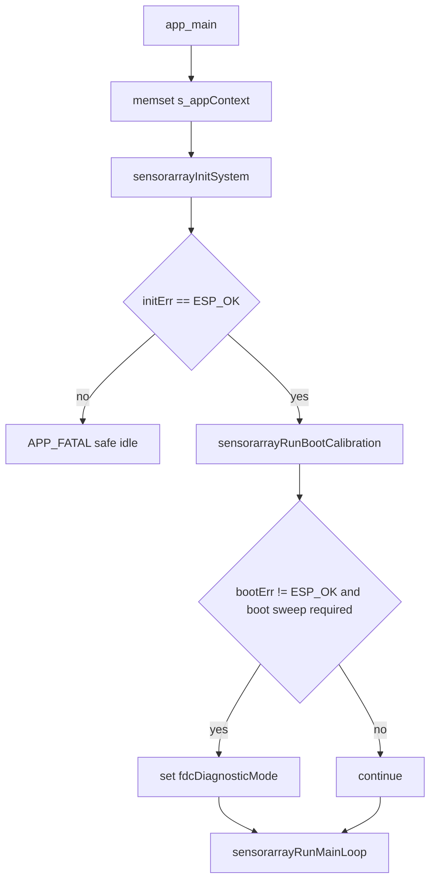

# main component - 应用层生命周期编排 / Application-layer Lifecycle Orchestration

## 目录 / Table of contents

- [中文说明 / Chinese documentation](#中文说明--chinese-documentation)
- [Australian English documentation](#australian-english-documentation)
- [应用层相关配置 / Application-level configuration](#应用层相关配置--application-level-configuration)
- [边界 / Boundaries](#边界--boundaries)

## 中文说明 / Chinese documentation

### 职责

`main/main.c` 是 SensorArray 固件的应用层编排文件。它负责：

- 初始化全局 `sensorarrayAppContext_t`。
- 顺序调用 runtime、board/routing、frontend 和 scan-plan 初始化。
- 调用 FDC boot sweep。
- 进入不返回的主循环。
- 在 init fatal、boot fatal、diagnostic mode、all-invalid frame 和 frame error 时输出应用层日志。
- 将当前帧发布给 `sensorarrayLogTask`，由异步日志任务调用 `sensorarrayFrameOutputPrint()` 输出文本。

它不直接实现 FDC 扫描算法、ADS 采样算法、板级映射或芯片寄存器访问。

### `sensorarrayAppContext_t`

| 字段 | 含义与生命周期 |
|---|---|
| `runtimeMode` | `sensorarrayInitRuntime()` 设置为 `SENSORARRAY_RUNTIME_MODE_FDC_MATRIX`；`sensorarrayRunOneFrame()` 用它选择 FDC/ADS/mixed 分支。 |
| `state` | `sensorarrayState_t`，保存 board/TMUX/ADS/FDC readiness、FDC cache 和 applied row shadow。 |
| `scanPlan` | `sensorarrayBuildDefaultScanPlan()` 构建默认 8 x 8 FDC cap scan plan。 |
| `frame` | 当前输出帧，FDC 路径填充后由主循环复制到 async snapshot ring，`sensorarrayLogTask` 再格式化打印。 |
| `fdcEngine` | FDC matrix engine facade；read/boot/full-rescue 调用会转交 `core/measure/fdc` 和 `core/measure`。 |
| `adsEngine` | ADS matrix engine facade；当前 read frame 返回 unsupported invalid frame。 |
| `fdcRescue` | `sensorarrayFdcRescueContext_t`，主循环每帧后调用 `sensorarrayRuntimeRescueTick()` 更新。 |
| `primaryAddrValid`, `secondaryAddrValid` | FDC I2C address 解析结果。 |
| `requestedFdcChannels` | FDC autoscan 通道数，当前矩阵需要 4 通道。 |
| `fdcBootSweepOk` | boot sweep 成功后为 true；诊断输出会引用。 |
| `fdcDiagnosticMode` | primary missing、required secondary missing、required boot sweep failure 或 repeated full rescue failure 后进入。 |
| `fdcFrameCounter` | 主循环每次读帧后递增，也用于每 100 帧输出 stack/memory 日志。 |
| `failedRescueCount` | full sweep rescue 失败次数。 |
| `rescueEpoch` | queued full rescue epoch 计数。 |
| `lastFullRescueTimeUs` | 上次 full rescue 结束时间，用于 cooldown。 |
| `rescueRunning` | 防止重复进入 full rescue。 |
| `asyncLogReady`, `legacySyncOutput` | 控制主循环使用异步 frame snapshot 输出，或在异步初始化失败时明确退回 legacy 同步输出。 |
| `runtimeI2cErrorStreak` | 连续 runtime I2C 错误帧计数；达到阈值后才允许重新执行 ICLK probe/fallback。 |

### `app_main()` 顺序

### `sensorarrayInitSystem()`

| 阶段 | 调用 | 成功副作用 | 失败表现 |
|---|---|---|---|
| Runtime | `sensorarrayInitRuntime(ctx)` | 清空 ctx，关闭 fast-speed output，设置 FDC matrix runtime mode，解析 FDC 地址和通道数。 | 返回错误，`app_main()` 进入 `APP_FATAL` safe idle。 |
| Board/routing | `sensorarrayInitBoardAndRouting(ctx)` | 初始化 `boardSupport`、`tmuxSwitch`，打印 board map audit，应用默认 TMUX route。 | boardSupport 失败打印 `APP_INIT_FATAL`，整体 init 失败。 |
| Frontends | `sensorarrayInitFrontends(ctx)` | 初始化 ADS，分配 primary/secondary FDC I2C context，初始化 FDC/ADS engines 和 rescue context。 | engine init 失败会整体 init 失败；单颗 FDC readiness 由 state 记录。 |
| Scan plan | `sensorarrayBuildDefaultScanPlan(ctx)` | 构建 S1..S8、D1..D8 的 FDC cap scan plan。 | 无错误返回。 |

### Boot calibration

`sensorarrayRunBootCalibration(ctx)` 的真实行为：

- primary FDC 不 ready：设置 `fdcBootSweepOk=false`、`fdcDiagnosticMode=true`，engine diagnostic mode 打开，打印 `FDC_FATAL,reason=primary_not_ready`，返回 `ESP_ERR_INVALID_STATE`。
- secondary FDC 不 ready 且 `CONFIG_SENSORARRAY_REQUIRE_DUAL_FDC_FOR_BOOT=y`：进入 diagnostic mode，打印 `FDC_FATAL,reason=secondary_not_ready_require_dual`，返回错误。
- secondary FDC 不 ready 且不要求 dual FDC：打印 `FDC_BUS_WARN` 和 `APP_FDC,stage=boot_sweep_skip`，允许 D1-D4 primary-only 继续。
- 两颗 FDC ready：调用 `sensorarrayFdcMatrixEngineRunBootSweep()`，再由 engine 调用 `sensorarrayFdcSweepRunBoot()`。
- boot sweep 失败且 required：打印 `FDC_FATAL,reason=boot_sweep_failed`，`app_main()` 会设置 diagnostic mode。
- boot sweep 失败但不 required：清掉 diagnostic mode，打印 warning，继续主循环。

### Main loop

主循环每次迭代按这个顺序运行：

1. `sensorarrayRunQueuedFullSweep(ctx)` 消费 queued full sweep request。该函数检查 `failedRescueCount`、`rescueRunning` 和 `CONFIG_SENSORARRAY_FDC_FULL_SWEEP_REQUEST_COOLDOWN_MS`。
2. 每 100 帧输出 `APP_STACK` 和 `APP_MEM`。
3. 如果 `ctx->fdcDiagnosticMode` 或 engine diagnostic mode 为 true，调用 `sensorarrayRunDiagnosticTick(ctx)`，打印 `MATRIXFDC_DIAG,stage=diagnostic_mode`，然后延时 1 秒并跳过正常读帧。
4. 记录 `frameStartUs`。
5. `sensorarrayRunOneFrame(ctx)` 根据 runtime mode 分发。默认 FDC path 调用 `sensorarrayFdcMatrixEngineReadFrame()`，后者调用 `sensorarrayMeasureReadFdcMatrixFrame()`。
6. `fdcFrameCounter++`。
7. 如果 `ctx->frame.capValidMask == 0`，发布 `MATRIXFDC_DIAG,stage=all_invalid_frame` 事件；如果 frame read 返回错误但仍有有效 cell，发布 `FRAME_ERROR` 事件。异步日志未运行时才同步打印。
8. 调用 `sensorarrayAsyncLogPublishFrameSnapshot(&ctx->frame, measureFrameUs)`。采样侧只复制二进制 `sensorarrayFrame_t`，不格式化 64 个 pF 字符串。
9. `sensorarrayRuntimeRescueTick(ctx)` 对 FDC/mixed mode 调用 `sensorarrayFdcRescueTick()`。
10. `sensorarrayRuntimeI2cFallbackTick(ctx)` 只在连续 I2C 错误超过阈值后触发 ICLK runtime re-probe。
11. `sensorarrayDelayFramePeriodSince(ctx, frameStartUs, ctx->frame.sequence)` 按 `CONFIG_SENSORARRAY_FDC_MATRIX_PERIOD_MS` 延时；若超时发布 `OV` 事件。

### 异步日志架构

- Producer：`sensorarrayRunMainLoop()` / FDC measurement path。每帧完成后只发布 snapshot，不执行 Cap 文本格式化，不等待串口输出。
- Consumer：`sensorarrayLogTask`。该低优先级任务负责 `Cap`、`S`/`OT`、`LOG20` 和异步事件的 `printf`。
- Frame snapshot：`main/output/sensorarrayAsyncLog.c` 使用固定大小 slot ring，默认 `CONFIG_SENSORARRAY_ASYNC_LOG_FRAME_SLOTS=4`。snapshot 包含完整 `sensorarrayFrame_t`，因此保留 sequence、timestampUs、64 个 `capTotalPf`、raw/frequency/status/mask 和健康计数。
- Drop policy：普通 Cap frame 队列满时默认丢旧保新，递增 `droppedOutputFrames`；采样任务不会因为日志落后而阻塞。
- Event queue：异常事件走 `CONFIG_SENSORARRAY_ASYNC_LOG_EVENT_QUEUE_LEN=32` 的非阻塞队列。队列满时递增 `droppedEventLogs`，后续 `LOG20` 汇报。
- 为什么异步：Cap 每帧 64 个 6 位小数文本输出在实板上约 65 ms；同步输出会阻塞下一帧 FDC 读取。异步后用 `measureFps` 看采样帧率，用 `outputFps` 看串口输出帧率。

### 日志策略和字段

- `Cap,s=<sequence>,t=<timestamp>,q=<quality>,pf=[...]` 每个可输出 frame 输出一次，仍为 64 个 pF 值，仍使用 6 位小数。
- `T/R/Q/I/CA/P/S/OT/BN` 类统计默认改为每 20 帧输出；`APP_STACK`/`APP_MEM` 仍按 100 帧级别输出。
- 正常 `FR`/`WP`/`FDC_EPOCH` 不应高频输出；异常、timeout、I2C fault、ready mismatch、cache/config verify mismatch 等才即时输出。
- `LOG20` 是异步日志任务汇总行，字段包括 `measureFps`、`outputFps`、`frameAgeAvgUs`、`frameAgeMaxUs`、`outputQueueDepth`、`qDepthMax`、`droppedOutputFrames`、`droppedEventLogs`、`outUsAvg`、`outUsMax`、`measureFrameUsAvg`。
- legacy `fu` 是主循环周期，不等于 FDC 转换时间；async 模式优先看 `measureFps`、`outputFps`、`frameAge*` 和 drop counters。

### I2C clock fallback

- bring-up 默认先尝试 350000 Hz，然后按 337500、325000、300000 回退。
- bus0 和 bus1 独立锁定，日志格式为 `ICLK,stage=probe|fallback|locked|verify,...`；不会 silent fallback。
- 每档会重复读取 FDC manufacturer/device ID 8 次，全部通过才锁定。runtime 只有连续 I2C 错误帧达到 `CONFIG_BOARD_I2C_RUNTIME_FALLBACK_ERROR_FRAMES` 后才重新 probe，单次错误不会降速。

### FDC2214 read constraint

正式数据路径必须按 `DATA_CHx -> DATA_LSB_CHx` 顺序读取：CH0 `0x00 -> 0x01`、CH1 `0x02 -> 0x03`、CH2 `0x04 -> 0x05`、CH3 `0x06 -> 0x07`。禁止把从 `0x00` 连续读 16 bytes 作为正式路径；旧 read-registers/burst 回调已删除。

### 验证流程

1. 在 PowerShell 设置 ESP-IDF 5.5.1 环境后运行 `idf build`。
2. 运行 `idf -p COM11 flash monitor`，必要时先 `idf -p COM11 erase-flash`。
3. monitor 至少观察 90 秒，确认 `APP_LOG_INIT,mode=async`、`ICLK ... locked`、`Cap` 每帧 64 个 6 位小数、`LOG20` 中 `measureFps`/`outputFps` 分离。
4. 检查 `S20`/`S` 中 `vc=64`、`fc=64`、`ic=0`，`I20`/I2C 统计中 `retry/nack/to/recovery` 正常为 0，`droppedOutputFrames`/`droppedEventLogs` 可解释且不会阻塞采样。
5. 已知限制：USB serial/JTAG 带宽不足时 `outputFps` 可能低于 `measureFps`；这不代表测量未加速，应同时看 `frameAge*` 和 drop counters。bus0 物理链路较慢时，测量上限仍可能被 bus0/I2C/row epoch 限制。

### Failure behaviour

| 场景 | 行为 |
|---|---|
| init failure | `APP_FATAL,stage=init`，进入 1 秒 safe idle heartbeat，不重启。 |
| primary FDC missing | boot fatal，diagnostic mode。 |
| secondary FDC missing | 如果 required dual FDC 则 boot fatal；否则 primary-only degraded operation。 |
| boot sweep failure | required 时 diagnostic mode；not required 时 warning 并继续。 |
| runtime all-invalid frame | 输出 diagnostic frame，`sensorarrayFdcRescueTick()` 先 restore autoscan，再 soft resync/cache dirty，之后 queue full sweep。 |
| queued full sweep repeated failure | 达到 `CONFIG_SENSORARRAY_FDC_MAX_CONSECUTIVE_FULL_SWEEP_FAILS` 后进入 diagnostic mode。 |

## Australian English documentation

### Responsibility

`main/main.c` is the application orchestration file for the SensorArray firmware. It owns global context initialisation, ordered subsystem initialisation, boot sweep invocation, the non-returning main loop, application-level failure logs, and publishing frame snapshots to the asynchronous output task.

It does not implement the FDC scan algorithm, ADS sampling algorithm, board map, or chip register access.

### `sensorarrayAppContext_t`

| Field | Meaning and lifecycle |
|---|---|
| `runtimeMode` | Set by `sensorarrayInitRuntime()` to `SENSORARRAY_RUNTIME_MODE_FDC_MATRIX`; used by `sensorarrayRunOneFrame()` dispatch. |
| `state` | Board, TMUX, ADS, FDC readiness, FDC cache, and applied-row state. |
| `scanPlan` | Default 8 x 8 FDC cap scan plan built during init. |
| `frame` | Current output frame filled by the measurement layer and copied into the async output snapshot ring. |
| `fdcEngine` | Thin FDC facade delegating boot/read/full-rescue work to `core/measure`. |
| `adsEngine` | ADS facade; current frame read returns an unsupported invalid frame. |
| `fdcRescue` | Runtime all-invalid rescue context ticked after each frame. |
| `primaryAddrValid`, `secondaryAddrValid` | FDC I2C address parse results. |
| `requestedFdcChannels` | Normalised FDC channel count; the matrix expects four channels per FDC. |
| `fdcBootSweepOk` | True only when the boot sweep transport succeeds and boot quality is `OK`. |
| `fdcBootSummary` | Last boot-sweep summary: valid/failed/cache-filled counts, row masks, quality and reason. |
| `fdcDegradedMode` | Set when boot policy allows partial hardware or the boot sweep quality is degraded. |
| `fdcDiagnosticMode` | Set after fatal FDC readiness, non-OK required boot quality, or repeated rescue failure conditions. |
| `fdcFrameCounter` | Incremented per read attempt and used for periodic stack/memory logs. |
| `failedRescueCount`, `rescueEpoch`, `lastFullRescueTimeUs`, `rescueRunning` | Full-sweep rescue throttling and diagnostics. |
| `asyncLogReady`, `legacySyncOutput` | Select async snapshot output, or explicit legacy sync fallback when async init fails. |
| `runtimeI2cErrorStreak` | Consecutive runtime I2C error-frame counter used before re-running ICLK fallback. |

### Runtime lifecycle

`app_main()` clears `s_appContext`, runs `sensorarrayInitSystem()`, enters safe idle on init failure, runs `sensorarrayRunBootCalibration()`, marks diagnostic mode when a required boot sweep does not produce `OK` quality, then calls `sensorarrayRunMainLoop()`.

The main loop consumes queued full sweeps, emits periodic memory/stack diagnostics, handles diagnostic mode, reads one frame, publishes anomaly events, publishes a binary frame snapshot, runs rescue and guarded I2C fallback ticks, then delays to the configured frame period. The log task formats and prints Cap text outside the measurement loop.

### Async log architecture

`sensorarrayLogTask` consumes fixed-slot frame snapshots and a small event queue from `main/output/sensorarrayAsyncLog.c`. The producer never waits for queue space and never formats the 64 capacitance values. When output falls behind, old normal frame snapshots can be dropped and the latest frame is kept; abnormal events are counted if their queue is full.

`LOG20` reports `measureFps`, `outputFps`, `frameAgeAvgUs`, `frameAgeMaxUs`, `outputQueueDepth`, `droppedOutputFrames`, `droppedEventLogs`, `outUsAvg`, `outUsMax`, and `measureFrameUsAvg`. Legacy `fu` is still a main-loop period metric, not an FDC conversion-time metric.

Cap output remains `Cap,s=<sequence>,t=<timestamp>,q=<quality>,pf=[...]` with 64 pF values and six decimal places. The FDC2214 formal read path uses ordered `DATA_CHx -> DATA_LSB_CHx` reads and does not use a single 0x00-based 16-byte burst.

### Application-level failure model

- Init failure enters safe idle with `APP_FATAL`; there is no automatic restart.
- Primary FDC missing is a serious boot failure.
- Secondary FDC missing is fatal only when dual-FDC boot is required.
- Required boot sweep quality must be `OK`; degraded or failed quality sets diagnostic mode when boot sweep is required.
- Runtime all-invalid frames are still emitted and then evaluated by the rescue path.
- Full rescue is throttled by cooldown and maximum consecutive failure count.

## 应用层相关配置 / Application-level configuration

完整配置表见根目录 `README.md` 的 “配置项 / Configuration options”。

For the full configuration table, see “Configuration options” in the root `README.md`.

| 配置项 / Option | 应用层影响 / Application-layer effect |
|---|---|
| `CONFIG_SENSORARRAY_FDC_MATRIX_PERIOD_MS` | `sensorarrayDelayFramePeriodSince()` uses it as target frame period. Current defaults set `50 ms`; `250 ms` would be about `4 fps`. |
| `CONFIG_SENSORARRAY_FDC_BOOT_SWEEP_REQUIRED` | Controls whether boot sweep failure leaves the app in diagnostic mode. |
| `CONFIG_SENSORARRAY_FDC_BOOT_MIN_VALID_CELLS`, `CONFIG_SENSORARRAY_FDC_BOOT_ALLOW_DEGRADED`, `CONFIG_SENSORARRAY_FDC_BOOT_REQUIRED_ROWS_MASK` | Define the boot quality gate stored in `fdcBootSummary`. |
| `CONFIG_SENSORARRAY_REQUIRE_DUAL_FDC_FOR_BOOT` | Controls whether secondary FDC absence is fatal or primary-only fallback. |
| `CONFIG_SENSORARRAY_FDC_FULL_SWEEP_REQUEST_COOLDOWN_MS` | Throttles queued full sweep in `sensorarrayRunQueuedFullSweep()`. |
| `CONFIG_SENSORARRAY_FDC_MAX_CONSECUTIVE_FULL_SWEEP_FAILS` | Enters diagnostic mode after repeated full sweep failures. |
| `CONFIG_SENSORARRAY_FDC_DIAG_DUMP_REGS`, `CONFIG_SENSORARRAY_FDC_DIAG_DUMP_INTERVAL_MS`, `CONFIG_SENSORARRAY_FDC_DIAG_DUMP_SKIP_OFFLINE_BUS` | Controls optional register dumping from `sensorarrayRunDiagnosticTick()`. |
| `CONFIG_SENSORARRAY_FDC_PARALLEL_DUAL_BUS_READ`, `CONFIG_SENSORARRAY_FDC_PARALLEL_DUAL_BUS_READ_SAFE`, `CONFIG_SENSORARRAY_FDC_FORCE_SINGLE_THREAD_READ` | Logged by app init through `sensorarrayLogFdcParallelCfg()` and used by measurement row epoch. |
| `CONFIG_SENSORARRAY_FDC_TEXT_OUTPUT_*`, `CONFIG_SENSORARRAY_FDC_RAW_DEBUG_LOG` | Controls what `sensorarrayLogTask` formats through `sensorarrayFrameOutputPrint()` after the app publishes a frame snapshot. |
| `CONFIG_SENSORARRAY_ASYNC_LOG_ENABLE` | Enables async producer/consumer logging. Default `y`. |
| `CONFIG_SENSORARRAY_ASYNC_LOG_FRAME_SLOTS` | Fixed frame snapshot slot count. Default `4`. |
| `CONFIG_SENSORARRAY_ASYNC_LOG_EVENT_QUEUE_LEN` | Non-blocking anomaly event queue length. Default `32`. |
| `CONFIG_SENSORARRAY_ASYNC_LOG_SUMMARY_EVERY_N_FRAMES` | `LOG20` summary cadence. Default `20`. |
| `CONFIG_SENSORARRAY_ASYNC_LOG_TASK_STACK`, `CONFIG_SENSORARRAY_ASYNC_LOG_TASK_PRIORITY`, `CONFIG_SENSORARRAY_ASYNC_LOG_TASK_CORE` | Log task stack, priority and affinity. Defaults `12288`, `7`, `CONFIG_SENSORARRAY_COMM_TASK_CORE`. |
| `CONFIG_SENSORARRAY_ASYNC_LOG_DROP_OLD_FRAMES` | Drops old normal frame snapshots instead of blocking measurement when output is behind. |
| `CONFIG_BOARD_I2C_AUTO_FALLBACK_ENABLE`, `CONFIG_BOARD_I2C_FALLBACK_LEVELS` | Enables and documents I2C probe/fallback levels: `350000,337500,325000,300000`. |
| `CONFIG_BOARD_I2C_PRIMARY_CLK_HZ_DEFAULT`, `CONFIG_BOARD_I2C_SECONDARY_CLK_HZ_DEFAULT` | Independent bus probe starting frequencies. Default `350000`. |

## 边界 / Boundaries

- `main` calls `sensorarrayFdcMatrixEngineReadFrame()`; it does not read FDC registers.
- `main` publishes frame snapshots; `sensorarrayLogTask` calls `sensorarrayFrameOutputPrint()` and formats matrix values.
- `main` can set diagnostic mode; it does not decide row-level cache, warning, or rescue policy.
- `main/output` is the current text output path. Binary output is not the default path in this source tree.
- User-callable console commands are not registered in `main/main.c` or elsewhere in the current source tree.
