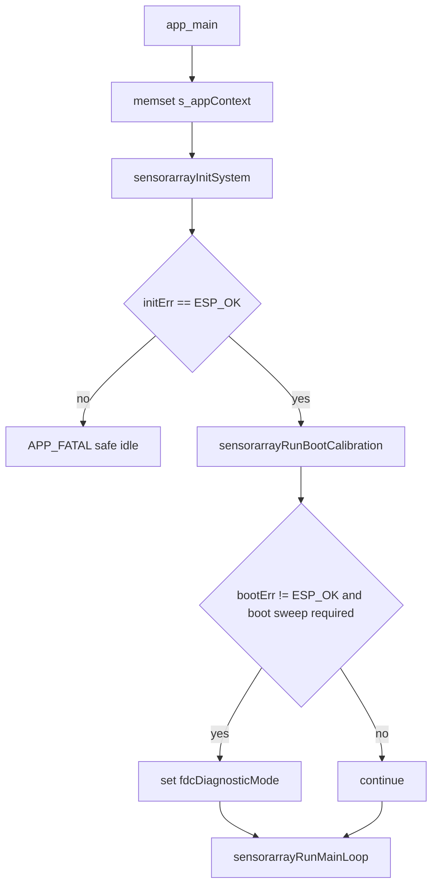

# main component - 应用层生命周期编排 / Application-layer Lifecycle Orchestration

## 目录 / Table of contents

- [中文说明 / Chinese documentation](#中文说明--chinese-documentation)
- [Australian English documentation](#australian-english-documentation)
- [应用层相关配置 / Application-level configuration](#应用层相关配置--application-level-configuration)
- [边界 / Boundaries](#边界--boundaries)

## 中文说明 / Chinese documentation

### 职责

`main/main.c` 是 SensorArray 固件的应用层编排文件。它负责：

- 初始化全局 `sensorarrayAppContext_t`。
- 顺序调用 runtime、board/routing、frontend 和 scan-plan 初始化。
- 调用 FDC boot sweep。
- 进入不返回的主循环。
- 在 init fatal、boot fatal、diagnostic mode、all-invalid frame 和 frame error 时输出应用层日志。
- 调用 `sensorarrayFrameOutputPrint()` 输出当前帧。

它不直接实现 FDC 扫描算法、ADS 采样算法、板级映射或芯片寄存器访问。

### `sensorarrayAppContext_t`

| 字段 | 含义与生命周期 |
|---|---|
| `runtimeMode` | `sensorarrayInitRuntime()` 设置为 `SENSORARRAY_RUNTIME_MODE_FDC_MATRIX`；`sensorarrayRunOneFrame()` 用它选择 FDC/ADS/mixed 分支。 |
| `state` | `sensorarrayState_t`，保存 board/TMUX/ADS/FDC readiness、FDC cache 和 applied row shadow。 |
| `scanPlan` | `sensorarrayBuildDefaultScanPlan()` 构建默认 8 x 8 FDC cap scan plan。 |
| `frame` | 当前输出帧，FDC 路径填充后由 `sensorarrayFrameOutputPrint()` 打印。 |
| `fdcEngine` | FDC matrix engine facade；read/boot/full-rescue 调用会转交 `core/measure/fdc` 和 `core/measure`。 |
| `adsEngine` | ADS matrix engine facade；当前 read frame 返回 unsupported invalid frame。 |
| `fdcRescue` | `sensorarrayFdcRescueContext_t`，主循环每帧后调用 `sensorarrayRuntimeRescueTick()` 更新。 |
| `primaryAddrValid`, `secondaryAddrValid` | FDC I2C address 解析结果。 |
| `requestedFdcChannels` | FDC autoscan 通道数，当前矩阵需要 4 通道。 |
| `fdcBootSweepOk` | boot sweep 成功后为 true；诊断输出会引用。 |
| `fdcDiagnosticMode` | primary missing、required secondary missing、required boot sweep failure 或 repeated full rescue failure 后进入。 |
| `fdcFrameCounter` | 主循环每次读帧后递增，也用于每 100 帧输出 stack/memory 日志。 |
| `failedRescueCount` | full sweep rescue 失败次数。 |
| `rescueEpoch` | queued full rescue epoch 计数。 |
| `lastFullRescueTimeUs` | 上次 full rescue 结束时间，用于 cooldown。 |
| `rescueRunning` | 防止重复进入 full rescue。 |

### `app_main()` 顺序

### `sensorarrayInitSystem()`

| 阶段 | 调用 | 成功副作用 | 失败表现 |
|---|---|---|---|
| Runtime | `sensorarrayInitRuntime(ctx)` | 清空 ctx，关闭 fast-speed output，设置 FDC matrix runtime mode，解析 FDC 地址和通道数。 | 返回错误，`app_main()` 进入 `APP_FATAL` safe idle。 |
| Board/routing | `sensorarrayInitBoardAndRouting(ctx)` | 初始化 `boardSupport`、`tmuxSwitch`，打印 board map audit，应用默认 TMUX route。 | boardSupport 失败打印 `APP_INIT_FATAL`，整体 init 失败。 |
| Frontends | `sensorarrayInitFrontends(ctx)` | 初始化 ADS，分配 primary/secondary FDC I2C context，初始化 FDC/ADS engines 和 rescue context。 | engine init 失败会整体 init 失败；单颗 FDC readiness 由 state 记录。 |
| Scan plan | `sensorarrayBuildDefaultScanPlan(ctx)` | 构建 S1..S8、D1..D8 的 FDC cap scan plan。 | 无错误返回。 |

### Boot calibration

`sensorarrayRunBootCalibration(ctx)` 的真实行为：

- primary FDC 不 ready：设置 `fdcBootSweepOk=false`、`fdcDiagnosticMode=true`，engine diagnostic mode 打开，打印 `FDC_FATAL,reason=primary_not_ready`，返回 `ESP_ERR_INVALID_STATE`。
- secondary FDC 不 ready 且 `CONFIG_SENSORARRAY_REQUIRE_DUAL_FDC_FOR_BOOT=y`：进入 diagnostic mode，打印 `FDC_FATAL,reason=secondary_not_ready_require_dual`，返回错误。
- secondary FDC 不 ready 且不要求 dual FDC：打印 `FDC_BUS_WARN` 和 `APP_FDC,stage=boot_sweep_skip`，允许 D1-D4 primary-only 继续。
- 两颗 FDC ready：调用 `sensorarrayFdcMatrixEngineRunBootSweep()`，再由 engine 调用 `sensorarrayFdcSweepRunBoot()`。
- boot sweep 失败且 required：打印 `FDC_FATAL,reason=boot_sweep_failed`，`app_main()` 会设置 diagnostic mode。
- boot sweep 失败但不 required：清掉 diagnostic mode，打印 warning，继续主循环。

### Main loop

主循环每次迭代按这个顺序运行：

1. `sensorarrayRunQueuedFullSweep(ctx)` 消费 queued full sweep request。该函数检查 `failedRescueCount`、`rescueRunning` 和 `CONFIG_SENSORARRAY_FDC_FULL_SWEEP_REQUEST_COOLDOWN_MS`。
2. 每 100 帧输出 `APP_STACK` 和 `APP_MEM`。
3. 如果 `ctx->fdcDiagnosticMode` 或 engine diagnostic mode 为 true，调用 `sensorarrayRunDiagnosticTick(ctx)`，打印 `MATRIXFDC_DIAG,stage=diagnostic_mode`，然后延时 1 秒并跳过正常读帧。
4. 记录 `frameStartUs`。
5. `sensorarrayRunOneFrame(ctx)` 根据 runtime mode 分发。默认 FDC path 调用 `sensorarrayFdcMatrixEngineReadFrame()`，后者调用 `sensorarrayMeasureReadFdcMatrixFrame()`。
6. `fdcFrameCounter++`。
7. 如果 `ctx->frame.capValidMask == 0`，打印 `MATRIXFDC_DIAG,stage=all_invalid_frame`；如果 frame read 返回错误但仍有有效 cell，打印 `FRAME_ERROR`。
8. 调用 `sensorarrayFrameOutputPrint(&ctx->frame)`。默认是 text `MATRIXFDC_CAP`，不是 binary transport。
9. `sensorarrayRuntimeRescueTick(ctx)` 对 FDC/mixed mode 调用 `sensorarrayFdcRescueTick()`。
10. `sensorarrayDelayFramePeriodSince(frameStartUs, ctx->frame.sequence)` 按 `CONFIG_SENSORARRAY_FDC_MATRIX_PERIOD_MS` 延时；若超时打印 `SCAN_TIMING_OVERRUN`。

### Failure behaviour

| 场景 | 行为 |
|---|---|
| init failure | `APP_FATAL,stage=init`，进入 1 秒 safe idle heartbeat，不重启。 |
| primary FDC missing | boot fatal，diagnostic mode。 |
| secondary FDC missing | 如果 required dual FDC 则 boot fatal；否则 primary-only degraded operation。 |
| boot sweep failure | required 时 diagnostic mode；not required 时 warning 并继续。 |
| runtime all-invalid frame | 输出 diagnostic frame，`sensorarrayFdcRescueTick()` 先 restore autoscan，再 soft resync/cache dirty，之后 queue full sweep。 |
| queued full sweep repeated failure | 达到 `CONFIG_SENSORARRAY_FDC_MAX_CONSECUTIVE_FULL_SWEEP_FAILS` 后进入 diagnostic mode。 |

## Australian English documentation

### Responsibility

`main/main.c` is the application orchestration file for the SensorArray firmware. It owns global context initialisation, ordered subsystem initialisation, boot sweep invocation, the non-returning main loop, application-level failure logs, and calls into frame output.

It does not implement the FDC scan algorithm, ADS sampling algorithm, board map, or chip register access.

### `sensorarrayAppContext_t`

| Field | Meaning and lifecycle |
|---|---|
| `runtimeMode` | Set by `sensorarrayInitRuntime()` to `SENSORARRAY_RUNTIME_MODE_FDC_MATRIX`; used by `sensorarrayRunOneFrame()` dispatch. |
| `state` | Board, TMUX, ADS, FDC readiness, FDC cache, and applied-row state. |
| `scanPlan` | Default 8 x 8 FDC cap scan plan built during init. |
| `frame` | Current output frame filled by the measurement layer and printed by output. |
| `fdcEngine` | Thin FDC facade delegating boot/read/full-rescue work to `core/measure`. |
| `adsEngine` | ADS facade; current frame read returns an unsupported invalid frame. |
| `fdcRescue` | Runtime all-invalid rescue context ticked after each frame. |
| `primaryAddrValid`, `secondaryAddrValid` | FDC I2C address parse results. |
| `requestedFdcChannels` | Normalised FDC channel count; the matrix expects four channels per FDC. |
| `fdcBootSweepOk` | Boot sweep result used by diagnostics. |
| `fdcDiagnosticMode` | Set after fatal FDC readiness, required boot sweep, or repeated rescue failure conditions. |
| `fdcFrameCounter` | Incremented per read attempt and used for periodic stack/memory logs. |
| `failedRescueCount`, `rescueEpoch`, `lastFullRescueTimeUs`, `rescueRunning` | Full-sweep rescue throttling and diagnostics. |

### Runtime lifecycle

`app_main()` clears `s_appContext`, runs `sensorarrayInitSystem()`, enters safe idle on init failure, runs `sensorarrayRunBootCalibration()`, marks diagnostic mode when a required boot sweep fails, then calls `sensorarrayRunMainLoop()`.

The main loop consumes queued full sweeps, emits periodic memory/stack diagnostics, handles diagnostic mode, reads one frame, prints all-invalid or frame-error diagnostics, emits text output, runs rescue tick, then delays to the configured frame period.

### Application-level failure model

- Init failure enters safe idle with `APP_FATAL`; there is no automatic restart.
- Primary FDC missing is a serious boot failure.
- Secondary FDC missing is fatal only when dual-FDC boot is required.
- Required boot sweep failure sets diagnostic mode.
- Runtime all-invalid frames are still emitted and then evaluated by the rescue path.
- Full rescue is throttled by cooldown and maximum consecutive failure count.

## 应用层相关配置 / Application-level configuration

完整配置表见根目录 `README.md` 的 “配置项 / Configuration options”。

For the full configuration table, see “Configuration options” in the root `README.md`.

| 配置项 / Option | 应用层影响 / Application-layer effect |
|---|---|
| `CONFIG_SENSORARRAY_FDC_MATRIX_PERIOD_MS` | `sensorarrayDelayFramePeriodSince()` uses it as target frame period. Current defaults set `50 ms`; `250 ms` would be about `4 fps`. |
| `CONFIG_SENSORARRAY_FDC_BOOT_SWEEP_REQUIRED` | Controls whether boot sweep failure leaves the app in diagnostic mode. |
| `CONFIG_SENSORARRAY_REQUIRE_DUAL_FDC_FOR_BOOT` | Controls whether secondary FDC absence is fatal or primary-only fallback. |
| `CONFIG_SENSORARRAY_FDC_FULL_SWEEP_REQUEST_COOLDOWN_MS` | Throttles queued full sweep in `sensorarrayRunQueuedFullSweep()`. |
| `CONFIG_SENSORARRAY_FDC_MAX_CONSECUTIVE_FULL_SWEEP_FAILS` | Enters diagnostic mode after repeated full sweep failures. |
| `CONFIG_SENSORARRAY_FDC_DIAG_DUMP_REGS`, `CONFIG_SENSORARRAY_FDC_DIAG_DUMP_INTERVAL_MS`, `CONFIG_SENSORARRAY_FDC_DIAG_DUMP_SKIP_OFFLINE_BUS` | Controls optional register dumping from `sensorarrayRunDiagnosticTick()`. |
| `CONFIG_SENSORARRAY_FDC_PARALLEL_DUAL_BUS_READ` | Logged by app init through `sensorarrayLogFdcParallelCfg()` and used by measurement row epoch. |
| `CONFIG_SENSORARRAY_FDC_TEXT_OUTPUT_*`, `CONFIG_SENSORARRAY_FDC_RAW_DEBUG_LOG` | Controls what `sensorarrayFrameOutputPrint()` prints after the app reads a frame. |

## 边界 / Boundaries

- `main` calls `sensorarrayFdcMatrixEngineReadFrame()`; it does not read FDC registers.
- `main` calls `sensorarrayFrameOutputPrint()`; it does not format each matrix value itself.
- `main` can set diagnostic mode; it does not decide row-level cache, warning, or rescue policy.
- `main/output` is the current text output path. Binary output is not the default path in this source tree.
- User-callable console commands are not registered in `main/main.c` or elsewhere in the current source tree.
