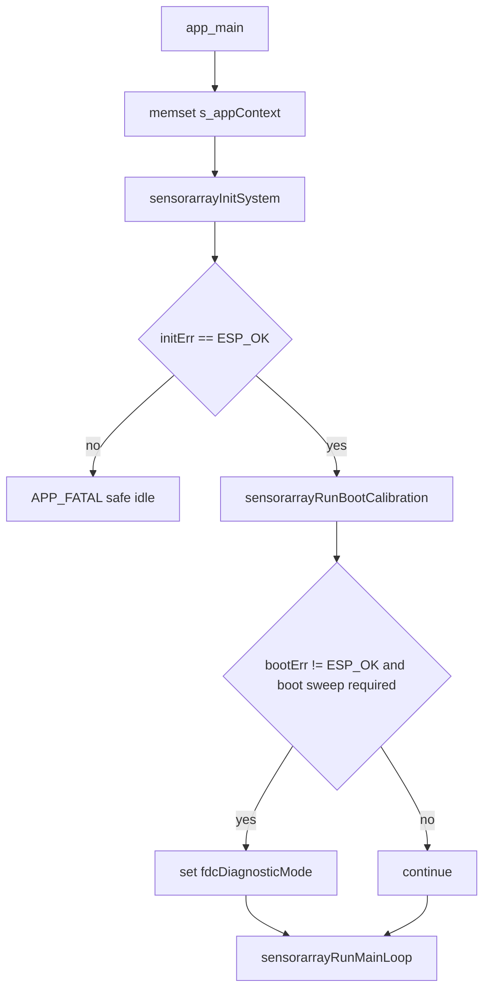

# main component - 应用层生命周期编排 / Application-layer Lifecycle Orchestration

## 目录 / Table of contents

- [中文说明 / Chinese documentation](#中文说明--chinese-documentation)
- [Australian English documentation](#australian-english-documentation)
- [应用层相关配置 / Application-level configuration](#应用层相关配置--application-level-configuration)
- [边界 / Boundaries](#边界--boundaries)

## 中文说明 / Chinese documentation

### 职责

`main/main.c` 是 SensorArray 固件的应用层编排文件。它负责：

- 初始化全局 `sensorarrayAppContext_t`。
- 顺序调用 runtime、board/routing、frontend 和 scan-plan 初始化。
- 调用 FDC boot sweep。
- 进入不返回的主循环。
- 在 init fatal、boot fatal、diagnostic mode、all-invalid frame 和 frame error 时输出应用层日志。
- 将当前帧发布给 `sensorarrayLogTask`，由异步日志任务调用 `sensorarrayFrameOutputPrint()` 输出文本。

它不直接实现 FDC 扫描算法、ADS 采样算法、板级映射或芯片寄存器访问。

### `sensorarrayAppContext_t`

| 字段 | 含义与生命周期 |
|---|---|
| `runtimeMode` | `sensorarrayInitRuntime()` 设置为 `SENSORARRAY_RUNTIME_MODE_FDC_MATRIX`；`sensorarrayRunOneFrame()` 用它选择 FDC/ADS/mixed 分支。 |
| `state` | `sensorarrayState_t`，保存 board/TMUX/ADS/FDC readiness、FDC cache 和 applied row shadow。 |
| `scanPlan` | `sensorarrayBuildDefaultScanPlan()` 构建默认 8 x 8 FDC cap scan plan。 |
| `frame` | 当前输出帧，FDC 路径填充后由主循环复制到 async snapshot ring，`sensorarrayLogTask` 再格式化打印。 |
| `fdcEngine` | FDC matrix engine facade；read/boot/full-rescue 调用会转交 `core/measure/fdc` 和 `core/measure`。 |
| `adsEngine` | ADS matrix engine facade；当前 read frame 返回 unsupported invalid frame。 |
| `fdcRescue` | `sensorarrayFdcRescueContext_t`，主循环每帧后调用 `sensorarrayRuntimeRescueTick()` 更新。 |
| `primaryAddrValid`, `secondaryAddrValid` | FDC I2C address 解析结果。 |
| `requestedFdcChannels` | FDC autoscan 通道数，当前矩阵需要 4 通道。 |
| `fdcBootSweepOk` | boot sweep 成功后为 true；诊断输出会引用。 |
| `fdcDiagnosticMode` | primary missing、required secondary missing、required boot sweep failure 或 repeated full rescue failure 后进入。 |
| `fdcFrameCounter` | 主循环每次读帧后递增，也用于每 100 帧输出 stack/memory 日志。 |
| `failedRescueCount` | full sweep rescue 失败次数。 |
| `rescueEpoch` | queued full rescue epoch 计数。 |
| `lastFullRescueTimeUs` | 上次 full rescue 结束时间，用于 cooldown。 |
| `rescueRunning` | 防止重复进入 full rescue。 |
| `asyncLogReady`, `legacySyncOutput` | 控制主循环使用异步 frame snapshot 输出，或在异步初始化失败时明确退回 legacy 同步输出。 |
| `runtimeI2cErrorStreak` | 连续 runtime I2C 错误帧计数；达到阈值后才允许重新执行 ICLK probe/fallback。 |

### `app_main()` 顺序

### `sensorarrayInitSystem()`

| 阶段 | 调用 | 成功副作用 | 失败表现 |
|---|---|---|---|
| Runtime | `sensorarrayInitRuntime(ctx)` | 清空 ctx，关闭 fast-speed output，设置 FDC matrix runtime mode，解析 FDC 地址和通道数。 | 返回错误，`app_main()` 进入 `APP_FATAL` safe idle。 |
| Board/routing | `sensorarrayInitBoardAndRouting(ctx)` | 初始化 `boardSupport`、`tmuxSwitch`，打印 board map audit，应用默认 TMUX route。 | boardSupport 失败打印 `APP_INIT_FATAL`，整体 init 失败。 |
| Frontends | `sensorarrayInitFrontends(ctx)` | 初始化 ADS，分配 primary/secondary FDC I2C context，初始化 FDC/ADS engines 和 rescue context。 | engine init 失败会整体 init 失败；单颗 FDC readiness 由 state 记录。 |
| Scan plan | `sensorarrayBuildDefaultScanPlan(ctx)` | 构建 S1..S8、D1..D8 的 FDC cap scan plan。 | 无错误返回。 |

### Boot calibration

`sensorarrayRunBootCalibration(ctx)` 的真实行为：

- primary FDC 不 ready：设置 `fdcBootSweepOk=false`、`fdcDiagnosticMode=true`，engine diagnostic mode 打开，打印 `FDC_FATAL,reason=primary_not_ready`，返回 `ESP_ERR_INVALID_STATE`。
- secondary FDC 不 ready 且 `CONFIG_SENSORARRAY_REQUIRE_DUAL_FDC_FOR_BOOT=y`：进入 diagnostic mode，打印 `FDC_FATAL,reason=secondary_not_ready_require_dual`，返回错误。
- secondary FDC 不 ready 且不要求 dual FDC：打印 `FDC_BUS_WARN` 和 `APP_FDC,stage=boot_sweep_skip`，允许 D1-D4 primary-only 继续。
- 两颗 FDC ready：调用 `sensorarrayFdcMatrixEngineRunBootSweep()`，再由 engine 调用 `sensorarrayFdcSweepRunBoot()`。
- boot sweep 失败且 required：打印 `FDC_FATAL,reason=boot_sweep_failed`，`app_main()` 会设置 diagnostic mode。
- boot sweep 失败但不 required：清掉 diagnostic mode，打印 warning，继续主循环。

### Main loop

主循环每次迭代按这个顺序运行：

1. `sensorarrayRunQueuedFullSweep(ctx)` 消费 queued full sweep request。该函数检查 `failedRescueCount`、`rescueRunning` 和 `CONFIG_SENSORARRAY_FDC_FULL_SWEEP_REQUEST_COOLDOWN_MS`。
2. 每 100 帧输出 `APP_STACK` 和 `APP_MEM`。
3. 如果 `ctx->fdcDiagnosticMode` 或 engine diagnostic mode 为 true，调用 `sensorarrayRunDiagnosticTick(ctx)`，打印 `MATRIXFDC_DIAG,stage=diagnostic_mode`，然后延时 1 秒并跳过正常读帧。
4. 记录 `frameStartUs`。
5. `sensorarrayRunOneFrame(ctx)` 根据 runtime mode 分发。默认 FDC path 调用 `sensorarrayFdcMatrixEngineReadFrame()`，后者调用 `sensorarrayMeasureReadFdcMatrixFrame()`。
6. `fdcFrameCounter++`。
7. 如果 `ctx->frame.capValidMask == 0`，发布 `MATRIXFDC_DIAG,stage=all_invalid_frame` 事件；如果 frame read 返回错误但仍有有效 cell，发布 `FRAME_ERROR` 事件。异步日志未运行时才同步打印。
8. 调用 `sensorarrayAsyncLogPublishFrameSnapshot(&ctx->frame, measureFrameUs)`。采样侧在保留 frame telemetry 的同时只格式化一次 C/D0-D3/K fixed-point ASCII packet，再发布到 `TextFrameBus`。
9. `sensorarrayRuntimeRescueTick(ctx)` 对 FDC/mixed mode 调用 `sensorarrayFdcRescueTick()`。
10. `sensorarrayRuntimeI2cFallbackTick(ctx)` 只在连续 I2C 错误超过阈值后触发 ICLK runtime re-probe。
11. `sensorarrayDelayFramePeriodSince(ctx, frameStartUs, ctx->frame.sequence)` 按 `CONFIG_SENSORARRAY_FDC_MATRIX_PERIOD_MS` 延时；普通超预算进入 `OV20` 汇总，只有超过 `CONFIG_SENSORARRAY_FDC_OVERRUN_HARD_US` 的 hard overrun 才即时发布 `OV` 事件。

### 异步日志架构

- Producer：`sensorarrayRunMainLoop()` / FDC measurement path。每帧完成后构造一次 C/D0-D3/K packet，不等待任何 sink。
- Consumer：`sensorarrayLogTask`。Core 0 output hub 将同一 packet 发布到独立 USB 和 network latest-only queue，并负责 S50/F50/A50/O50 与 EventRing 输出。
- TextFrameBus slot：`main/output/sensorarrayAsyncLog.c` 使用固定大小 slot ring，slot 同时保留 frame telemetry 与已格式化的 `sensorarrayTextPacket_t`，所有 sink 不再重复格式化。
- Drop policy：普通 Cap frame 队列满时默认丢旧保新，递增 `droppedOutputFrames`；采样任务不会因为日志落后而阻塞。
- EventRing：异常、overrun、状态变化和命令应用走 `CONFIG_SENSORARRAY_ASYNC_LOG_EVENT_QUEUE_LEN=32` 的非阻塞队列，满时只计数。
- CommandMailbox：BLE `FF01` 写入由 Core 0 解析；Core 1 只在 frame boundary 应用 `BLECAP`、`TRACE` 和 `CAL`。
- 调度隔离：scan/coordinator 默认在 `CONFIG_SENSORARRAY_SCAN_TASK_CORE=1`、优先级 12；log task 默认在 `CONFIG_SENSORARRAY_COMM_TASK_CORE=0`、优先级 7；FDC primary/secondary worker 分别由 `CONFIG_SENSORARRAY_FDC_PRIMARY_WORKER_TASK_CORE` 和 `CONFIG_SENSORARRAY_FDC_SECONDARY_WORKER_TASK_CORE` 固定，优先级继承 `CONFIG_SENSORARRAY_FDC_WORKER_TASK_PRIO`，高于 log task。

### FDC 双 worker row epoch

- coordinator 只负责 row select、TMUX settle、cached row config/profile diff、barrier release、等待两个 worker done、merge row result；coordinator 不直接调用 `Fdc2214CapReadStatus()` 或 FDC DATA read。
- `primaryFdcWorker` 和 `secondaryFdcWorker` 是常驻 task。每个 row epoch 都带 `epochId` 和 generation，避免 stale done 被当作当前结果。
- 两个 worker 使用同一个 `sensorarrayMeasureFdcRunDeviceEpochAfterSleep()` read-row-device 路径，只是 device context 不同。这样 primary/bus0 与 secondary/bus1 的 `wait/status/data/run` timing 可以直接比较。
- 每颗 FDC 启动时比较 ordered 与 16-byte candidate read；只有连续完全匹配才启用 burst。INTB 新边沿可走 direct DATA，校验失败再等待下一 conversion 并走 STATUS-confirmed fallback。

### 日志策略和字段

- Level 1 error：I2C timeout/NACK、bus stuck、ID mismatch、hard STATUS fault、worker queue/deadline、stale epoch、all-invalid frame、forced rescue/fallback 等真实异常允许同步即时输出，但必须带 row/device/epoch/status/unread/err/timing 等最小定位信息并限流。
- Level 2 Cap：每个 fresh frame 输出 C/D0-D3/K；D 值为 `pF * 1e6` 的整数，wire invalid sentinel 为 `-1000000`。
- Level 3 normal diagnostics：正式默认由异步 log task 输出 `FPS20/PHY20/FRESH20/FAST20/I2C20/CACHE20/PIPE20`；扫描任务内每 100 帧的同步 `APP_STACK`/`APP_MEM` 默认关闭，可用 `CONFIG_SENSORARRAY_RUNTIME_PERIODIC_DIAG_ENABLE` 临时开启。
- normal `FR` 条件：`pv=F`、`sv=F`、`vm=FF`、`wm=00`、`em=00`、`cm=00`、`tm=00`、`pt=0`。normal FR 不再逐 row 输出，只进入 `FR20`；valid/warn/error/cache/timeout/partial 异常才输出 `FR,r=...`。
- normal `WP` 条件：双 worker 正常启动、`mode=par`、`reason=ok`、无 stale/timeout/serialized/fallback。normal WP 不再每 5 帧逐 row 输出，只进入 `WP20`；queue/ack/deadline/stale/skew/serialization 异常才输出 `WP,r=...`。
- 正常运行汇总每 50 帧输出 `S50/F50/A50/O50`；`O50` 用 `sfps/sdrop/skb/blk` 的 USB/BLE/Wi-Fi tuple 表达各 sink 健康度。
- `WP20` 看 primary/secondary worker 是否对等；`RW20` 看 row wall 组成；`READY20` 看 INTB/DRDY/STATUS ready 是否是瓶颈；`I2C_EXPECT20` 看 45 SCL/read 的理论线时与 measured read 的差值；`P5_FULL` 看 conversion-only profile round 与完整 row pipeline 的误差。
- legacy `fu` 是主循环周期，不等于 FDC 转换时间；20 FPS 验收只看 `physFps`、`emitFps`、fresh/stale/mixed 和三组 fresh mask。

### I2C clock selection

- FDC handle 创建前保留 ID-only 早期 fallback；创建后 bus0/bus1 分别从 400 kHz 到 300 kHz 按 5 kHz 做真实负载 sweep。
- 每档覆盖 ID、STATUS、ordered DATA，以及 burst probe 已通过时的 block DATA；输出 `I2C_SWEEP`。
- 最终使用 `maxStableHz - 10 kHz`，最低 300 kHz，并输出 `I2C_SELECTED`。runtime 连续 I2C 错误阈值仍防止单次瞬态误降速。

### FDC2214 read selection

ordered fallback 固定按 CH0 `0x00 -> 0x01`、CH1 `0x02 -> 0x03`、CH2 `0x04 -> 0x05`、CH3 `0x06 -> 0x07`。候选 block path 只有在 5 次 ordered/block raw 和 error bits 完全匹配时才启用；运行时 block I2C 错误会永久关闭 burst 并立即 ordered retry。

### 验证流程

1. 在 PowerShell 设置 ESP-IDF 5.5.1 环境后运行 `idf build`。
2. 运行 `idf -p COM11 flash monitor`，必要时先 `idf -p COM11 erase-flash`。
3. monitor 至少 60 秒，确认 `BURST_PROBE`、`I2C_SWEEP/I2C_SELECTED`、`FPS20/PHY20/FRESH20/FAST20/I2C20/CACHE20/PIPE20`。
4. 检查 emitted frame 的 `rf/pfmask/sfmask=FF`、`stale=0,mixed=0`，并确认 I2C retry/nack/timeout/recovery 正常为 0。
5. 正常 200 帧内 `FR,r=...vm=FF,wm=00,em=00,cm=00,tm=00,pt=0` 和 `WP,r=...mode=par,reason=ok` 应为 0；用 `FR20`/`WP20` 确认 normal row 被聚合。
6. 同时检查 physical/output FPS、stale/mixed 和三个 fresh mask；任一 sink drop 只允许影响对应 `O50` tuple，不能反压 Core 1。

### Failure behaviour

| 场景 | 行为 |
|---|---|
| init failure | `APP_FATAL,stage=init`，进入 1 秒 safe idle heartbeat，不重启。 |
| primary FDC missing | boot fatal，diagnostic mode。 |
| secondary FDC missing | 如果 required dual FDC 则 boot fatal；否则 primary-only degraded operation。 |
| boot sweep failure | required 时 diagnostic mode；not required 时 warning 并继续。 |
| runtime all-invalid frame | 输出 diagnostic frame，`sensorarrayFdcRescueTick()` 先 restore autoscan，再 soft resync/cache dirty，之后 queue full sweep。 |
| queued full sweep repeated failure | 达到 `CONFIG_SENSORARRAY_FDC_MAX_CONSECUTIVE_FULL_SWEEP_FAILS` 后进入 diagnostic mode。 |

## Australian English documentation

### Responsibility

`main/main.c` is the application orchestration file for the SensorArray firmware. It owns global context initialisation, ordered subsystem initialisation, boot sweep invocation, the non-returning main loop, application-level failure logs, and publishing frame snapshots to the asynchronous output task.

It does not implement the FDC scan algorithm, ADS sampling algorithm, board map, or chip register access.

### `sensorarrayAppContext_t`

| Field | Meaning and lifecycle |
|---|---|
| `runtimeMode` | Set by `sensorarrayInitRuntime()` to `SENSORARRAY_RUNTIME_MODE_FDC_MATRIX`; used by `sensorarrayRunOneFrame()` dispatch. |
| `state` | Board, TMUX, ADS, FDC readiness, FDC cache, and applied-row state. |
| `scanPlan` | Default 8 x 8 FDC cap scan plan built during init. |
| `frame` | Current output frame filled by the measurement layer and copied into the async output snapshot ring. |
| `fdcEngine` | Thin FDC facade delegating boot/read/full-rescue work to `core/measure`. |
| `adsEngine` | ADS facade; current frame read returns an unsupported invalid frame. |
| `fdcRescue` | Runtime all-invalid rescue context ticked after each frame. |
| `primaryAddrValid`, `secondaryAddrValid` | FDC I2C address parse results. |
| `requestedFdcChannels` | Normalised FDC channel count; the matrix expects four channels per FDC. |
| `fdcBootSweepOk` | True only when the boot sweep transport succeeds and boot quality is `OK`. |
| `fdcBootSummary` | Last boot-sweep summary: valid/failed/cache-filled counts, row masks, quality and reason. |
| `fdcDegradedMode` | Set when boot policy allows partial hardware or the boot sweep quality is degraded. |
| `fdcDiagnosticMode` | Set after fatal FDC readiness, non-OK required boot quality, or repeated rescue failure conditions. |
| `fdcFrameCounter` | Incremented per read attempt and used for periodic stack/memory logs. |
| `failedRescueCount`, `rescueEpoch`, `lastFullRescueTimeUs`, `rescueRunning` | Full-sweep rescue throttling and diagnostics. |
| `asyncLogReady`, `legacySyncOutput` | Select async snapshot output, or explicit legacy sync fallback when async init fails. |
| `runtimeI2cErrorStreak` | Consecutive runtime I2C error-frame counter used before re-running ICLK fallback. |

### Runtime lifecycle

`app_main()` clears `s_appContext`, runs `sensorarrayInitSystem()`, enters safe idle on init failure, runs `sensorarrayRunBootCalibration()`, marks diagnostic mode when a required boot sweep does not produce `OK` quality, then calls `sensorarrayRunMainLoop()`.

The main loop applies pending mailbox commands at the frame boundary, consumes queued full sweeps, reads one frame, publishes anomaly events and one preformatted C/D/K packet, runs rescue and guarded I2C fallback ticks, then delays to the configured frame period.

### Async log architecture

`sensorarrayLogTask` consumes fixed TextFrameBus slots and the EventRing. Core 1 formats each C/D0-D3/K packet once after measurement; Core 0 forwards the same bytes to independent USB and network queues. Old normal packets can be dropped and the latest kept without blocking acquisition.

`S50/F50/A50/O50` are emitted every 50 frames. `O50` is the authoritative per-sink rate/drop/byte/block view; `A50.bt` is battery mV and `bt=-1,br=...` is the only invalid form.

Every runtime transport is compact ASCII. USB and Wi-Fi normally receive every C/D0-D3/K packet; BLE receives summaries by default and can enable low-rate cap text with `BLECAP=N`.

### FDC dual-worker row epoch

The row coordinator selects the row, waits for TMUX settle, applies cached device configuration/profile diffs, releases a shared barrier, waits for both workers to finish, and merges the row result. It does not directly call `Fdc2214CapReadStatus()` or read FDC DATA registers in the parallel path.

`primaryFdcWorker` and `secondaryFdcWorker` are persistent tasks. Every row job carries an `epochId` and generation so stale completions can be discarded instead of merged into the current row. Both workers call the same read-row-device path, which keeps primary/bus0 and secondary/bus1 timing directly comparable.

The start semaphore is a coordinator-owned barrier, so workers wait for its release while a cold runtime-profile update is applied. The device ready/read deadline starts from each worker's actual run start after release. Profile application remains part of row-wall timing but cannot consume the device watchdog before the read begins.

At startup each FDC compares ordered DATA reads with a candidate 16-byte block read. Only exact multi-trial matches enable burst for that device; mismatch keeps ordered mode, and a runtime burst I2C failure disables burst and immediately retries ordered.

### Log strategy

Level 1 errors such as I2C timeout/NACK, bus stuck, ID mismatch, hard STATUS fault, worker queue/deadline failure, stale epoch, all-invalid frame, forced rescue, and fallback may emit immediately, but they should include row/device/epoch/status/unread/error/timing context and remain rate-limited.

Level 2 C/D/K output is asynchronous and frame based. Normal runtime summaries are aggregated every 50 frames as `S50/F50/A50/O50`; detailed legacy diagnostic aggregates remain available for focused FDC work.

Normal `FR` rows have `pv=F`, `sv=F`, `vm=FF`, `wm=00`, `em=00`, `cm=00`, `tm=00`, and `pt=0`. Normal `WP` rows have both workers launched in `mode=par` with `reason=ok` and no stale, timeout, fallback, or serialised path. These normal rows are suppressed as per-row text and counted in `FR20`/`WP20`; abnormal rows still emit `FR,r=...` or `WP,r=...`.

`WP20` checks primary/secondary worker symmetry, `RW20` breaks down row-wall timing, `READY20` separates INTB/DRDY/STATUS readiness, `I2C_EXPECT20` compares the 45-SCL theoretical read time with measured driver/wrapper time, and `P5_FULL` compares the conversion-only profile model with the full row pipeline.

The default formal continuous-frame profile is `fast_runtime` (`RCOUNT=0x0900`); boot and full sweeps remain high precision. The final 2026-06-12 COM11 validation produced 320 consecutive full 64-cell frames at a steady `12.41..12.42 fps`, with all fresh masks `FF`, zero stale/mixed frames, and zero queue drops. The 20 fps target was not met: physical sweep time was about `78.5 ms`, row step about `9.54 ms`, ready wait about `4.276 ms/device-row`, and DATA read about `2.369 ms/device-row`. Both devices rejected candidate burst mode, so ordered reads remained active; selected I2C frequency was `345 kHz` on both buses.

### Application-level failure model

- Init failure enters safe idle with `APP_FATAL`; there is no automatic restart.
- Primary FDC missing is a serious boot failure.
- Secondary FDC missing is fatal only when dual-FDC boot is required.
- Required boot sweep quality must be `OK`; degraded or failed quality sets diagnostic mode when boot sweep is required.
- Runtime all-invalid frames are still emitted and then evaluated by the rescue path.
- Full rescue is throttled by cooldown and maximum consecutive failure count.

## 应用层相关配置 / Application-level configuration

完整配置表见根目录 `README.md` 的 “配置项 / Configuration options”。

For the full configuration table, see “Configuration options” in the root `README.md`.

| 配置项 / Option | 应用层影响 / Application-layer effect |
|---|---|
| `CONFIG_SENSORARRAY_FDC_MATRIX_PERIOD_MS` | `sensorarrayDelayFramePeriodSince()` uses it as target frame period. Current defaults set `50 ms`; `250 ms` would be about `4 fps`. |
| `CONFIG_SENSORARRAY_FDC_BOOT_SWEEP_REQUIRED` | Controls whether boot sweep failure leaves the app in diagnostic mode. |
| `CONFIG_SENSORARRAY_FDC_BOOT_MIN_VALID_CELLS`, `CONFIG_SENSORARRAY_FDC_BOOT_ALLOW_DEGRADED`, `CONFIG_SENSORARRAY_FDC_BOOT_REQUIRED_ROWS_MASK` | Define the boot quality gate stored in `fdcBootSummary`. |
| `CONFIG_SENSORARRAY_REQUIRE_DUAL_FDC_FOR_BOOT` | Controls whether secondary FDC absence is fatal or primary-only fallback. |
| `CONFIG_SENSORARRAY_FDC_FULL_SWEEP_REQUEST_COOLDOWN_MS` | Throttles queued full sweep in `sensorarrayRunQueuedFullSweep()`. |
| `CONFIG_SENSORARRAY_FDC_MAX_CONSECUTIVE_FULL_SWEEP_FAILS` | Enters diagnostic mode after repeated full sweep failures. |
| `CONFIG_SENSORARRAY_FDC_DIAG_DUMP_REGS`, `CONFIG_SENSORARRAY_FDC_DIAG_DUMP_INTERVAL_MS`, `CONFIG_SENSORARRAY_FDC_DIAG_DUMP_SKIP_OFFLINE_BUS` | Controls optional register dumping from `sensorarrayRunDiagnosticTick()`. |
| `CONFIG_SENSORARRAY_FDC_PARALLEL_DUAL_BUS_READ`, `CONFIG_SENSORARRAY_FDC_PARALLEL_DUAL_BUS_READ_SAFE`, `CONFIG_SENSORARRAY_FDC_FORCE_SINGLE_THREAD_READ` | Logged by app init through `sensorarrayLogFdcParallelCfg()` and used by measurement row epoch. |
| `CONFIG_SENSORARRAY_FDC_PRIMARY_WORKER_TASK_CORE`, `CONFIG_SENSORARRAY_FDC_SECONDARY_WORKER_TASK_CORE`, `CONFIG_SENSORARRAY_FDC_WORKER_TASK_PRIO` | Pin and prioritise the persistent primary/secondary FDC workers used by the row-epoch barrier path. |
| `CONFIG_SENSORARRAY_FDC_TIMING_SUMMARY_EVERY_N_FRAMES`, `CONFIG_SENSORARRAY_FDC_TIMING_COMPACT_EVERY_N_FRAMES`, `CONFIG_SENSORARRAY_FDC_READY_LOG_EVERY_N_FRAMES`, `CONFIG_SENSORARRAY_FDC_PROFILE_LOG_EVERY_N_FRAMES`, `CONFIG_SENSORARRAY_FDC_I2C_LOG_EVERY_N_FRAMES` | Control the 20-frame aggregate diagnostics such as `WP20`, `FR20`, `READY20`, `RW20`, `I2C_EXPECT20`, and `P5_FULL`. |
| `CONFIG_SENSORARRAY_FDC_OVERRUN_HARD_US` | Suppresses normal immediate overrun spam; only frame overruns above this threshold emit immediate `OV`/`BN`, while ordinary over-budget timing is aggregated into `OV20`/`BN20`. |
| `CONFIG_SENSORARRAY_FDC_TEXT_OUTPUT_*`, `CONFIG_SENSORARRAY_FDC_RAW_DEBUG_LOG` | Legacy focused diagnostics; normal runtime Cap output is always compact C/D/K text. |
| `CONFIG_SENSORARRAY_ASYNC_LOG_ENABLE` | Enables async producer/consumer logging. Default `y`. |
| `CONFIG_SENSORARRAY_ASYNC_LOG_FRAME_SLOTS` | Fixed TextFrameBus slot count. |
| `CONFIG_SENSORARRAY_ASYNC_LOG_EVENT_QUEUE_LEN` | Non-blocking anomaly event queue length. Default `32`. |
| `CONFIG_SENSORARRAY_ASYNC_LOG_SUMMARY_EVERY_N_FRAMES` | S50/F50/A50/O50 cadence. Default `50`. |
| `CONFIG_SENSORARRAY_ASYNC_LOG_TASK_STACK`, `CONFIG_SENSORARRAY_ASYNC_LOG_TASK_PRIORITY`, `CONFIG_SENSORARRAY_ASYNC_LOG_TASK_CORE` | Log task stack, priority and affinity. Defaults `12288`, `7`, `CONFIG_SENSORARRAY_COMM_TASK_CORE`. |
| `CONFIG_SENSORARRAY_ASYNC_LOG_DROP_OLD_FRAMES` | Drops old normal frame snapshots instead of blocking measurement when output is behind. |
| `CONFIG_SENSORARRAY_BLE_CAP_TEXT_EVERY_N_FRAMES` | Initial BLE cap-text cadence; default `0` keeps BLE summary-only. Runtime `BLECAP=N` overrides it. |
| `CONFIG_SENSORARRAY_OUTPUT_ALLOW_NON_FRESH_DEBUG` | Allows explicitly marked stale/mixed output only for diagnostics. Default `n`. |
| `CONFIG_SENSORARRAY_FDC_DEBUG_TIMING_GPIO_ENABLE` and strobe GPIO options | Enables oscilloscope row/frame/read-window markers. Default `n`. |
| `CONFIG_SENSORARRAY_FDC_WAVE_DEBUG_MODE` | Selects normal, route-only, row-hold, primary-only, secondary-only, or single-channel isolation. Default normal. |
| `CONFIG_SENSORARRAY_FDC_MAP_VERIFY_DEBUG` | Prints the D1-D8 firmware mapping check. Default `n`. |
| `CONFIG_BOARD_I2C_AUTO_FALLBACK_ENABLE` | Retains the early ID-only fallback before FDC handles exist; the post-create real-load sweep then tests 400 kHz down in 5 kHz steps and selects a 10 kHz margin. |
| `CONFIG_BOARD_I2C_PRIMARY_CLK_HZ_DEFAULT`, `CONFIG_BOARD_I2C_SECONDARY_CLK_HZ_DEFAULT` | Initial board-support clocks before the startup real-load sweep. |

## 边界 / Boundaries

- `main` calls `sensorarrayFdcMatrixEngineReadFrame()`; it does not read FDC registers.
- `main` publishes a frame snapshot plus one preformatted C/D/K packet; Core 0 sinks reuse the packet.
- `main` can set diagnostic mode; it does not decide row-level cache, warning, or rescue policy.
- `main/output` owns TextFrameBus, EventRing aggregation, summaries, and the USB sink; `main/net` owns Wi-Fi/BLE sinks.
- BLE ASCII commands enter `CommandMailbox` through writable characteristic `FF01` and are applied by Core 1 at a safe boundary.
